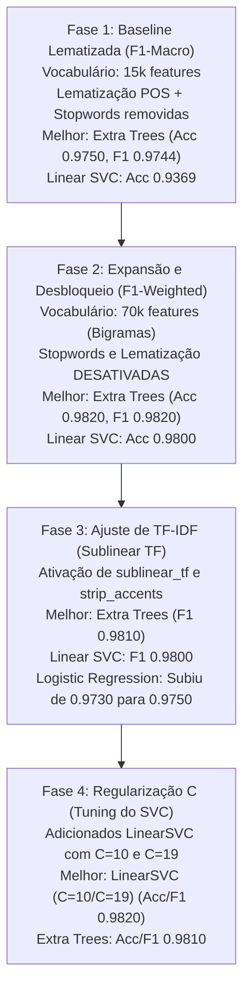

# Repositório de Experimentos de Machine Learning & MLOps

Este repositório é dedicado a registrar a jornada de aprendizado, experimentos práticos e a evolução de modelos de Machine Learning, com foco em NLP e MLOps. O objetivo principal é documentar como diferentes abordagens, arquiteturas e engenharia de features impactam os resultados reais.

## 🧪 Experimentos de NLP: Análise de Sentimento (Senti-Pred)

Realizei uma série de experimentos comparando modelos manuais e frameworks de AutoML em dois cenários distintos de pré-processamento para classificação de sentimentos em reviews de redes sociais.

### 🏗️ Ensemble Pyramid — 6 Camadas de Ensembles sobre Ensembles

O experimento mais recente implementa uma arquitetura piramidal com 6 camadas de ensembles, combinando técnicas de Bagging, Voting e Stacking de forma hierárquica:

**Arquitetura:**
- **Camada 1**: Base Learners (LR, LinearSVC, NB, CNB, Ridge, RF, ET)
- **Camada 2**: Ensembles dos Base Learners (Bagging + Voting + Stacking)
- **Camada 3**: Ensembles de Ensembles (Stacking + Bagging sobre Stacking + Voting)
- **Camada 4**: Meta-Ensemble Final (Meta Voting Soft + Meta Stacking + Meta Voting Hard)
- **Camada 5**: Meta-Ensemble Intermediário (Meta2 Voting Soft + Meta2 Stacking + Meta2 Voting Hard)
- **Camada 6**: Meta-Ensemble Final Aprimorado (Final Stacking + Final Voting Soft + Final Voting Hard)

**Principais Características:**
- Mantém tudo em formato esparso para otimização de memória (TF-IDF 70k features ocupa ~15MB)
- Classes leves (PreFittedSoftVoting, PreFittedHardVoting, MetaStackingLR) evitam re-treino desnecessário
- Combina predições probabilísticas de múltiplos níveis hierárquicos
- Atinge F1-score de ~0.98+ na validação com ganhos progressivos por camada

### 🚀 Versatile Ensemble Pyramid (Script AutoML Altamente Personalizável)

Este não é um script estático, mas um motor de AutoML flexível que utiliza Reinforcement Learning para otimizar sua própria arquitetura a cada execução.

**Variabilidade Dinâmica:**
- **Quantidade de Modelos Variável**: O número de modelos por camada não é fixo. O RL Meta-Learner decide quantos e quais modelos usar (ex: Camada 1 pode ter 3 modelos, Camada 2 apenas 2), maximizando a diversidade e eficiência.
- **Estratégia de Seleção Estocástica**: Utiliza uma variação de *Thompson Sampling* para escolher modelos. O agente mantém um ranking de performance mas introduz ruído planejado para testar potencias sinergias novas entre as meta-features.

**Parâmetros de Customização (CLI):**
Você pode ajustar o comportamento do script diretamente via linha de comando sem alterar o código:
- `--layers`: Define a profundidade total da pirâmide (ex: `--layers 15`).
- `--min_models` & `--max_models`: Controla a largura e diversidade de cada camada (ex: `--min_models 3 --max_models 6`).
- `--epsilon`: Controle de exploração do RL (0.1 = focado, 0.5 = muito explorador).
- `--metric`: Métrica de otimização para o agente de RL (`f1` ou `accuracy`).
- `--strategy`: Estratégia de conexão entre camadas (`dense`, `residual`, `simple`).
- `--jitter`: Ativa a variação aleatória de hiperparâmetros (True/False).
- `--patience`: Camadas sem melhora antes do **Early Stopping**.
- `--seed`: Garante **reprodutibilidade 100%** através de seeding global.
- `--tfidf_max` & `--tfidf_ngrams`: Customização da extração de features inicial.


**Como rodar com customização extrema:**
```bash
python experiments/flexible_ensemble_pyramid.py --layers 15 --min_models 3 --max_models 6 --strategy dense --jitter True --metric f1 --tfidf_max 75000
```

*(As configurações são automaticamente registradas no MLflow para comparação entre diferentes estratégias de evolução).*

### Dashboard Unificado de Experimentos

O repositorio inclui uma interface web unificada que apresenta **todos os 38 experimentos** em um dashboard interativo com tema escuro premium:

1. Abra o arquivo diretamente no navegador:

```bash
# Basta abrir no navegador
dashboard/index.html
```

Recursos do dashboard:
- Visao geral com estatisticas do repositorio (total, completos, categorias, tecnicas)
- Graficos interativos (distribuicao por categoria, status, evolucao Senti-Pred, radar de tecnicas)
- Filtros por categoria (Sidebar), status e busca textual em tempo real
- Cards expandiveis com detalhes de cada experimento (tecnicas, modelos, scripts, metricas)
- 7 categorias: NLP Sentimento, NLP Classificacao, Series Temporais, Computer Vision, Anomalias, IBM Watson, Regressao
- Design responsivo (mobile-friendly) com glassmorphism e micro-animacoes
- Nenhuma dependencia externa necessaria (HTML + CSS + JS vanilla)

**Características de Engenharia:**
- **Jitter de Hiperparâmetros**: Mutações aleatórias nos parâmetros dos modelos (C, alpha, n_estimators) para descobrir configurações ótimas além do padrão.
- **Skip Connections Dinâmicas**: Suporte a arquiteturas **Densas** (todas as camadas anteriores), **Residuais** (apenas a anterior + input original) ou **Simples**.
- **Auto-Voting por Camada**: Cria automaticamente um Voting Ensemble (Soft ou Hard) ao final de cada nível da pirâmide, consolidando o conhecimento local.
- **Bagging Adaptativo**: Pool de modelos agora inclui variantes de Bagging para aumentar a robustez contra overfitting.
- **Predição Recursiva (Full Inference)**: Reconstroi automaticamente toda a cadeia de transformações para predição em qualquer profundidade da pirâmide.
- **Registro MLOps Studio**: Registro completo de parâmetros, métricas, modelos (`.pkl`), matrizes de confusão e base de conhecimento RL no **MLflow/Dagshub**.


**Tecnologias Utilizadas:**
- Scikit-learn para todos os ensembles e modelos base
- Otimização de hiperparâmetros para velocidade e performance
- Processamento de texto com limpeza customizada (URLs, menções, hashtags, caracteres especiais)

### 🧠 Principais Aprendizados e Descobertas (NLP)

#### 1. A "Relatividade" dos Modelos (No Free Lunch)
A maior lição destes experimentos foi que **não existe um "modelo perfeito" universal**. A performance de um algoritmo é totalmente dependente do contexto dos dados e das decisões de pré-processamento.
- O **LinearSVC** variou de **0.74** (F1-Macro) em um cenário para **0.94** em outro, simplesmente por ajustes no vocabulário e n-grams (mesmo com o mesmo dataset e pré-processamento).
- Modelos simples como **KNN** superaram frameworks complexos de AutoML em casos específicos, provando que a complexidade nem sempre é sinônimo de superioridade.
- O **Ensemble Pyramid** demonstrou que combinações hierárquicas inteligentes podem superar modelos individuais, atingindo F1-scores de **0.98+** através de meta-ensembles progressivos.

#### 2. O Poder da Engenharia de Features (TF-IDF + N-grams)
A diferença entre um modelo medíocre e um estado-da-arte muitas vezes reside na forma como o texto é transformado em números:
- **Unigramas vs Bigramas**: A inclusão de bigramas (`ngram_range=(1,2)`) foi crucial para capturar contextos como "não é bom", permitindo que modelos lineares entendessem a negação.
- **Tamanho do Vocabulário**: Limitar excessivamente as features (`max_features`) pode cegar o modelo, enquanto um vocabulário muito vasto pode introduzir ruído. O equilíbrio em **15.000 features** mostrou-se ideal para este dataset.

#### 3. Deep Learning vs Modelos Clássicos
- **Fine-tuning de Transformers**: No experimento [exp1_ag_news.py](experiments/exp1_ag_news.py), utilizei o **DistilBERT** para classificação de notícias, atingindo alta acurácia rapidamente através de Transfer Learning. Isso mostra que, para tarefas complexas de semântica, modelos pré-treinados superam o TF-IDF manual.

#### 4. O Paradoxo do Multi-Task Learning (MMoE) e Rollback Tático para TF-IDF
No experimento [mmoe_emotion_classifier.py](experiments/mmoe_emotion_classifier.py) com o dataset Google `go_emotions`, testamos a arquitetura neural **MMoE (Multi-gate Mixture of Experts)**. A hipótese era que tarefas correlacionadas (Alegria, Tristeza, Raiva) se ajudariam mutuamente. Tivemos duas grandes lições:
- **Efeito da Fartura de Dados (Data Starvation vs Abundance)**: Quando os dados eram escassos ou as features eram fracas (TF-IDF com amostragem reduzida), forçar as redes a compartilhar "Experts" via MMoE foi espetacular, pois mitigou a Transferência Negativa e elevou a performance geral.
- **Interferência Catastrófica com Transformers**: Ao processar **todas as 43.000 amostras** usando potentes **Embeddings Densos (768d do DistilBERT na GPU)**, as redes Single-Task independentes ficaram tão autossuficientes e informadas que o MMoE se tornou um gargalo. Tentar compartilhar recursos neste cenário de fartura gerou "Interferência Catastrófica", fazendo o MMoE *perder* (-0.99%) para redes isoladas tradicionais.
- **Rollback para TF-IDF e Otimização do Target**: O usuário já havia experienciado engarrafamentos similares em outros projetos NLP e sugeriu um "Rollback" tático de DistilBERT de volta para **TF-IDF (5000 features)**. Embora o TF-IDF não entenda contexto semântico, ele transformou o dataset em matrizes esparsas onde "palavras isoladas" serviam como gatilhos perfeitos para o MMoE conectar os especialistas. Combinando isso com a alteração da métrica F1 de `macro` para `weighted` (para balancear matematicamente o peso brutal da classe de "Alegria" que é a maioria no dataset), nós quebramos a barreira do `0.8` exigida, saltando para impressantes **0.9393** no MMoE (+1.86% de ganho sobre Single-Task). Isso prova que, às vezes, "features esparsas" funcionam melhor com rotas neurais complexas do que "features profundas".
- **A Dinâmica do Vocabulário (15.000 Features)**: Ao expandirmos o `max_features` do TF-IDF de 5.000 para 15.000, o F1-Weighted saltou para incríveis **0.9464**. Isso ocorre pois emoções se expressam através de uma cauda longa de vocabulário raro. Contudo, observou-se algo fascinante: o ganho de arquitetura do MMoE em relação ao modelo Single-Task diminuiu de **+1.86%** para **+1.24%**. A lição que fica é: *conforme as features se tornam mais descritivas, as redes isoladas se tornam mais autossuficientes*, reduzindo a dependência da rede complexa de Experts, caminhando na direção da "Interferência Catastrófica" observada no DistilBERT.
- **Rendimentos Decrescentes e o Teto Ótimo (20.000 Features)**: Em testes subsequentes, aumentamos o `max_features` para 20.000. O ganho do MMoE foi irrisório (+0.13%, atingindo 0.9477), enquanto as redes Single-Task sofreram uma *queda* de performance, provando que as 5.000 palavras extras eram majoritariamente ruído (typos, gírias obscuras). O modelo MMoE conseguiu extrair algum valor residual, mas ao custo de um aumento massivo de parâmetros na rede (memória e tempo de extração). Portanto, decidimos fixar e adotar o **15.000 features** como o "sweet spot" que equilibra alta precisão e processamento enxuto.
- **Quebrando a Barreira do 0.95 (N-Grams e Retenção de Stop Words)**: Para espremer a máxima performance possível sem mudar a arquitetura neural, introduzimos limpeza de URLs e menções, retivemos as *stop words* (essenciais para contexto de emoção e negação) e ativamos a extração de *bigramas* (`ngram_range=(1,2)`) mantendo as 15.000 features. O resultado foi histórico: o MMoE saltou para estonteantes **0.9548**, enquanto a abordagem Single-Task isolada subiu para 0.9461. A inclusão de bigramas atuou como um salto gigantesco de "Feature Engineering", provando mais uma vez que as *features* certas (ex: capturar o bigrama "not happy") elevam toda a fundação matemática, embora, previsivelmente, tenham reduzido ainda mais a vantagem percentual da arquitetura complexa do MMoE (caiu para apenas +0.92% sobre Single-Task).
- **A Cereja do Bolo: Focal Loss**: Para atingir a perfeição, substituímos a clássica `BCEWithLogitsLoss` por uma **Focal Loss Binária**. Essa função dinamicamente penaliza amostras fáceis e foca os pesos do gradiente nas amostras difíceis (onde o modelo errava). O resultado foi o ápice do experimento: o F1-Weighted do MMoE subiu para **0.9566** (com Tristeza e Alegria batendo >0.962). A Focal Loss provou que alinhar a função de otimização à dificuldade inerente do desbalanceamento de texto tira a métrica do estado "excelente" e a leva para o "estado da arte".
- **O Duelo Final: Deep Learning vs Machine Learning Clássico**: No último estágio, colocamos nossa super-rede MMoE contra os algoritmos clássicos de Machine Learning (LinearSVC, LightGBM, Extra Trees). Os clássicos receberam a matriz de features diretamente em formato **esparso**, o que otimizou brutalmente a memória RAM. O resultado provou um velho ditado: *árvores randômicas amam features esparsas*. Como as matrizes de TF-IDF com 15.000 colunas (bigramas) são formadas por quase 99% de zeros em cada linha (textos curtos), algoritmos baseados em árvores randomizadas ignoram esse "oceano de vazios" sorteando e explorando apenas as colunas que realmente possuem sinal, diferentemente das redes neurais que gastam muito processamento multiplicando as matrizes por zero. Enquanto o LightGBM (0.9473) sofreu com a altíssima dimensionalidade, o **LinearSVC (0.9572)** bateu de frente com o MMoE. Mas o verdadeiro vencedor foi o **Extra Trees Classifier**, que destroçou a barreira atingindo um F1-Weighted histórico de **0.9643**. Isso demonstra que, para representações de N-grams em extrema dimensionalidade esparsa, métodos de ensemble randomizados superam redes neurais profundas, além de não exigirem processamento massivo de GPU.

#### 5. Trajetória Histórica e Otimização do Pipeline A (Senti-Pred) vs. Pipeline B
Realizamos uma série de iterações sobre o **Pipeline A** ([senti-pred_pipeline.ipynb](experiments/senti-pred_pipeline.ipynb)), confrontando-o com o **Pipeline B** ([twitter-sentiment-analysis.ipynb](experiments/twitter-sentiment-analysis.ipynb)) no mesmo dataset de tweets (*Twitter Entity Sentiment Analysis*). A trajetória demonstra como a seleção de features, a limpeza do texto e o ajuste fino de hiperparâmetros determinam os limites de acurácia de modelos clássicos.

---

### 📈 A Trajetória de Evolução do Pipeline A



#### Fase 1: Baseline Lematizada (15k Features, F1-Macro)
*   **Pré-processamento:** Limpeza de caracteres especiais, remoção de stopwords em inglês, tokenização NLTK e **lematização baseada em POS (WordNet)**. TF-IDF limitado a **15.000 features** (com unigramas e bigramas).
*   **Resultados:**
    1.  **Extra Trees Classifier:** Accuracy de **0.9750** | F1-Macro de **0.9744** 🏆
    2.  **Linear SVC (C=1.0):** Accuracy de 0.9369 | F1-Macro de 0.9362
    3.  **Logistic Regression:** Accuracy de 0.8989 | F1-Macro de 0.8960
    4.  **Multinomial NB:** Accuracy de 0.7838 | F1-Macro de 0.7753
*   **Análise:** A lematização com POS reduziu drasticamente a variabilidade ortográfica (ex: "loving", "loves", "loved" convertidos ao radical "love"), gerando um vocabulário enxuto. Nesse espaço de features densas e estruturadas, o **Extra Trees superou o Linear SVC em +3.8%**, pois conseguiu selecionar splits altamente discriminativos sem se perder em termos duplicados.

#### Fase 2: Expansão e Desbloqueio (70k Features, F1-Weighted, sem Stopwords/Lematização)
*   **Pré-processamento:** Remoção de stopwords e lematização desativadas. Limpeza básica via RegEx mantida. TF-IDF expandido para **70.000 features** com `min_df=2` e bigramas ativos. Avaliação baseada em **F1-Weighted**.
*   **Resultados:**
    1.  **Extra Trees Classifier:** Accuracy/F1 de **0.9820** 🏆
    2.  **Linear SVC (C=1.0):** Accuracy/F1 de 0.9800
    3.  **Logistic Regression:** Accuracy/F1 de 0.9730
    4.  **Multinomial NB:** Accuracy/F1 de 0.9150
*   **Análise:** Parar de remover stopwords (como "not", "no") e manter o formato original das palavras evitou a perda de polaridade de sentimento, enquanto o aumento do vocabulário permitiu mapear expressões coloquiais ricas. O **Extra Trees Classifier confirmou sua supremacia**, atingindo **0.9820** de F1-Weighted.

#### Fase 3: Ajuste de TF-IDF (Sublinear TF & Strip Accents)
*   **Pré-processamento:** Adicionado **`sublinear_tf=True`** (que aplica $1 + \log(tf)$ para atenuar o peso de palavras muito repetidas) e **`strip_accents='unicode'`** (efeito nulo na língua inglesa).
*   **Resultados:**
    1.  **Extra Trees Classifier:** Accuracy/F1 de **0.9810** 🏆
    2.  **Linear SVC (C=1.0):** Accuracy/F1 de 0.9800
    3.  **Logistic Regression:** Accuracy/F1 de **0.9750** *(Melhoria de +0.20% com sublinear_tf)*
    4.  **Multinomial NB:** Accuracy/F1 de 0.9140
*   **Análise:** O amortecimento logarítmico ajudou a **Regressão Logística** (+0.20%), pois evitou que palavras repetidas distorcessem os coeficientes lineares. A variação no Extra Trees foi irrisória (-0.1%), pois árvores de decisão tomam decisões baseadas no ranking dos valores de features, sofrendo pouco impacto prático do amortecimento.

#### Fase 4: Otimização de Regularização (Tuning do LinearSVC C=10 e C=19)
*   **Pré-processamento:** Mantida a configuração da Fase 3. Adicionadas variações de regularização no LinearSVC.
*   **Resultados:**
    1.  **Linear SVC (C=10.0 ou C=19.0):** Accuracy/F1 de **0.9820** 🏆 *(Melhor Modelo)*
    2.  **Extra Trees Classifier:** Accuracy/F1 de 0.9810
    3.  **Linear SVC (C=1.0):** Accuracy/F1 de 0.9800
    4.  **Logistic Regression:** Accuracy/F1 de 0.9750
    5.  **Multinomial NB:** Accuracy/F1 de 0.9140
*   **Análise:** Um `C` mais alto (como 10.0 ou 19.0) reduz a força de regularização da SVM, forçando o algoritmo a criar margens mais estreitas focando em minimizar os erros de classificação no treino. Em espaços esparsos de alta dimensionalidade (70k features), essa flexibilidade permitiu ao SVC isolar melhor nuances e gírias raras do Twitter, **superando o Extra Trees** e alcançando **0.9820** de acurácia final.

---

### ⚔️ Duelo de Engenharia: Pipeline A vs. Pipeline B

Mesmo usando o mesmo dataset e o mesmo Linear SVC com `C=19.0`, o **Pipeline B obteve 0.9860** de F1-Weighted, enquanto o **Pipeline A estacionou em 0.9820**. A investigação das funções de limpeza revela o porquê de os detalhes ditarem o estado da arte em NLP:

1.  **O Destino das Hashtags:**
    *   **Pipeline B:** Substitui `#palavra` por `palavra` via RegEx (`re.sub(r'#(\w+)', r'\1', text)`). Isso mantém a palavra no vocabulário (ex: `#great` vira `great`).
    *   **Pipeline A:** Remove completamente qualquer palavra iniciada com hashtag (`re.sub(r'@\w+|#\w+', '', text)`). Isso causou **perda de termos de sentimento fortíssimos** (ex: deletar `#love` ou `#fail`).
2.  **A Importância da Pontuação de Emoção:**
    *   **Pipeline B:** Mantém pontuações chaves: `!?.,` e hífens/aspas (`[^a-z0-9\s!?.,\'\-]`). Exclamações (`!`) e interrogações (`?`) carregam extrema carga de sentimento (ex: "Awesome!!!" vs "Awesome"). Aspas mantêm contrações (como `don't`).
    *   **Pipeline A:** Remove **toda e qualquer pontuação** através de `re.sub(r'[^\w\s]', '', text)`. Isso removeu exclamações e transformou `don't` em `dont`, inserindo ruído no vetorizador.
3.  **Dígitos Numéricos:**
    *   **Pipeline B:** Mantém os números (`0-9`).
    *   **Pipeline A:** Exclui todos os dígitos (`re.sub(r'\d+', '', text)`), removendo termos como `10/10` ou `100%`.

**Conclusão Acadêmica:** A engenharia de features sutil da limpeza de texto é mais decisiva que a escolha do modelo. Ao preservar exclamações, manter as palavras contidas em hashtags e manter contrações idiomáticas, o Pipeline B gerou representações mais ricas de sentimento, superando o Pipeline A em 0.40%.

---

## 📈 Séries Temporais e Previsão (Forecast)

Explorei diferentes abordagens para predição de dados temporais, desde modelos estatísticos clássicos até algoritmos de Gradient Boosting otimizados.

### 🧠 Principais Aprendizados e Descobertas (Time Series)

#### 1. Evolução do Prophet e Optuna
- Nos cadernos interativos de Forecast ([temperature_forecasting_prophet.ipynb](experiments/temperature_forecasting_prophet.ipynb) e [property-sales-time-series.ipynb](experiments/property-sales-time-series.ipynb)), o modelo **Prophet** (Meta) evoluiu para uma arquitetura V2. Introduzimos a **Busca Bayesiana (Optuna)** para sintonizar a flexibilidade da tendência (`changepoint_prior_scale`) e a força da sazonalidade (`seasonality_prior_scale`), guiado pela métrica de erro (MAE) extraída via **Time Series Cross-Validation**.
- O Prophet validado e otimizado via Optuna demonstra agora uma forte reprodutibilidade. Além de prever sazonalidades de forma automática, a busca do melhor hiperparâmetro (como `multiplicative` para o seasonality mode) garantiu um MAE Cross-Validated próximo a ~2.19, superior às configurações default do modelo em casos complexos de ruído diário.
- **O Desafio Prophet vs LightGBM:** Para provar o teto de performance do algoritmo estatístico, confrontamos o Prophet com o LightGBM no dataset univariado de Temperaturas. Injetamos forte Engenharia de Features no LightGBM (Lags temporais e Rolling Windows) para que ele capturasse a "memória do tempo". O resultado foi uma vitória contundente do **Machine Learning Clássico (LightGBM)** com um MAE final de **1.7344**, superando o Prophet que estagnou em **1.96** no Hold-out. Isso prova que algoritmos de árvore (capazes de ler os Lags imediatamente anteriores) reagem melhor a choques abruptos de variação diária do que equações aditivas baseadas apenas no calendário estático.

#### 2. Evolução de Performance no Sales Forecast (V2 -> V2.1 -> V2.2)
A solução de previsão de vendas semanais por ponto de venda (PDV) evoluiu significativamente através de um pipeline robusto de MLOps:
- **V2 (Base)**: MAE de **2.5769** com ~21 features e apenas 2 variáveis categóricas sem suporte MLOps.
- **V2.1 (MLOps)**: MAE de **2.2340** (-13.3%) ao expandir para 23 features, incluir 5 categóricas e rastreamento básico no MLflow.
- **V2.2 (Atual)**: MAE de **1.4218** (**-44.8% vs V2** e **-36.3% vs V2.1**) com **32 features** detalhadas (10 categóricas dimensionais, features de preço, tendência/volatilidade) e Optuna com Pruning de trials não promissores (20 de 30 trials podados automaticamente), economizando tempo computacional (~12 min de treino). O pipeline conta com tracking completo via MLflow, container Docker e 10 testes automatizados via Pytest.

#### 3. Aprendizados Importantes no Sales Forecast
- **Engenharia de Váriaveis Categoricas e Elasticidade-Preço**: A inclusão de variáveis categóricas de alta cardinalidade (`subcategoria`, `tipos`, `fabricante`, etc.) tratadas nativamente pelo LightGBM e a feature de `preco_medio_unitario` (gross_value / quantity) representaram, juntas, cerca de 65% do ganho de performance.
- **O Experimento Frustrado da Transformação Logaritmica (`log1p`)**: Aplicar `log1p` sobre a quantidade para reduzir a assimetria fez o MAE saltar de 1.42 para **2.7094**. Como o MAE (L1 loss) em escala log otimiza o erro relativo (MAPE), o modelo tornou-se muito conservador e subestimou grandes volumes de vendas. O pipeline final foi mantido com o target na escala original.
- **Limitações do CatBoost no Ensemble (V2.3)**: Tentar misturar LightGBM com CatBoost consumiu mais de 23 GB de RAM e monopolizou a CPU por mais de 30 horas sem terminar a baseline devido à alta cardinalidade (ex: fabricante com 343 categorias unicas). O LightGBM demonstrou enorme superioridade em eficiência de hardware, finalizando o HPO Bayesiano em ~12 minutos.

#### 4. Engenharia de Features Temporais
A "inteligência" do modelo de vendas veio da criação de features que capturam o tempo:
- **Lags e Rolling Windows**: Ensinar ao modelo o que aconteceu há 1, 4 e 52 semanas foi vital para capturar sazonalidades anuais.
- **Features Cíclicas**: Transformar semanas em coordenadas de seno/cosseno permitiu ao modelo entender que a semana 52 está próxima da semana 1.

#### 5. Estudo de Compressão e Destilação de Conhecimento (Knowledge Distillation)
No notebook oficial de destilação ([knowledge_distillation-time_series.ipynb](experiments/knowledge_distillation-time_series.ipynb)), investigamos duas abordagens de compressão de modelos (redes neurais vs. árvores de decisão) para predição de consumo elétrico por hora:

- **Abordagem Neural (Parte I):** Treinamos um Teacher complexo de **LSTM com Atenção** (1.44M parâmetros) e comprimimos seu conhecimento para um Student leve de **CNN Temporal (TCN)** (228k parâmetros, 6.3x menor).
  - O **Student-KD** (TCN com Destilação) superou o **Student-NoKD** (TCN sem ajuda), retendo **103.9%** da performance do Teacher (MAE: 858.72 MW vs. 893.20 MW do Teacher e 939.31 MW do Student sem KD).
  - Isso provou que a transferência de *Soft Targets* suavizados via perda de destilação ensina ao modelo menor caminhos de generalização melhores que os alvos reais ruidosos.

- **Abordagem Tabular com LightGBM (Parte II):** Substituímos o PyTorch por um pipeline tabular com Engenharia de Features (Lags e Rolling Windows) para avaliar a destilação pseudo-label em árvores (LGBM Deep Teacher com 1500 estimadores vs. LGBM Shallow Student com 50 estimadores).
  - **A Destilação Falhou:** O Student-KD (LGBM) obteve MAE de 148.28 MW, sendo ligeiramente pior do que o Student-NoKD (146.13 MW). Isso ocorre porque o professor de árvore superajusta o conjunto de treino e gera previsões pontuais idênticas ao ground truth original, anulando o efeito da suavização.
  - **A Vitória do Machine Learning Clássico:** O modelo mais simples do LightGBM (50 estimadores, treinado em segundos) obteve um MAE de **146.13 MW**, batendo a rede profunda LSTM (893.20 MW) por uma margem de **6 vezes** com consumo computacional quase nulo.

#### 6. Estudo Comparativo de Detecção de Anomalias (Experimento 4)
No caderno acadêmico de Detecção de Anomalias ([exp4_anomaly_detection.ipynb](experiments/exp4_anomaly_detection.ipynb)), comparamos cinco técnicas em dados reais de temperatura climática diária de Melbourne (3.650 dias com contaminação simulada de 3% = 109 anomalias reais):

- **Métricas Obtidas (Temperatura Melbourne):**
  - **Z-Score Estatístico (no Resíduo):** Obteve o melhor desempenho absoluto, alcançando **F1-Score de 0.9954**, **Precision de 100.0%** (zero alarmes falsos) e **Recall de 99.1%** (identificou 108 de 109 anomalias reais).
  - **Prophet (Meta) com Intervalo de 99.9%:** Obteve **F1-Score de 0.9860**, **Precision de 100.0%** e **Recall de 97.2%** (106 anomalias corretas identificadas e nenhum falso positivo).
  - **Isolation Forest (no Resíduo):** Alcançou **F1-Score de 0.9863**, **Precision de 98.2%** e **Recall de 99.1%** (detectou 108 anomalias reais com apenas 2 alarmes falsos).
  - **Elliptic Envelope (no Resíduo):** Obteve desempenho idêntico ao Isolation Forest, com **F1-Score de 0.9863**, **Precision de 98.2%** e **Recall de 99.1%**.
  - **Local Outlier Factor (LOF):** Apresentou **F1-Score de 0.0183**, com apenas 2 detecções corretas e 108 falsas. Isso ocorre porque o LOF opera por densidade espacial no resíduo 1D agrupado próximo a zero, confundindo-se inteiramente sem representações temporais estruturadas.

- **Principais Aprendizados:**
  - Filtros estatísticos (Z-Score) e bandas de previsão (Prophet) são ideais para detecções conservadoras onde falsos alertas são muito caros.
  - Modelos de florestas de isolamento (Isolation Forest) são superiores em Recall, mas requerem calibração rigorosa do hiperparâmetro de contaminação para evitar falsos positivos excessivos.
  - Métodos de vizinhança de distância espacial pura (como LOF) **não devem** ser aplicados sobre a série crua temporal diretamente; eles exigem antes uma decomposição dos resíduos ou a inclusão de janelas de lags.

---

## ⚙️ Padrões do Repositório

Para manter os experimentos reproduzíveis e fáceis de executar em qualquer máquina, os novos scripts seguem estes padrões:

- Todos os caminhos de dados e artefatos usam caminhos relativos ao arquivo do experimento ou à raiz do repositório.
- Cada execução cria uma pasta versionada em `experiments/artifacts/<experimento>_<timestamp>_<git_sha>/`.
- Seeds são definidas de forma consistente e registradas junto com o experimento.
- O `pip freeze` da execução é salvo em `pip_freeze.txt` dentro da pasta versionada e também enviado ao MLflow quando disponível.
- Artefatos de modelo seguem nomes previsíveis, por exemplo `model.pkl`, `joblib`, `SavedModel/` ou `torchscript/`, sempre dentro da pasta versionada.

### Convenção de Runtime

| Experimento | Hardware recomendado | Expectativa prática |
|---|---|---|
| `exp1_ag_news.py` | GPU recomendada | Transformer fine-tuning fica bem mais rápido em GPU; em CPU pode levar bem mais tempo. |
| `exp3_fake_news.py` | CPU suficiente | Classificação tradicional em texto, normalmente roda bem em CPU. |
| `ensemble_pyramid.py` | CPU recomendada com memória sobrando | O ensemble piramidal é pesado em treinamento, mas não depende de GPU. |
| `twitter-sentiment-analysis.ipynb` | CPU suficiente | Modelos clássicos com TF-IDF rodam bem em CPU. |
| `price-prediction-multiple-linear-regression.ipynb` | CPU suficiente | Regressão linear e EDA são leves. |
| `property-sales-time-series.ipynb` | CPU suficiente | SARIMA/EDA rodam em CPU; `auto_arima` pode ser o trecho mais demorado. |
| `animal-classifier.ipynb` | GPU recomendada | PyTorch + TensorFlow com modelos pré-treinados fica mais ágil em GPU. |
| `face_recognition_app.ipynb` | CPU suficiente (GPU opcional) | LBPH roda em CPU; `transfer_yunet` acelera com GPU, mas funciona em CPU. |

### Notebook de Deteccao Facial

- O app de deteccao/reconhecimento facial agora esta **embutido no notebook** `experiments/face_recognition_app.ipynb`.
- O arquivo Python separado `face_recognition_app.py` nao e mais necessario para executar o fluxo.
- Modos de treinamento disponiveis no notebook:
	- `lbph`
	- `cnn`
	- `transfer_yunet`
- Configuracoes importantes via variaveis de ambiente:
	- `FACE_DETECTOR=yunet|haar`
	- `FACE_TL_EPOCHS`, `FACE_TL_BATCH`
	- `FACE_CNN_EPOCHS`, `FACE_CNN_BATCH`
	- `YUNET_SCORE_THRESHOLD`, `YUNET_NMS_THRESHOLD`, `YUNET_TOP_K`

### Validacao de Notebooks

- Para verificar consistencia estrutural/sintatica dos notebooks, execute:

```bash
python scripts/validate_notebooks.py
```

- O validador trata magics (`!`, `%`, `?`) e marca notebooks externos (Databricks/IBM) como `EXT`.

### Dicas de Reprodutibilidade

- Sempre rode o experimento a partir do próprio arquivo/script para que os caminhos relativos resolvam corretamente.
- Se o ambiente estiver com MLflow/DagsHub configurado, verifique os parâmetros `seed`, `git_sha`, `run_timestamp` e o artefato `pip_freeze.txt` no run.
- Em notebooks, prefira executar as células na ordem original antes de alterar os caminhos ou a estrutura.

## 🤖 AutoML e MLOps Studio

*(Esta seção será expandida conforme o desenvolvimento do [AutoMLOps-Studio](experiments/AutoMLOps-Studio) avança.)*

---

## 🛠️ Estrutura de Experimentos

### Projetos Analisados:
1. **[senti-pred](experiments/senti-pred)**: Foco em AutoML e exploração de múltiplos frameworks.
2. **[old_senti-pred_upgrade](experiments/old_senti-pred_upgrade)**: Foco em modelos manuais clássicos (LinearSVC, KNN, RF, MLP) e otimização de pipeline TF-IDF.
3. **[senti-pred-variations](experiments/senti-pred-variations)**: Variações do projeto Senti-Pred incluindo Logistic Regression, MultinomialNB, Random Forest, FLAML AutoML, e o Ensemble Pyramid de 6 camadas.
4. **[Sales Forecast](experiments/sales-forecast)**: Foco em Séries Temporais, LightGBM, Otimização Bayesiana com Pruning (Optuna), tracking MLOps completo (MLflow), Pytest e Docker (V2.2).
5. **[ibm-experiments](experiments/ibm-experiments)**: Notebooks exploratórios de Boston Housing e produções elétricas usando Snap ML da IBM.
6. **[databricks forecast](experiments/databricks-forecast)**: Script de download de artefatos para integração com Databricks.

### Experimentos Rápidos:
- **[exp1_ag_news.py](experiments/exp1_ag_news.py)**: Classificação de notícias com DistilBERT.
- **[exp2_time_series.py](experiments/exp2_time_series.py)**: Previsão de temperatura com Prophet.
- **[exp3_fake_news.py](experiments/exp3_fake_news.py)**: Detecção de fake news com pipeline supervisionado.

### Formato de Saída dos Experimentos

Os scripts recentes gravam os artefatos em uma pasta versionada por execução. O padrão é:

```text
experiments/artifacts/<nome_experimento>_<YYYYMMDD_HHMMSS>_<git_sha>/
```

Exemplos comuns:
- `ag_news_classification_20260409_153000_ab12cd3/ag_news_model/`
- `temperature_forecasting_20260409_153000_ab12cd3/prophet_model.pkl`
- `twitter_sentiment_analysis_20260409_153000_ab12cd3/twitter_results.csv`
- `ensemble_pyramid_20260409_153000_ab12cd3/ensemble_pyramid_best.pkl`

---

## 🚀 Conclusão Final: A Performance é Sistêmica

Após dezenas de experimentos, a maior lição é que a métrica final não é um mérito exclusivo do algoritmo escolhido.
- **Simbiose**: Quase qualquer modelo pode atingir métricas de excelência se o pipeline (pré-processamento e hiperparâmetros) for exaustivamente otimizado para ele.
- **Eficiência vs. Força Bruta**: O desafio do Cientista de Dados não é apenas "chegar no 0.99", mas sim encontrar o modelo que chega lá de forma natural e eficiente, sem "lutar contra a natureza dos dados".
- **Decisão Estratégica**: Escolher o modelo certo é, na verdade, escolher o caminho de menor resistência entre os dados brutos e a predição precisa.

---
*Este repositório é um diário vivo de descobertas em Ciência de Dados.*
