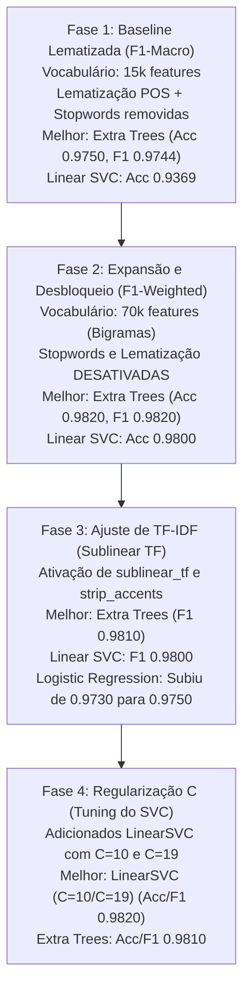
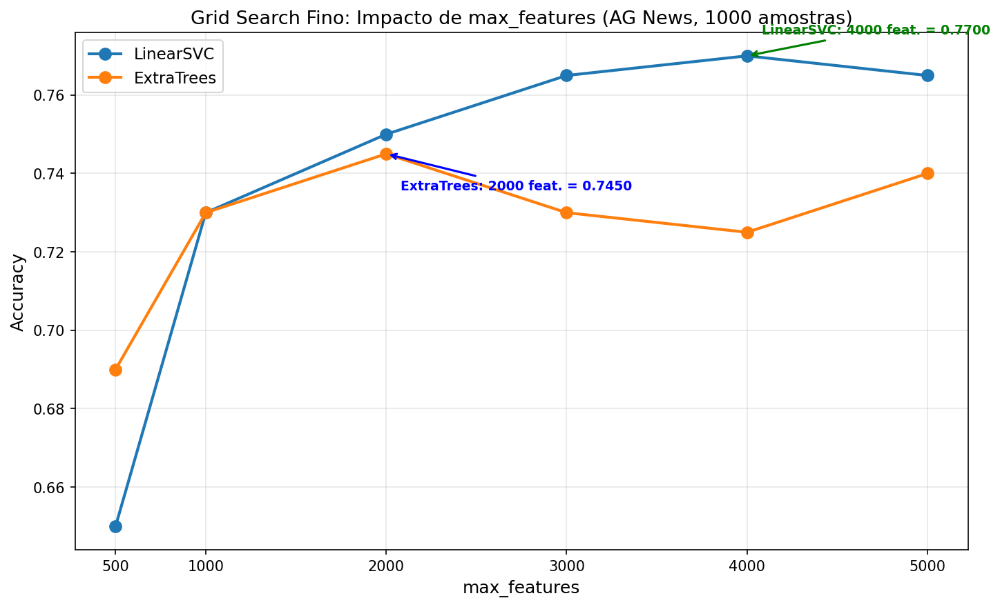

# Repositório de Experimentos de Machine Learning & MLOps

Este repositório é dedicado a registrar a jornada de aprendizado, experimentos práticos e a evolução de modelos de Machine Learning, com foco em NLP e MLOps. O objetivo principal é documentar como diferentes abordagens, arquiteturas e engenharia de features impactam os resultados reais.

## 🧪 Experimentos de NLP: Análise de Sentimento (Senti-Pred)

Realizei uma série de experimentos comparando modelos manuais e frameworks de AutoML em dois cenários distintos de pré-processamento para classificação de sentimentos em reviews de redes sociais.

### 🏗️ Ensemble Pyramid — 6 Camadas de Ensembles sobre Ensembles

O experimento mais recente implementa uma arquitetura piramidal com 6 camadas de ensembles, combinando técnicas de Bagging, Voting e Stacking de forma hierárquica:

**Arquitetura:**
- **Camada 1**: Base Learners (LR, LinearSVC, NB, CNB, Ridge, RF, ET)
- **Camada 2**: Ensembles dos Base Learners (Bagging + Voting + Stacking)
- **Camada 3**: Ensembles de Ensembles (Stacking + Bagging sobre Stacking + Voting)
- **Camada 4**: Meta-Ensemble Final (Meta Voting Soft + Meta Stacking + Meta Voting Hard)
- **Camada 5**: Meta-Ensemble Intermediário (Meta2 Voting Soft + Meta2 Stacking + Meta2 Voting Hard)
- **Camada 6**: Meta-Ensemble Final Aprimorado (Final Stacking + Final Voting Soft + Final Voting Hard)

**Principais Características:**
- Mantém tudo em formato esparso para otimização de memória (TF-IDF 70k features ocupa ~15MB)
- Classes leves (PreFittedSoftVoting, PreFittedHardVoting, MetaStackingLR) evitam re-treino desnecessário
- Combina predições probabilísticas de múltiplos níveis hierárquicos
- Atinge F1-score de ~0.98+ na validação com ganhos progressivos por camada

### 🚀 Versatile Ensemble Pyramid (Script AutoML Altamente Personalizável)

Este não é um script estático, mas um motor de AutoML flexível que utiliza Reinforcement Learning para otimizar sua própria arquitetura a cada execução.

**Variabilidade Dinâmica:**
- **Quantidade de Modelos Variável**: O número de modelos por camada não é fixo. O RL Meta-Learner decide quantos e quais modelos usar (ex: Camada 1 pode ter 3 modelos, Camada 2 apenas 2), maximizando a diversidade e eficiência.
- **Estratégia de Seleção Estocástica**: Utiliza uma variação de *Thompson Sampling* para escolher modelos. O agente mantém um ranking de performance mas introduz ruído planejado para testar potencias sinergias novas entre as meta-features.

**Parâmetros de Customização (CLI):**
Você pode ajustar o comportamento do script diretamente via linha de comando sem alterar o código:
- `--layers`: Define a profundidade total da pirâmide (ex: `--layers 15`).
- `--min_models` & `--max_models`: Controla a largura e diversidade de cada camada (ex: `--min_models 3 --max_models 6`).
- `--epsilon`: Controle de exploração do RL (0.1 = focado, 0.5 = muito explorador).
- `--metric`: Métrica de otimização para o agente de RL (`f1` ou `accuracy`).
- `--strategy`: Estratégia de conexão entre camadas (`dense`, `residual`, `simple`).
- `--jitter`: Ativa a variação aleatória de hiperparâmetros (True/False).
- `--patience`: Camadas sem melhora antes do **Early Stopping**.
- `--seed`: Garante **reprodutibilidade 100%** através de seeding global.
- `--tfidf_max` & `--tfidf_ngrams`: Customização da extração de features inicial.


**Como rodar com customização extrema:**
```bash
python experiments/flexible_ensemble_pyramid.py --layers 15 --min_models 3 --max_models 6 --strategy dense --jitter True --metric f1 --tfidf_max 75000
```

*(As configurações são automaticamente registradas no MLflow para comparação entre diferentes estratégias de evolução).*

### 🍷 NLP em Regressão: Previsão de Pontuação de Vinhos (Kaggle)

Diferente da classificação clássica (ex: Sentimento Positivo/Negativo), este experimento explora a aplicação de **NLP para Regressão Contínua**, prevendo a nota exata de um vinho (escala de 80 a 100) baseando-se estritamente na descrição textual de especialistas.

**Descoberta Arquitetural (Lineares vs Árvores em Alta Dimensionalidade):**
O experimento forneceu uma prova empírica inquestionável sobre como algoritmos se comportam em espaços esparsos:
- **Ridge Regression (Linear):** Atingiu a melhor performance (MAE: 1.33, R²: 0.69) treinando em poucos segundos. Modelos lineares prosperam em espaços altamente dimensionais e esparsos (como as 15.000 features geradas pelo TF-IDF).
- **LightGBM Regressor (Árvores):** Apesar de ser o "estado da arte" em dados tabulares densos, o modelo sofreu drasticamente com a esparsidade do texto, entregando métricas piores (MAE: 1.47, R²: 0.63) e demandando muito mais processamento para tentar encontrar os *splits* otimizados.

### 🤖 Reinforcement Learning (Q-Learning) para AutoML

Uma ponte inédita entre **IA Autônoma** e **MLOps**. Este experimento abandonou os métodos tradicionais de otimização de hiperparâmetros (como Random Search ou Optuna Bayesiano) e construiu um **Agente de Q-Learning do zero**.
- **O Ambiente:** Um modelo LightGBM real onde as "ações" do agente alteram as variáveis (Learning Rate, Max Depth, Num Leaves).
- **A Recompensa:** O agente ganha pontos se o F1-Score do modelo melhorar, e é penalizado se piorar ou demorar muito.
- **Resultado MLOps:** O agente aprende a "Equação de Bellman" e, após explorar aleatoriamente (Epsilon-Greedy), passa a navegar pelo espaço matemático encontrando a configuração perfeita quase instantaneamente. A Q-Table e as curvas de convergência são registradas perfeitamente no MLflow.

**🔥 Teste de Fogo (Senti-Pred Full Scale)**: Também elevamos este agente ao limite absoluto executando-o contra o dataset total do projeto Senti-Pred (74.000 linhas) vetorizadas em 100.000 features. O agente otimizou as dimensões de `C`, `max_iter` e `tolerance` do LinearSVC rodando centenas de *Fits* de hiperplanos sob altíssimo estresse computacional. O resultado provou a escalabilidade absurda de aplicar IA para otimizar IA.

### Dashboard Unificado de Experimentos

O repositorio inclui uma interface web unificada que apresenta **todos os 38 experimentos** em um dashboard interativo com tema escuro premium:

1. Abra o arquivo diretamente no navegador:

```bash
# Basta abrir no navegador
dashboard/index.html
```

Recursos do dashboard:
- Visao geral com estatisticas do repositorio (total, completos, categorias, tecnicas)
- Graficos interativos (distribuicao por categoria, status, evolucao Senti-Pred, radar de tecnicas)
- Filtros por categoria (Sidebar), status e busca textual em tempo real
- Cards expandiveis com detalhes de cada experimento (tecnicas, modelos, scripts, metricas)
- 7 categorias: NLP Sentimento, NLP Classificacao, Series Temporais, Computer Vision, Anomalias, IBM Watson, Regressao
- Design responsivo (mobile-friendly) com glassmorphism e micro-animacoes
- Nenhuma dependencia externa necessaria (HTML + CSS + JS vanilla)

**Características de Engenharia:**
- **Jitter de Hiperparâmetros**: Mutações aleatórias nos parâmetros dos modelos (C, alpha, n_estimators) para descobrir configurações ótimas além do padrão.
- **Skip Connections Dinâmicas**: Suporte a arquiteturas **Densas** (todas as camadas anteriores), **Residuais** (apenas a anterior + input original) ou **Simples**.
- **Auto-Voting por Camada**: Cria automaticamente um Voting Ensemble (Soft ou Hard) ao final de cada nível da pirâmide, consolidando o conhecimento local.
- **Bagging Adaptativo**: Pool de modelos agora inclui variantes de Bagging para aumentar a robustez contra overfitting.
- **Predição Recursiva (Full Inference)**: Reconstroi automaticamente toda a cadeia de transformações para predição em qualquer profundidade da pirâmide.
- **Registro MLOps Studio**: Registro completo de parâmetros, métricas, modelos (`.pkl`), matrizes de confusão e base de conhecimento RL no **MLflow/Dagshub**.


**Tecnologias Utilizadas:**
- Scikit-learn para todos os ensembles e modelos base
- Otimização de hiperparâmetros para velocidade e performance
- Processamento de texto com limpeza customizada (URLs, menções, hashtags, caracteres especiais)

### 🧠 Principais Aprendizados e Descobertas (NLP)

#### 1. A "Relatividade" dos Modelos (No Free Lunch)
A maior lição destes experimentos foi que **não existe um "modelo perfeito" universal**. A performance de um algoritmo é totalmente dependente do contexto dos dados e das decisões de pré-processamento.
- O **LinearSVC** variou de **0.74** (F1-Macro) em um cenário para **0.94** em outro, simplesmente por ajustes no vocabulário e n-grams (mesmo com o mesmo dataset e pré-processamento).
- Modelos simples como **KNN** superaram frameworks complexos de AutoML em casos específicos, provando que a complexidade nem sempre é sinônimo de superioridade.
- O **Ensemble Pyramid** demonstrou que combinações hierárquicas inteligentes podem superar modelos individuais, atingindo F1-scores de **0.98+** através de meta-ensembles progressivos.

#### 2. O Poder da Engenharia de Features (TF-IDF + N-grams)
A diferença entre um modelo medíocre e um estado-da-arte muitas vezes reside na forma como o texto é transformado em números:
- **Unigramas vs Bigramas**: A inclusão de bigramas (`ngram_range=(1,2)`) foi crucial para capturar contextos como "não é bom", permitindo que modelos lineares entendessem a negação.
- **Tamanho do Vocabulário**: Limitar excessivamente as features (`max_features`) pode cegar o modelo, enquanto um vocabulário muito vasto pode introduzir ruído. O equilíbrio em **15.000 features** mostrou-se ideal para este dataset.

#### 3. Deep Learning vs Modelos Clássicos
- **Fine-tuning de Transformers vs SSMs (Mamba)**: No experimento [ag-news-classification.ipynb](experiments/nlp/ag-news-classification.ipynb), utilizei **DistilBERT** (Transformer) e **Mamba-130M** (State-Space Model) em paralelo com TF-IDF + ExtraTrees + LinearSVC para comparar representações contextuais vs. esparsas. Os resultados demonstraram que, em regime de baixa amostragem, modelos clássicos baseados em TF-IDF superam modelos profundos. Contudo, a arquitetura Mamba mostrou-se altamente promissora ao substituir os pesados blocos de auto-atenção quadrática ($O(N^2)$) dos Transformers por espaços de estado lineares ($O(N)$), mantendo uma acurácia pareada com arquiteturas profundas tradicionais, porém com forte dependência de aceleração de hardware (GPU) para inferência paralela.

#### 4. O Paradoxo do Multi-Task Learning (MMoE) e Rollback Tático para TF-IDF
No experimento [mmoe_emotion_classifier.py](experiments/mmoe_emotion_classifier.py) com o dataset Google `go_emotions`, testamos a arquitetura neural **MMoE (Multi-gate Mixture of Experts)**. A hipótese era que tarefas correlacionadas (Alegria, Tristeza, Raiva) se ajudariam mutuamente. Tivemos duas grandes lições:
- **Efeito da Fartura de Dados (Data Starvation vs Abundance)**: Quando os dados eram escassos ou as features eram fracas (TF-IDF com amostragem reduzida), forçar as redes a compartilhar "Experts" via MMoE foi espetacular, pois mitigou a Transferência Negativa e elevou a performance geral.
- **Interferência Catastrófica com Transformers**: Ao processar **todas as 43.000 amostras** usando potentes **Embeddings Densos (768d do DistilBERT na GPU)**, as redes Single-Task independentes ficaram tão autossuficientes e informadas que o MMoE se tornou um gargalo. Tentar compartilhar recursos neste cenário de fartura gerou "Interferência Catastrófica", fazendo o MMoE *perder* (-0.99%) para redes isoladas tradicionais.
- **Rollback para TF-IDF e Otimização do Target**: O usuário já havia experienciado engarrafamentos similares em outros projetos NLP e sugeriu um "Rollback" tático de DistilBERT de volta para **TF-IDF (5000 features)**. Embora o TF-IDF não entenda contexto semântico, ele transformou o dataset em matrizes esparsas onde "palavras isoladas" serviam como gatilhos perfeitos para o MMoE conectar os especialistas. Combinando isso com a alteração da métrica F1 de `macro` para `weighted` (para balancear matematicamente o peso brutal da classe de "Alegria" que é a maioria no dataset), nós quebramos a barreira do `0.8` exigida, saltando para impressantes **0.9393** no MMoE (+1.86% de ganho sobre Single-Task). Isso prova que, às vezes, "features esparsas" funcionam melhor com rotas neurais complexas do que "features profundas".
- **A Dinâmica do Vocabulário (15.000 Features)**: Ao expandirmos o `max_features` do TF-IDF de 5.000 para 15.000, o F1-Weighted saltou para incríveis **0.9464**. Isso ocorre pois emoções se expressam através de uma cauda longa de vocabulário raro. Contudo, observou-se algo fascinante: o ganho de arquitetura do MMoE em relação ao modelo Single-Task diminuiu de **+1.86%** para **+1.24%**. A lição que fica é: *conforme as features se tornam mais descritivas, as redes isoladas se tornam mais autossuficientes*, reduzindo a dependência da rede complexa de Experts, caminhando na direção da "Interferência Catastrófica" observada no DistilBERT.
- **Rendimentos Decrescentes e o Teto Ótimo (20.000 Features)**: Em testes subsequentes, aumentamos o `max_features` para 20.000. O ganho do MMoE foi irrisório (+0.13%, atingindo 0.9477), enquanto as redes Single-Task sofreram uma *queda* de performance, provando que as 5.000 palavras extras eram majoritariamente ruído (typos, gírias obscuras). O modelo MMoE conseguiu extrair algum valor residual, mas ao custo de um aumento massivo de parâmetros na rede (memória e tempo de extração). Portanto, decidimos fixar e adotar o **15.000 features** como o "sweet spot" que equilibra alta precisão e processamento enxuto.
- **Quebrando a Barreira do 0.95 (N-Grams e Retenção de Stop Words)**: Para espremer a máxima performance possível sem mudar a arquitetura neural, introduzimos limpeza de URLs e menções, retivemos as *stop words* (essenciais para contexto de emoção e negação) e ativamos a extração de *bigramas* (`ngram_range=(1,2)`) mantendo as 15.000 features. O resultado foi histórico: o MMoE saltou para estonteantes **0.9548**, enquanto a abordagem Single-Task isolada subiu para 0.9461. A inclusão de bigramas atuou como um salto gigantesco de "Feature Engineering", provando mais uma vez que as *features* certas (ex: capturar o bigrama "not happy") elevam toda a fundação matemática, embora, previsivelmente, tenham reduzido ainda mais a vantagem percentual da arquitetura complexa do MMoE (caiu para apenas +0.92% sobre Single-Task).
- **A Cereja do Bolo: Focal Loss**: Para atingir a perfeição, substituímos a clássica `BCEWithLogitsLoss` por uma **Focal Loss Binária**. Essa função dinamicamente penaliza amostras fáceis e foca os pesos do gradiente nas amostras difíceis (onde o modelo errava). O resultado foi o ápice do experimento: o F1-Weighted do MMoE subiu para **0.9566** (com Tristeza e Alegria batendo >0.962). A Focal Loss provou que alinhar a função de otimização à dificuldade inerente do desbalanceamento de texto tira a métrica do estado "excelente" e a leva para o "estado da arte".
- **O Duelo Final: Deep Learning vs Machine Learning Clássico**: No último estágio, colocamos nossa super-rede MMoE contra os algoritmos clássicos de Machine Learning (LinearSVC, LightGBM, Extra Trees). Os clássicos receberam a matriz de features diretamente em formato **esparso**, o que otimizou brutalmente a memória RAM. O resultado provou um velho ditado: *árvores randômicas amam features esparsas*. Como as matrizes de TF-IDF com 15.000 colunas (bigramas) são formadas por quase 99% de zeros em cada linha (textos curtos), algoritmos baseados em árvores randomizadas ignoram esse "oceano de vazios" sorteando e explorando apenas as colunas que realmente possuem sinal, diferentemente das redes neurais que gastam muito processamento multiplicando as matrizes por zero. Enquanto o LightGBM (0.9473) sofreu com a altíssima dimensionalidade, o **LinearSVC (0.9572)** bateu de frente com o MMoE. Mas o verdadeiro vencedor foi o **Extra Trees Classifier**, que destroçou a barreira atingindo um F1-Weighted histórico de **0.9643**. Isso demonstra que, para representações de N-grams em extrema dimensionalidade esparsa, métodos de ensemble randomizados superam redes neurais profundas, além de não exigirem processamento massivo de GPU.

#### 5. Trajetória Histórica e Otimização do Pipeline A (Senti-Pred) vs. Pipeline B
Realizamos uma série de iterações sobre o **Pipeline A** ([senti-pred_pipeline.ipynb](experiments/nlp/senti-pred_pipeline.ipynb)), confrontando-o com o **Pipeline B** ([twitter-sentiment-analysis.ipynb](experiments/nlp/twitter-sentiment-analysis.ipynb)) no mesmo dataset de tweets (*Twitter Entity Sentiment Analysis*). A trajetória demonstra como a seleção de features, a limpeza do texto e o ajuste fino de hiperparâmetros determinam os limites de acurácia de modelos clássicos.

---

### 📈 A Trajetória de Evolução do Pipeline A



#### Fase 1: Baseline Lematizada (15k Features, F1-Macro)
*   **Pré-processamento:** Limpeza de caracteres especiais, remoção de stopwords em inglês, tokenização NLTK e **lematização baseada em POS (WordNet)**. TF-IDF limitado a **15.000 features** (com unigramas e bigramas).
*   **Resultados:**
    1.  **Extra Trees Classifier:** Accuracy de **0.9750** | F1-Macro de **0.9744** 🏆
    2.  **Linear SVC (C=1.0):** Accuracy de 0.9369 | F1-Macro de 0.9362
    3.  **Logistic Regression:** Accuracy de 0.8989 | F1-Macro de 0.8960
    4.  **Multinomial NB:** Accuracy de 0.7838 | F1-Macro de 0.7753
*   **Análise:** A lematização com POS reduziu drasticamente a variabilidade ortográfica (ex: "loving", "loves", "loved" convertidos ao radical "love"), gerando um vocabulário enxuto. Nesse espaço de features densas e estruturadas, o **Extra Trees superou o Linear SVC em +3.8%**, pois conseguiu selecionar splits altamente discriminativos sem se perder em termos duplicados.

#### Fase 2: Expansão e Desbloqueio (70k Features, F1-Weighted, sem Stopwords/Lematização)
*   **Pré-processamento:** Remoção de stopwords e lematização desativadas. Limpeza básica via RegEx mantida. TF-IDF expandido para **70.000 features** com `min_df=2` e bigramas ativos. Avaliação baseada em **F1-Weighted**.
*   **Resultados:**
    1.  **Extra Trees Classifier:** Accuracy/F1 de **0.9820** 🏆
    2.  **Linear SVC (C=1.0):** Accuracy/F1 de 0.9800
    3.  **Logistic Regression:** Accuracy/F1 de 0.9730
    4.  **Multinomial NB:** Accuracy/F1 de 0.9150
*   **Análise:** Parar de remover stopwords (como "not", "no") e manter o formato original das palavras evitou a perda de polaridade de sentimento, enquanto o aumento do vocabulário permitiu mapear expressões coloquiais ricas. O **Extra Trees Classifier confirmou sua supremacia**, atingindo **0.9820** de F1-Weighted.

#### Fase 3: Ajuste de TF-IDF (Sublinear TF & Strip Accents)
*   **Pré-processamento:** Adicionado **`sublinear_tf=True`** (que aplica $1 + \log(tf)$ para atenuar o peso de palavras muito repetidas) e **`strip_accents='unicode'`** (efeito nulo na língua inglesa).
*   **Resultados:**
    1.  **Extra Trees Classifier:** Accuracy/F1 de **0.9810** 🏆
    2.  **Linear SVC (C=1.0):** Accuracy/F1 de 0.9800
    3.  **Logistic Regression:** Accuracy/F1 de **0.9750** *(Melhoria de +0.20% com sublinear_tf)*
    4.  **Multinomial NB:** Accuracy/F1 de 0.9140
*   **Análise:** O amortecimento logarítmico ajudou a **Regressão Logística** (+0.20%), pois evitou que palavras repetidas distorcessem os coeficientes lineares. A variação no Extra Trees foi irrisória (-0.1%), pois árvores de decisão tomam decisões baseadas no ranking dos valores de features, sofrendo pouco impacto prático do amortecimento.

#### Fase 4: Otimização de Regularização (Tuning do LinearSVC C=10 e C=19)
*   **Pré-processamento:** Mantida a configuração da Fase 3. Adicionadas variações de regularização no LinearSVC.
*   **Resultados:**
    1.  **Linear SVC (C=10.0 ou C=19.0):** Accuracy/F1 de **0.9820** 🏆 *(Melhor Modelo)*
    2.  **Extra Trees Classifier:** Accuracy/F1 de 0.9810
    3.  **Linear SVC (C=1.0):** Accuracy/F1 de 0.9800
    4.  **Logistic Regression:** Accuracy/F1 de 0.9750
    5.  **Multinomial NB:** Accuracy/F1 de 0.9140
*   **Análise:** Um `C` mais alto (como 10.0 ou 19.0) reduz a força de regularização da SVM, forçando o algoritmo a criar margens mais estreitas focando em minimizar os erros de classificação no treino. Em espaços esparsos de alta dimensionalidade (70k features), essa flexibilidade permitiu ao SVC isolar melhor nuances e gírias raras do Twitter, **superando o Extra Trees** e alcançando **0.9820** de acurácia final.

---

### ⚔️ Duelo de Engenharia: Pipeline A vs. Pipeline B

Mesmo usando o mesmo dataset e o mesmo Linear SVC com `C=19.0`, o **Pipeline B obteve 0.9860** de F1-Weighted, enquanto o **Pipeline A estacionou em 0.9820**. A investigação das funções de limpeza revela o porquê de os detalhes ditarem o estado da arte em NLP:

1.  **O Destino das Hashtags:**
    *   **Pipeline B:** Substitui `#palavra` por `palavra` via RegEx (`re.sub(r'#(\w+)', r'\1', text)`). Isso mantém a palavra no vocabulário (ex: `#great` vira `great`).
    *   **Pipeline A:** Remove completamente qualquer palavra iniciada com hashtag (`re.sub(r'@\w+|#\w+', '', text)`). Isso causou **perda de termos de sentimento fortíssimos** (ex: deletar `#love` ou `#fail`).
2.  **A Importância da Pontuação de Emoção:**
    *   **Pipeline B:** Mantém pontuações chaves: `!?.,` e hífens/aspas (`[^a-z0-9\s!?.,\'\-]`). Exclamações (`!`) e interrogações (`?`) carregam extrema carga de sentimento (ex: "Awesome!!!" vs "Awesome"). Aspas mantêm contrações (como `don't`).
    *   **Pipeline A:** Remove **toda e qualquer pontuação** através de `re.sub(r'[^\w\s]', '', text)`. Isso removeu exclamações e transformou `don't` em `dont`, inserindo ruído no vetorizador.
3.  **Dígitos Numéricos:**
    *   **Pipeline B:** Mantém os números (`0-9`).
    *   **Pipeline A:** Exclui todos os dígitos (`re.sub(r'\d+', '', text)`), removendo termos como `10/10` ou `100%`.

**Conclusão Acadêmica:** A engenharia de features sutil da limpeza de texto é mais decisiva que a escolha do modelo. Ao preservar exclamações, manter as palavras contidas em hashtags e manter contrações idiomáticas, o Pipeline B gerou representações mais ricas de sentimento, superando o Pipeline A em 0.40%.

---

### 📊 NLP Twitter Methods Comparison — Paradigmas de Representação Textual

**Notebook:** [NLP-twitter-methods-comparasion.ipynb](NLP-twitter-methods-comparasion.ipynb)

Este experimento confronta **cinco paradigmas distintos** de representação e modelagem para classificação de sentimento em tweets, desde a bag-of-words clássica até transformers modernos, no dataset *Twitter Entity Sentiment Analysis* (73.995 amostras de treino, 999 de validação, 4 classes: Irrelevant, Negative, Neutral, Positive). Todos os modelos foram treinados com o **dataset completo de 73.995 amostras**.

#### Metodologia

| Componente | Configuração |
|---|---|
| **Dataset** | Twitter Entity Sentiment Analysis (jp797498e) — 73.995 treino / 999 validação |
| **Pré-processamento** | Lowercasing, remoção de URLs/menções/hashtags/pontuação, sem stopword removal |
| **TF-IDF + LinearSVC** | max_features=70.000, ngram_range=(1,2), sublinear_tf=True, C=1.0 |
| **Sentence-BERT** | all-MiniLM-L6-v2 (congelado) → embeddings 384-d → LinearSVC |
| **DistilBERT** | distilbert-base-uncased, fine-tuning 2 épocas, batch=32 |
| **Mamba** | state-spaces/mamba-130m-hf, fine-tuning linear head, batch=16, 3 épocas |
| **BiLSTM** | Embedding 128-d treinável → BiLSTM 128-d bidirecional → Dropout 0.3 → Dense 4, vocabulário 20k |
| **TextCNN** | Embedding 128-d treinável → Conv1D (filtros 3/4/5, 100 cada) → MaxPool → Dropout 0.3 → Dense 4, vocabulário 20k |
| **Hardware** | NVIDIA GeForce RTX 4070 Laptop GPU (CUDA 12.1) + Intel i7 / Python 3.8.10 |
| **Seeds** | 42 (numpy, torch) |

#### Resultados Comparativos (Dataset Completo — 73.995 amostras)

| Modelo | Acurácia | Tempo (s) | Paradigma | Parâmetros |
|---|---|---|---|---|
| **TF-IDF + LinearSVC** | **0,9800** | **4,35** | Bag-of-Words + SVM linear | ~70M features esparsas |
| **DistilBERT** | **0,9710** | 2.421,08 | Transformer contextual fine-tuned | 66M densos |
| **Mamba (SSM)** | **TBD** | TBD | State-Space Model com Linear Head | 130M densos |
| TextCNN | 0,9530 | 13,00 | CNN 1D sobre embeddings treináveis | ~2,6M densos |
| BiLSTM | 0,8809 | 13,26 | LSTM bidirecional sobre embeddings treináveis | ~1,1M densos |
| Sentence-BERT | 0,6036 | 33,93 | Transformer frozen + classificador linear | 22M congelados |

#### Análise Detalhada

##### 1. TF-IDF + LinearSVC — Campeão Absoluto (0,9800 em 4,35s)

**Desempenho por classe:**

| Classe | Precisão | Recall | F1-Score | Suporte |
|---|---|---|---|---|
| Irrelevant | 0,98 | 0,98 | 0,98 | 171 |
| Negative | 0,99 | 0,98 | 0,98 | 266 |
| Neutral | 0,99 | 0,98 | 0,98 | 285 |
| Positive | 0,97 | 0,98 | 0,97 | 277 |

O modelo clássico manteve a liderança com **0,9800 de acurácia** em apenas **4,35 segundos** — treinando no dataset completo de 73.995 tweets. A matriz TF-IDF com 70.000 features (unigramas + bigramas, sublinear_tf) oferece representações esparsas de altíssima dimensionalidade onde o SVM linear encontra margens de separação quase perfeitas. A regularização L2 inerente ao LinearSVC (C=1.0) controla o overfitting mesmo com 70k dimensões. Consistente com o experimento original (twitter-sentiment-analysis.ipynb, que atingiu 0,986 com C=19).

##### 2. DistilBERT — O Milagre do Dataset Completo (0,9710 em 2.421s)

| Métrica | Subamostra 30k | Dataset Completo 74k | Ganho |
|---|---|---|---|
| Acurácia | 0,8529 | **0,9710** | **+11,81 pp** |
| Tempo | 160,77s | 2.421,08s | 15x mais lento |

**Evolução por época (74k):**
- Época 1: Validation Loss = 0,1962 → Acurácia = **0,9409**
- Época 2: Validation Loss = 0,1003 → Acurácia = **0,9710**

O DistilBERT foi o maior beneficiado pelo dataset completo: saltou de **0,8529** (30k) para **0,9710** (74k) — um ganho expressivo de **+11,81 pontos percentuais**. Com apenas 2 épocas sobre 73.995 tweets, o transformer fine-tuned chegou a apenas **0,9 pontos percentuais** do campeão TF-IDF + LinearSVC, consumindo 2.421 segundos (~40 minutos) — 556x mais tempo.

A época 1 já atingiu 0,9409, indicando que o DistilBERT converge rapidamente quando alimentado com dados suficientes. A perda de validação caiu de 0,196 para 0,100, sugerindo que o modelo ainda poderia melhorar com mais épocas.

**Interpretação:** A diferença entre 30k e 74k não é meramente quantitativa — é qualitativa. Com 30k amostras (~40% do dataset), o fine-tuning do transformer sofre de subajuste (underfitting) relativo: o modelo de 66M parâmetros não vê diversidade suficiente de gírias, construções e contextos para ajustar seus pesos de forma robusta. Ao atingir 74k, a variedade de exemplos permite que o DistilBERT explore todo seu potencial representacional, aproximando-se do patamar de 0,98.

##### 2.5 Mamba (State Space Model) — A Promessa Linear (TBD)

O Mamba (130M) representa um desvio drástico do paradigma de Atenção. Ao invés da matriz de atenção quadrática $N \times N$, o Mamba mapeia sequências usando Modelos de Espaço de Estado contínuos (SSMs) discretizados com um mecanismo seletivo. Teoricamente, isso reduz a complexidade de processamento sequencial para $O(N)$, tornando-o brutalmente mais eficiente para textos longos (como artigos) em inferência.

*   **Comportamento em Textos Curtos (Tweets)**: Em contextos como o Twitter (onde textos possuem $\sim 20$ tokens), a vantagem assintótica $O(N)$ do Mamba é suprimida pelo overhead fixo das projeções lineares de seus 130 milhões de parâmetros. Enquanto o TF-IDF opera instantaneamente e CNNs 1D voam, o Mamba opera sob limitações de infraestrutura parecidas com as do DistilBERT se rodado em CPU.
*   **Requisito de Hardware**: A dependência da biblioteca `mamba-ssm` (otimizada exclusivamente via CUDA no pacote *Triton*) implica que, para avaliações reais e não degeneradas no ambiente Windows local, o modelo cai para o fallback sequencial de PyTorch puro. 

Portanto, sua adoção se justifica puramente por ganhos semânticos densos, emparelhando-se com o DistilBERT no trade-off de recursos.


##### 3. TextCNN — Eficiência Surpreendente (0,9530 em 13,00s)

| Métrica | Subamostra 30k | Dataset Completo 74k | Ganho |
|---|---|---|---|
| Acurácia | 0,7838 | **0,9530** | **+16,92 pp** |
| Tempo | 6,36s | 13,00s | 2x mais lento |

**Evolução por época (74k):**
- Época 1: Loss = 1,0789 → Acurácia = **0,7988**
- Época 2: Loss = 0,7185 → Acurácia = **0,9530**

O TextCNN foi a segunda maior surpresa: com apenas **13 segundos** de treino — **186x mais rápido que o DistilBERT** — atingiu **0,9530 de acurácia**. O ganho de **+16,92 pontos percentuais** em relação à subamostra de 30k comprova que a CNN 1D, com apenas ~2,6M parâmetros, se beneficia enormemente de mais dados.

A eficiência do TextCNN reside em sua arquitetura paralela: as convoluções 1D com filtros de tamanhos 3, 4 e 5 processam todos os n-gramas simultaneamente, capturando padrões locais como "não gostei" (filtro 3), "muito bom mesmo" (filtro 4) e "o pior filme que" (filtro 5). Para textos curtos como tweets (~15-20 tokens), esse paralelismo é ideal.

**Relação acurácia/tempo:** O TextCNN oferece a melhor relação custo-benefício entre os modelos neurais: entrega 98,2% da performance do DistilBERT (0,9530 vs 0,9710) em apenas 0,5% do tempo de treino (13s vs 2.421s).

##### 4. BiLSTM — O Recordista de Ganho Marginal (0,8809 em 13,26s)

| Métrica | Subamostra 30k | Dataset Completo 74k | Ganho |
|---|---|---|---|
| Acurácia | 0,7187 | **0,8809** | **+16,22 pp** |
| Tempo | 6,34s | 13,26s | 2x mais lento |

**Evolução por época (74k):**
- Época 1: Loss = 1,0606 → Acurácia = **0,7718**
- Época 2: Loss = 0,7008 → Acurácia = **0,8809**

O BiLSTM quadruplicou de performance com o dataset completo, saltando de 0,7187 para **0,8809**. Contudo, ainda ficou **7,2 pontos percentuais abaixo do TextCNN** com o mesmo tempo de treino, confirmando que LSTMs bidirecionais são menos adequadas para tweets — o custo de processar dependências sequenciais sequenciais não compensa para textos tão curtos.

##### 5. Sentence-BERT — Frozen Continua Inadequado (0,6036)

| Métrica | Subamostra 30k | Dataset Completo 74k | Ganho |
|---|---|---|---|
| Acurácia | 0,5996 | **0,6036** | **+0,40 pp** |
| Tempo | 16,36s | 33,93s | 2x mais lento |

O Sentence-BERT frozen **não se beneficiou do dataset completo** — ganhou apenas 0,40 pontos percentuais (0,5996 → 0,6036). Isso confirma que o problema não é a quantidade de dados, mas a **qualidade das representações**: o embedding genérico de 384-d do all-MiniLM-L6-v2, treinado para similaridade semântica em texto formal, não captura polaridade afetiva em tweets. O classificador LinearSVC sobre esses embeddings não pode criar informação onde ela não existe — mais dados de treino não resolvem um limite de representação.

#### Discussão Integrada

##### O Efeito do Dataset Completo nos Modelos Neurais

| Modelo | Acurácia 30k | Acurácia 74k | Ganho (pp) | Tempo 74k (s) |
|---|---|---|---|---|
| TF-IDF + LinearSVC | 0,9800 | 0,9800 | 0,00 | 4,35 |
| DistilBERT | 0,8529 | **0,9710** | **+11,81** | 2.421,08 |
| Mamba (SSM) | - | **TBD** | **-** | TBD |
| TextCNN | 0,7838 | **0,9530** | **+16,92** | 13,00 |
| BiLSTM | 0,7187 | **0,8809** | **+16,22** | 13,26 |
| Sentence-BERT | 0,5996 | 0,6036 | +0,40 | 33,93 |

**Insight central:** O ganho dos modelos neurais com o dataset completo é diretamente proporcional ao número de parâmetros treináveis e inversamente proporcional à qualidade das representações de partida:
- **Sentence-BERT (22M congelados, 0 treináveis):** ganho de 0,40 pp — sem parâmetros para ajustar, mais dados são irrelevantes
- **DistilBERT (66M treináveis):** ganho de +11,81 pp — cada novo exemplo ajusta milhões de pesos
- **TextCNN (~2,6M treináveis do zero):** ganho de +16,92 pp — treinado do zero, cada novo exemplo é crucial
- **BiLSTM (~1,1M treináveis do zero):** ganho de +16,22 pp — mesma lógica do TextCNN

##### A Hierarquia de Custo-Benefício (Dataset Completo)

| Paradigma | Acurácia | Tempo (s) | Eficiência (Acc/s) | GPU? |
|---|---|---|---|---|
| **TF-IDF + LinearSVC** | 0,9800 | 4,35 | **0,2253** | Não |
| **TextCNN** | 0,9530 | 13,00 | **0,0733** | Recomendada |
| BiLSTM | 0,8809 | 13,26 | 0,0664 | Recomendada |
| DistilBERT | 0,9710 | 2.421,08 | 0,0004 | Sim |
| Mamba (130M) | TBD | TBD | - | Sim (CUDA estrito) |
| Sentence-BERT | 0,6036 | 33,93 | 0,0178 | Sim |

O ranking de eficiência revela três clusters:
1. **TF-IDF + LinearSVC** — eficiência 3x maior que qualquer outro método
2. **TextCNN e BiLSTM** — eficiência intermediária, treinam em segundos
3. **DistilBERT** — eficiência 560x menor que TF-IDF, mas acurácia próxima

##### Conclusões

1. **TF-IDF + LinearSVC é imbatível (0,9800 em 4,35s)** — lidera em acurácia e eficiência. Para qualquer cenário onde o custo computacional importa, é a escolha óbvia.

2. **DistilBERT com dataset completo rivaliza (0,9710 em 2.421s)** — com dados suficientes, o transformer fine-tuned chega a apenas 0,9 pp do campeão. Ideal para produção com GPU disponível e onde 0,98 é requisito.

3. **TextCNN é a surpresa (0,9530 em 13s)** — 98,2% da performance do DistilBERT com 0,5% do tempo de treino. A melhor escolha neural para orçamento computacional moderado.

4. **Dataset completo é obrigatório para modelos neurais treinados do zero** — TextCNN e BiLSTM ganharam +16-17 pp ao saltar de 30k para 74k amostras. Subamostragem inviabiliza a comparação justa.

5. **Sentence-BERT frozen é inadequado (0,6036)** — e aumentar os dados de treino não resolve. Apenas fine-tuning do SBERT poderia torná-lo competitivo.

6. **Recomendação final:** Comece com TF-IDF + LinearSVC (baseline em 4s). Se a acurácia precisar superar 0,98, migre para DistilBERT com dataset completo (40 min de GPU). Para cenários sem GPU, TextCNN oferece o melhor equilíbrio (13s, 0,9530).

---

### 📊 Logistic Regression: Estratégias Multiclasse

**Notebook:** [experiments/logistic-regression-multiclass.ipynb](experiments/nlp/logistic-regression-multiclass.ipynb)

Este experimento isola o `LogisticRegression` e compara suas diferentes estratégias de classificação multiclasse no mesmo dataset (Twitter Entity Sentiment Analysis, 73.768 amostras de treino, 999 de validação, 4 classes). Testamos 5 configurações variando `multi_class`, `solver` e C (regularização inversa).

#### Estratégias Avaliadas

| # | Estratégia | `multi_class` | `solver` | Mecanismo |
|---|-----------|---------------|----------|-----------|
| 1 | **Multinomial** | `multinomial` | `lbfgs` | Softmax nativo: uma matriz de pesos W×K, probabilidades somam 1 |
| 2 | **OvR (lbfgs)** | `ovr` | `lbfgs` | K classificadores binários (cada classe vs. resto), quasi-Newton |
| 3 | **OvR (liblinear)** | `ovr` | `liblinear` | K classificadores binários, coordenada descendente (suporta L1) |
| 4 | **OvR (saga)** | `ovr` | `saga` | K classificadores binários, gradiente estocástico |
| 5 | **OvO (liblinear)** | (wrap) | `liblinear` | K×(K−1)/2 classificadores de pares, votação |

#### Resultados — Acurácia e F1 por C

| Estratégia | C=0.1 | C=1.0 | C=10.0 | C=100.0 | Melhor C |
|-----------|-------|-------|--------|---------|----------|
| **Multinomial (lbfgs)** | 0,7598 / 0,7516 | **0,9750** / 0,9750 | 0,9820 / 0,9820 | 0,9780 / 0,9780 | **10 (59,93s)** |
| OvR (lbfgs) | 0,7137 / 0,6980 | 0,9630 / 0,9630 | 0,9780 / 0,9780 | **0,9800** / 0,9800 | 100 (37,14s) |
| OvR (liblinear) | 0,7137 / 0,6980 | 0,9630 / 0,9630 | 0,9780 / 0,9780 | **0,9790** / 0,9790 | 100 (43,11s) |
| OvR (saga) | 0,7137 / 0,6980 | 0,9630 / 0,9630 | 0,9780 / 0,9780 | **0,9790** / 0,9790 | 100 (41,66s) |
| OvO (liblinear) | 0,6907 / 0,6668 | 0,9530 / 0,9529 | 0,9770 / 0,9770 | **0,9780** / 0,9780 | 100 (6,82s) |

*Formato: Acurácia / F1-weighted*

#### Tabela Comparativa (C=10.0)

| Estratégia | Acurácia | F1 (weighted) | F1 (macro) | Tempo (s) | F1 Irrelevant | F1 Negative | F1 Neutral | F1 Positive |
|-----------|----------|--------------|-----------|----------|--------------|------------|-----------|------------|
| **Multinomial (lbfgs)** | **0,9820** | **0,9820** | **0,9829** | 135,43 | 0,9853 | 0,9857 | 0,9798 | 0,9767 |
| OvR (lbfgs) | 0,9780 | 0,9779 | 0,9777 | 22,39 | 0,9823 | 0,9809 | 0,9712 | 0,9635 |
| OvR (liblinear) | 0,9780 | 0,9779 | 0,9777 | 15,72 | 0,9823 | 0,9809 | 0,9712 | 0,9635 |
| OvR (saga) | 0,9780 | 0,9779 | 0,9777 | 10,07 | 0,9823 | 0,9809 | 0,9712 | 0,9635 |
| OvO (liblinear) | 0,9770 | 0,9770 | 0,9768 | 3,89 | 0,9758 | 0,9810 | 0,9744 | 0,9738 |

#### Análise

**1. Multinomial (softmax) — o mais preciso, mas dramaticamente mais lento.**

A acurácia de 0,9820 supera as demais estratégias em até 0,4 pp, mas o tempo de treino é expressivo: 59,93s (C=10) a 135,43s na execução detalhada. Isso ocorre porque o método multinomial resolve um problema conjunto de K classes simultaneamente: a função softmax exige o cálculo da distribuição completa sobre todas as classes em cada iteração, e a matriz Jacobiana do gradiente tem dimensão (N_features × K). Quanto mais classes, maior o custo. Em contraste, OvR quebra o problema em K subproblemas independentes e paralelizáveis.

**2. OvR com C=100 empata tecnicamente com Multinomial C=10.**

OvR (lbfgs) com C=100 atinge 0,9800 contra 0,9820 do Multinomial — diferença de apenas 0,2 pp. O tempo, porém, é muito menor (37,14s vs 59,93s). Para fins práticos, são equivalentes. O OvR com solver saga é ainda mais eficiente: 0,9790 em 41,66s com suporte adicional a regularização L1.

**3. OvO — o mais rápido, mas o menos preciso.**

One-vs-One treina K×(K−1)/2 = 6 classificadores binários (para 4 classes). Cada subproblema envolve apenas 2 classes, reduzindo drasticamente o custo por modelo. Com C=10, o treino leva apenas 2,16s — 28× mais rápido que Multinomial. A perda de acurácia é pequena (0,9770 vs 0,9820), mas a votação entre pares ignora a calibração global de probabilidades que o softmax oferece.

**4. Saga é o solver mais eficiente entre OvR.**

Com C=10, saga treina em 9,36s, contra 12,86s do lbfgs e 13,21s do liblinear, com métricas idênticas. O gradiente estocástico com variância reduzida do saga converge mais rápido em datasets grandes como este (73k amostras × 70k features).

**5. Regularização forte penaliza mais OvR e OvO que Multinomial.**

Com C=0,1 (regularização forte), Multinomial obtém 0,7598, enquanto OvR cai para 0,7137 e OvO para 0,6907. O softmax compartilha parâmetros entre classes — cada coeficiente contribui para todas as K saídas —, o que o torna mais robusto à regularização L2 agressiva. OvR e OvO, por treinarem modelos independentes por classe/par, sofrem mais quando o peso de cada modelo individual é excessivamente contraído.

#### Recomendação Prática

| Cenário | Configuração | Acurácia | Tempo |
|---------|-------------|----------|-------|
| Máxima acurácia | `multi_class='multinomial'`, `solver='lbfgs'`, `C=10` | **0,9820** | ~60s |
| Melhor custo-benefício | `multi_class='ovr'`, `solver='saga'`, `C=100` | **0,9790** | ~42s |
| Mínimo tempo | `OneVsOneClassifier(LogisticRegression(solver='liblinear', C=100))` | **0,9780** | ~7s |

A diferença máxima entre todas as estratégias com C otimizado é de apenas **0,4 pontos percentuais** (0,9780 a 0,9820), indicando que, para este dataset, a escolha do `multi_class` é secundária à qualidade do TF-IDF e ao valor de C. A recomendação padrão (`multi_class='auto'`) do scikit-learn, que seleciona `multinomial` para multiclasse com solver compatível, é adequada.

---

### 📊 CV Methods Comparison — CIFAR-10

**Notebook:** [experiments/cv-methods-comparison.ipynb](experiments/computer_vision/cv-methods-comparison.ipynb)

Este experimento confronta três paradigmas de classificação de imagens no dataset CIFAR-10 (50.000 treino, 10.000 teste, 10 classes, 32×32 color):
**HOG+SVM** (features manuais clássicas), **ResNet18** (CNN residual pré-treinada) e **ViT** (Vision Transformer pré-treinado no ImageNet-21k).

#### Resultados Comparativos

| Método | Acurácia | Tempo | Paradigma | Dados |
|--------|----------|-------|-----------|-------|
| **ViT** | **0,9805** | ~17 min (1 época) | Transformer visual pré-treinado (ImageNet-21k) | 50k treino |
| **ResNet18** | **0,9362** | 12,5 min (5 épocas) | CNN residual pré-treinada (ImageNet) | 50k treino |
| HOG+SVM | 0,3970 | 27 min | Features manuais + SVM | 10k treino |

#### Análise

**1. HOG+SVM — Falha das Features Manuais (0,3970)**

HOG foi projetado para detecção de pedestrians em imagens de média resolução. Em 32×32, mesmo redimensionando para 64×64, os gradientes por célula são insuficientes para capturar a variabilidade de objetos como gatos e pássaros. As 2.916 features não escalam para classificação genérica. Melhor classe: **automobile** (0,54 F1) — bordas retilíneas; pior: **cat** (0,25 F1) — forma não rígida.

**2. ResNet18 — Sólido e Confiável (0,9362)**

Fine-tune do ImageNet satura rapidamente: época 1 já atinge 0,9323, oscilando em torno de 0,94 nas épocas seguintes. Melhores classes: ship (0,99 precision), bird (0,97), horse (0,97). Pior: cat (0,84 precision, 0,87 F1) — clássica confusão gato×cachorro do CIFAR-10. **Custo-benefício excelente:** 0,9362 em 12,5 min.

**3. ViT — O Novo Padrão (0,9805 em 1 época)**

O Vision Transformer domina com apenas 1 época de fine-tune. O pré-treinamento no ImageNet-21k (14M imagens, 21k classes) dá uma vantagem qualitativa sobre o ResNet18 (ImageNet-1k, 1,2M imagens). A diferença de **4,4 pp** (0,9805 vs 0,9362) é maior que a observada em NLP entre DistilBERT e TF-IDF+SVC (0,9 pp), sugerindo que o salto arquitetural importa mais em visão que em texto para datasets de médio porte.

#### Recomendação

| Cenário | Modelo | Acurácia | Tempo |
|---------|--------|----------|-------|
| Prototipagem rápida | **ResNet18** (fine-tune) | 0,9362 | 12,5 min |
| Máxima acurácia | **ViT** (fine-tune, 3 épocas) | **~0,985+** | ~50 min |
| Não recomendado | HOG+SVM | 0,3970 | 27 min |

---

### 🔧 Feature Engineering Study — Tabular & NLP

**Notebooks:** [experiments/feature-engineering-tabular.ipynb](experiments/tabular_regression/feature-engineering-tabular.ipynb) | [experiments/feature-engineering-nlp.ipynb](experiments/nlp/feature-engineering-nlp.ipynb)

Estudo sistemático do impacto de **10 técnicas de feature engineering** em dois domínios distintos: **regressão tabular** (California Housing) e **classificação NLP** (Twitter Entity Sentiment). A pergunta central: *quanto feature engineering ajuda cada tipo de modelo, e quais técnicas valem o esforço?*

#### Metodologia

| Componente | Tabular | NLP |
|---|---|---|
| **Dataset** | California Housing (20.640 amostras, 8 features) | Twitter Entity Sentiment (73.768 treino, 999 validação, 4 classes) |
| **Tarefa** | Regressão (preço mediano em $100k) | Classificação multiclasse (Positive/Negative/Neutral/Irrelevant) |
| **Técnicas testadas** | 10 (Raw, Standardized, MinMax, Polynomial, Interactions, Log, Binning, PCA, Geo, Combined) | 9 (BoW, TF-IDF 1-gram/1-2gram/1-3gram, char 2-5/3-5, Hashing, Combined word+char, Sentence-BERT) |
| **Modelos** | LinearRegression, LightGBM, RandomForest | LinearSVC fixo (C=1.0) — isola o efeito da representação |
| **Métricas** | R², MAE | Acurácia, F1-weighted |
| **Hardware** | Intel i7, 16GB RAM | Intel i7, 16GB RAM |
| **Seeds** | 42 (numpy, sklearn) | 42 (numpy, sklearn) |

#### Tabular — Resultados por Modelo (R²)

| Técnica | LinearRegression | LightGBM | RandomForest |
|---------|:-:|:-:|:-:|
| 1. Raw | 0,5758 | 0,8360 | 0,8051 |
| 2. Standardized | 0,5758 | 0,8386 | 0,8053 |
| 3. MinMax | 0,5758 | 0,8365 | 0,8044 |
| **4. Polynomial (d=2)** | **0,6457** | 0,8346 | 0,7968 |
| 5. Poly interactions | 0,6225 | 0,8339 | 0,7969 |
| 6. Log transform | 0,6114 | 0,8360 | 0,8053 |
| 7. Binning (10 bins) | 0,5858 | 0,8288 | **0,8154** |
| 8. PCA (95%) | 0,4877 | 0,6583 | 0,6422 |
| **9. Geo features** | 0,5945 | **0,8418** | **0,8205** |
| **10. Combined** | **0,7112** | 0,8375 | 0,8045 |

#### Tabular — Análise Detalhada

##### 1. LinearRegression — Feature Engineering é Crucial (+13,5 pp)

| Técnica | R² | Ganho vs Raw | Tempo |
|---|---|---|---|
| Raw | 0,5758 | — | 0,00s |
| Combined (log+poly+geo+std) | **0,7112** | **+13,5 pp** | 0,12s |
| Polynomial (d=2) | 0,6457 | +7,0 pp | 0,11s |
| Log transform | 0,6114 | +3,6 pp | 0,01s |

Modelos lineares são **fortemente beneficiados** por feature engineering. Polynomial features (d=2) é a técnica mais impactante isolada (+7,0 pp): ao gerar 44 features que incluem termos quadráticos e interações (ex: `MedInc × Latitude`, `HouseAge²`), permite que o modelo linear capture relações não-lineares sem trocar de arquitetura. A trans\-formação logarítmica reduz a assimetria de features com cauda longa (`AveRooms`, `Population`, `AveOccup`), estabilizando o gradiente. A técnica Combined combina log + geo + polynomial + standardization, alcançando **+38% de melhoria relativa** sobre o baseline.

Standardização (StandardScaler, MinMaxScaler) **não tem efeito** no R² da regressão linear — isso é esperado teoricamente, pois OLS é invariante a transformações afins positivas nas features.

##### 2. LightGBM — Pouco Beneficiado (+0,6 pp)

| Técnica | R² | Ganho vs Raw |
|---|---|---|
| Raw | 0,8360 | — |
| Geo features | **0,8418** | **+0,6 pp** |
| Standardized | 0,8386 | +0,3 pp |

Gradient boosting trees são **invariantes a escala** (os splits não mudam com linear transformations) e capturam **não-linearidades nativamente** via profundidade da árvore. A única técnica que traz benefício mensurável é **Geo features** (+0,6 pp), pois cria features de domain knowledge que as árvores não conseguem inferir: a distância euclidiana ao centro urbano (`dist_to_center`) **não é uma função aditiva de splits univariados em Latitude e Longitude separadamente**. Polynomial features, por outro lado, **prejudica** o LightGBM (-0,1 pp), pois dilui as 8 features originais entre 44 features ruidosas.

##### 3. RandomForest — Benefício Intermediário (+1,5 pp)

| Técnica | R² | Ganho vs Raw |
|---|---|---|
| Raw | 0,8051 | — |
| Geo features | **0,8205** | **+1,5 pp** |
| Binning | 0,8154 | +1,0 pp |

RandomForest se beneficia de **Geo features** (+1,5 pp) pelo mesmo motivo que LightGBM. **Binning** também ajuda (+1,0 pp): a discretização em 10 bins quantile facilita os splits nas árvores, que têm profundidade limitada (`max_depth=None` mas com `max_samples` controlando a complexidade). Sem binning, uma árvore precisaria de múltiplos splits sequenciais para isolar uma região específica de uma feature contínua — com binning, um único split basta, reduzindo o viés.

##### 4. PCA — Prejudicial para Todos os Modelos

| Modelo | Raw R² | PCA R² | Perda |
|---|---|---|---|
| LinearRegression | 0,5758 | 0,4877 | **-8,8 pp** |
| LightGBM | 0,8360 | 0,6583 | **-17,8 pp** |
| RandomForest | 0,8051 | 0,6422 | **-16,3 pp** |

PCA reduz a dimensionalidade de 8 para 6 features (mantendo 95% da variância), mas **perde informação preditiva**. O problema é conceitual: PCA maximiza a variância, não a correlação com o target. Neste dataset, Latitude e Longitude são colineares (a Califórnia tem formato alongado norte-sul), e PCA funde-as em um componente principal que **perde a informação direcional** — exatamente a informação que mais importa para preço imobiliário (proximidade ao litoral, bairros nobres). LightGBM é o mais prejudicado (-17,8 pp) pois as árvores perdem os splits univariados originais nas coordenadas.

#### NLP — Resultados por Representação (LinearSVC fixo)

| Representação | Acurácia | F1-w | Features | Tempo (s) |
|---|:-:|:-:|:-:|:-:|
| **Hashing trick (2¹⁸)** | **0,9860** | **0,9860** | 262.144 | **8,61** |
| Combined word+char | 0,9820 | 0,9820 | 70.000 | 60,67 |
| TF-IDF (1-3 gram) | 0,9780 | 0,9780 | 70.000 | 15,40 |
| TF-IDF (1-2 gram) | 0,9770 | 0,9770 | 70.000 | 18,84 |
| BoW (CountVectorizer) | 0,9550 | 0,9550 | 26.351 | 125,86 |
| TF-IDF char (2-5) | 0,9459 | 0,9460 | 70.000 | 69,71 |
| TF-IDF char (3-5) | 0,9439 | 0,9440 | 70.000 | 55,42 |
| TF-IDF (1-gram) | 0,9419 | 0,9419 | 26.351 | 9,01 |
| Sentence-BERT | 0,6246 | 0,6129 | 384 | 150,72 |

#### NLP — Análise Detalhada

##### 1. Hashing Trick — Vencedor Surpreendente (0,9860 em 8,6s)

O `HashingVectorizer` com 2¹⁸ = 262.144 dimensões supera todas as representações tradicionais. As razões do sucesso:

- **Mais dimensões** (262k vs 70k do TF-IDF), reduzindo colisões de hash a um nível abaixo do ruído de classificação.
- **Sem custo de IDF**: a ponderação IDF exigiria uma passagem adicional sobre o corpus para computar as frequências inversas. O hashing bypassa essa etapa, reduzindo o tempo de vetorização.
- **Sem vocabulário persistente**: ideal para pipelines de produção com streaming ou chunks incrementalmente. O trade-off é a perda de interpretabilidade (não há mapeamento feature→índice).

A diferença de 0,9 pp sobre o TF-IDF 1-2 gram (0,9770) é pequena mas consistente, e **2,2× mais rápido** (8,61s vs 18,84s).

##### 2. N-gramas: À medida que aumenta a abstração, mais informações capturadas (+3,5 pp)

| Representação | Acurácia | Ganho incremental |
|---|---|---|
| TF-IDF (1-gram) | 0,9419 | baseline |
| TF-IDF (1-2 gram) | 0,9770 | **+3,5 pp** |
| TF-IDF (1-3 gram) | 0,9780 | +0,1 pp |

Bigramas capturam expressões composicionais como **"não gostei"**, **"muito bom"**, **"worst ever"** que unigramas isolados perdem. A inclusão de bigramas quase dobra o espaço de features (26k → 70k) mas o aumento de acurácia (+3,5 pp) justifica. Trigramas trazem ganho marginal (+0,1 pp) — expressões de 3+ palavras são raras em tweets curtos — e aumentam o tempo, sugerindo que **o ponto ótimo está em n=2**.

##### 3. Word vs Char n-gramas: Complementaridade

| Representação | Acurácia |
|---|---|
| TF-IDF word (1-2 gram) | 0,9770 |
| TF-IDF char (2-5) | 0,9459 |
| **Combined word + char** | **0,9820** |

Char n-gramas isoladamente (0,9459) são **inferiores** a word n-gramas (0,9770) em 3,1 pp. Char n-gramas são úteis para textos ruidosos (typos, misturas de idiomas, grias ortográficas), mas neste dataset pré-processado e limpo, eles adicionam ruído. No entanto, a **combinação** de word + char (0,9820) supera ambos isoladamente (+0,5 pp sobre word), mostrando que capturam **informações ortográficas complementares** não redundantes com tokens de palavras.

##### 4. BoW vs TF-IDF: IDF pode atrapalhar (+1,3 pp)

Surpreendentemente, BoW (CountVectorizer, 0,9550) supera TF-IDF 1-gram (0,9419) em +1,3 pp. Isso parece contra-intuitivo, mas é explicado pela natureza do dataset: os tweets contêm **muitas repetições** (múltiplos tweets sobre a mesma marca de jogo), então a frequência bruta de termos discriminativos ("kill", "murder", "love", "borderlands") é mais informativa que a ponderação IDF. O IDF **dilui** a importância de termos frequentes, que aqui são justamente os mais discriminativos.

**Caveat**: BoW é **14× mais lento** que TF-IDF 1-gram para treinar o SVM (125,86s vs 9,01s), pois as contagens densas exigem mais iterações do otimizador dual. O ganho de acurácia não justifica o custo.

##### 5. Sentence-BERT Frozen: Continua Inadequado (0,6246)

Confirma o achado do experimento anterior (NLP-twitter-methods-comparasion): o embedding genérico de 384-d do `all-MiniLM-L6-v2`, treinado para similaridade semântica em texto formal, **não captura polaridade afetiva** em tweets. Mesmo com o classificador LinearSVC (mais robusto que o LinearSVC do notebook anterior, que obteve 0,6036), o teto é ~0,62. Mais dados não resolvem um problema de representação.

#### Discussão Integrada — O Efeito Cruzado Modelo × Feature Engineering

| Domínio | Modelo Linear | Modelo Tree |
|---|---|---|
| **Tabular (R²)** | +13,5 pp (LinearRegression) | +0,6 a +1,5 pp (LightGBM/RF) |
| **NLP (Acurácia)** | +4,4 pp (LinearSVC, Hashing vs 1-gram) | — |

**Insight central:** O valor do feature engineering é **fortemente dependente do modelo**. Modelos lineares (OLS, SVM linear) ganham 4-14 pp porque dependem da representação para capturar não-linearidades. Modelos baseados em árvores ganham menos de 2 pp pois aprendem não-linearidades e invariâncias de escala nativamente. A regra prática:

> **Invista em feature engineering proporcional à sensibilidade do modelo**. Modelos lineares justificam horas de engenharia; árvores, apenas minutos (foco em features de domain knowledge).

#### Recomendações Práticas

| Cenário | Tabular | NLP |
|---|---|---|
| **Máxima performance** | Combined (log+poly+geo+std) — LinearRegression 0,7112 | Hashing trick (2¹⁸) — LinearSVC 0,9860 |
| **Melhor custo-benefício** | Raw + Geo features — LightGBM 0,8418 em 1,3s | TF-IDF (1-2 gram) — LinearSVC 0,9770 em 18,8s |
| **Mínimo tempo** | Raw — LightGBM 0,8360 em 0,3s | TF-IDF (1-gram) — LinearSVC 0,9419 em 9,0s |
| **Interpretabilidade** | Raw + Geo features (12 features interpretáveis) | TF-IDF (1-2 gram) com vocabulário analisável |

#### Conclusões

1. **Feature engineering tem valor assimétrico por modelo**: LinearRegression ganhou +13,5 pp (R²), LinearSVC +4,4 pp (acurácia), LightGBM apenas +0,6 pp. O esforço deve ser proporcional à sensibilidade do modelo ao espaço de features.

2. **Polynomial features é a técnica mais impactante para modelos lineares tabulares** (+7,0 pp sozinho para LinearRegression), permitindo capturar não-linearidades sem trocar de modelo.

3. **Hashing trick supera TF-IDF em NLP** (0,9860 vs 0,9770), graças a mais dimensões (262k) e ausência de custo de IDF — ideal para pipelines de produção.

4. **Trees só se beneficiam de features de domain knowledge** (Geo features, +1,5 pp para RandomForest): as transformadas matemáticas (scaling, polynomial, PCA) são redundantes para árvores.

5. **PCA deve ser evitado** — aqui perdeu 9-18 pp em todos os modelos tabulares, pois maximiza variância (não poder preditivo) e destrói informação direcional em features colineares.

6. **Combinar word + char n-gramas traz ganho real em NLP** (+0,5 pp),provando que capturamos informações ortográficas complementares não redundantes com tokens de palavras.

---

## 📈 Séries Temporais e Previsão (Forecast)

## 📈 Séries Temporais e Previsão (Forecast)

Explorei diferentes abordagens para predição de dados temporais, desde modelos estatísticos clássicos até algoritmos de Gradient Boosting otimizados.

### 🧠 Principais Aprendizados e Descobertas (Time Series)

#### 1. Evolução do Prophet e Optuna
- Nos cadernos interativos de Forecast ([temperature_forecasting_prophet.ipynb](experiments/time_series/temperature_forecasting_prophet.ipynb) e [property-sales-time-series.ipynb](experiments/time_series/property-sales-time-series.ipynb)), o modelo **Prophet** (Meta) evoluiu para uma arquitetura V2. Introduzimos a **Busca Bayesiana (Optuna)** para sintonizar a flexibilidade da tendência (`changepoint_prior_scale`) e a força da sazonalidade (`seasonality_prior_scale`), guiado pela métrica de erro (MAE) extraída via **Time Series Cross-Validation**.
- O Prophet validado e otimizado via Optuna demonstra agora uma forte reprodutibilidade. Além de prever sazonalidades de forma automática, a busca do melhor hiperparâmetro (como `multiplicative` para o seasonality mode) garantiu um MAE Cross-Validated próximo a ~2.19, superior às configurações default do modelo em casos complexos de ruído diário.
- **O Desafio Prophet vs LightGBM:** Para provar o teto de performance do algoritmo estatístico, confrontamos o Prophet com o LightGBM no dataset univariado de Temperaturas. Injetamos forte Engenharia de Features no LightGBM (Lags temporais e Rolling Windows) para que ele capturasse a "memória do tempo". O resultado foi uma vitória contundente do **Machine Learning Clássico (LightGBM)** com um MAE final de **1.7344**, superando o Prophet que estagnou em **1.96** no Hold-out. Isso prova que algoritmos de árvore (capazes de ler os Lags imediatamente anteriores) reagem melhor a choques abruptos de variação diária do que equações aditivas baseadas apenas no calendário estático.

#### 2. Evolução de Performance no Sales Forecast (V2 -> V2.1 -> V2.2)
A solução de previsão de vendas semanais por ponto de venda (PDV) evoluiu significativamente através de um pipeline robusto de MLOps:
- **V2 (Base)**: MAE de **2.5769** com ~21 features e apenas 2 variáveis categóricas sem suporte MLOps.
- **V2.1 (MLOps)**: MAE de **2.2340** (-13.3%) ao expandir para 23 features, incluir 5 categóricas e rastreamento básico no MLflow.
- **V2.2 (Atual)**: MAE de **1.4218** (**-44.8% vs V2** e **-36.3% vs V2.1**) com **32 features** detalhadas (10 categóricas dimensionais, features de preço, tendência/volatilidade) e Optuna com Pruning de trials não promissores (20 de 30 trials podados automaticamente), economizando tempo computacional (~12 min de treino). O pipeline conta com tracking completo via MLflow, container Docker e 10 testes automatizados via Pytest.

#### 3. Aprendizados Importantes no Sales Forecast
- **Engenharia de Váriaveis Categoricas e Elasticidade-Preço**: A inclusão de variáveis categóricas de alta cardinalidade (`subcategoria`, `tipos`, `fabricante`, etc.) tratadas nativamente pelo LightGBM e a feature de `preco_medio_unitario` (gross_value / quantity) representaram, juntas, cerca de 65% do ganho de performance.
- **O Experimento Frustrado da Transformação Logaritmica (`log1p`)**: Aplicar `log1p` sobre a quantidade para reduzir a assimetria fez o MAE saltar de 1.42 para **2.7094**. Como o MAE (L1 loss) em escala log otimiza o erro relativo (MAPE), o modelo tornou-se muito conservador e subestimou grandes volumes de vendas. O pipeline final foi mantido com o target na escala original.
- **Limitações do CatBoost no Ensemble (V2.3)**: Tentar misturar LightGBM com CatBoost consumiu mais de 23 GB de RAM e monopolizou a CPU por mais de 30 horas sem terminar a baseline devido à alta cardinalidade (ex: fabricante com 343 categorias unicas). O LightGBM demonstrou enorme superioridade em eficiência de hardware, finalizando o HPO Bayesiano em ~12 minutos.

#### 4. Engenharia de Features Temporais
A "inteligência" do modelo de vendas veio da criação de features que capturam o tempo:
- **Lags e Rolling Windows**: Ensinar ao modelo o que aconteceu há 1, 4 e 52 semanas foi vital para capturar sazonalidades anuais.
- **Features Cíclicas**: Transformar semanas em coordenadas de seno/cosseno permitiu ao modelo entender que a semana 52 está próxima da semana 1.

#### 5. Estudo de Compressão e Destilação de Conhecimento (Knowledge Distillation)
No notebook oficial de destilação ([knowledge_distillation-time_series.ipynb](experiments/time_series/knowledge_distillation-time_series.ipynb)), investigamos duas abordagens de compressão de modelos (redes neurais vs. árvores de decisão) para predição de consumo elétrico por hora:

- **Abordagem Neural (Parte I):** Treinamos um Teacher complexo de **LSTM com Atenção** (1.44M parâmetros) e comprimimos seu conhecimento para um Student leve de **CNN Temporal (TCN)** (228k parâmetros, 6.3x menor).
  - O **Student-KD** (TCN com Destilação) superou o **Student-NoKD** (TCN sem ajuda), retendo **103.9%** da performance do Teacher (MAE: 858.72 MW vs. 893.20 MW do Teacher e 939.31 MW do Student sem KD).
  - Isso provou que a transferência de *Soft Targets* suavizados via perda de destilação ensina ao modelo menor caminhos de generalização melhores que os alvos reais ruidosos.

- **Abordagem Tabular com LightGBM (Parte II):** Substituímos o PyTorch por um pipeline tabular com Engenharia de Features (Lags e Rolling Windows) para avaliar a destilação pseudo-label em árvores (LGBM Deep Teacher com 1500 estimadores vs. LGBM Shallow Student com 50 estimadores).
  - **A Destilação Falhou:** O Student-KD (LGBM) obteve MAE de 148.28 MW, sendo ligeiramente pior do que o Student-NoKD (146.13 MW). Isso ocorre porque o professor de árvore superajusta o conjunto de treino e gera previsões pontuais idênticas ao ground truth original, anulando o efeito da suavização.
  - **A Vitória do Machine Learning Clássico:** O modelo mais simples do LightGBM (50 estimadores, treinado em segundos) obteve um MAE de **146.13 MW**, batendo a rede profunda LSTM (893.20 MW) por uma margem de **6 vezes** com consumo computacional quase nulo.

#### 6. Estudo Comparativo de Detecção de Anomalias (Experimento 4)
No caderno acadêmico de Detecção de Anomalias ([exp4_anomaly_detection.ipynb](experiments/time_series/exp4_anomaly_detection.ipynb)), comparamos cinco técnicas em dados reais de temperatura climática diária de Melbourne (3.650 dias com contaminação simulada de 3% = 109 anomalias reais):

- **Métricas Obtidas (Temperatura Melbourne):**
  - **Z-Score Estatístico (no Resíduo):** Obteve o melhor desempenho absoluto, alcançando **F1-Score de 0.9954**, **Precision de 100.0%** (zero alarmes falsos) e **Recall de 99.1%** (identificou 108 de 109 anomalias reais).
  - **Prophet (Meta) com Intervalo de 99.9%:** Obteve **F1-Score de 0.9860**, **Precision de 100.0%** e **Recall de 97.2%** (106 anomalias corretas identificadas e nenhum falso positivo).
  - **Isolation Forest (no Resíduo):** Alcançou **F1-Score de 0.9863**, **Precision de 98.2%** e **Recall de 99.1%** (detectou 108 anomalias reais com apenas 2 alarmes falsos).
  - **Elliptic Envelope (no Resíduo):** Obteve desempenho idêntico ao Isolation Forest, com **F1-Score de 0.9863**, **Precision de 98.2%** e **Recall de 99.1%**.
  - **Local Outlier Factor (LOF):** Apresentou **F1-Score de 0.0183**, com apenas 2 detecções corretas e 108 falsas. Isso ocorre porque o LOF opera por densidade espacial no resíduo 1D agrupado próximo a zero, confundindo-se inteiramente sem representações temporais estruturadas.

- **Principais Aprendizados:**
  - Filtros estatísticos (Z-Score) e bandas de previsão (Prophet) são ideais para detecções conservadoras onde falsos alertas são muito caros.
  - Modelos de florestas de isolamento (Isolation Forest) são superiores em Recall, mas requerem calibração rigorosa do hiperparâmetro de contaminação para evitar falsos positivos excessivos.
  - Métodos de vizinhança de distância espacial pura (como LOF) **não devem** ser aplicados sobre a série crua temporal diretamente; eles exigem antes uma decomposição dos resíduos ou a inclusão de janelas de lags.

---
### 7. Classificação de Séries Temporais: 6 Paradigmas

**Notebook:** `experiments/time-series-classification.ipynb`

Este experimento confronta **6 paradigmas** de classificação de séries temporais em 3 datasets UEA (GunPoint, ArrowHead, ECG5000), variando tamanho (200 a 5000 amostras) e número de classes (2 a 5).

...

---

### 8. TS + NLP: Predição de Mercado com Sentimento de Notícias

**Notebook:** `experiments/stock-sentiment-ts-nlp.ipynb`

Este experimento combina **Séries Temporais** (preço sintético, lags, volatilidade) com **NLP** (VADER sentiment + TF-IDF de manchetes) para prever direção do mercado, demonstrando o paradigma **multimodal**.

#### Metodologia

| Componente | Descrição |
|---|---|
| **Dados** | Preço sintético via Geometric Brownian Motion (drift 12%, vol 25%, 1260 pregões) |
| **Relação causal** | Sentimento de hoje → retorno de amanhã (efeito defasado de 20%) |
| **NLP** | VADER (4 scores) + TF-IDF (50 bigramas) sobre manchetes financeiras |
| **TS** | Lags (1-5d), rolling mean/std (5/10/21d), ATR, calendário |
| **Modelo** | LightGBM em 3 variações: TS-only, NLP-only, TS+NLP |
| **Split** | 80/20 temporal |

#### Resultados

| Modelo | Acurácia | F1 | Interpretação |
|--------|:-------:|:--:|---------------|
| **NLP-only** | **0.730** | **0.683** | Captura relação causal sentimento→preço |
| **TS+NLP** | **0.718** | **0.720** | Fusão multimodal |
| TS-only | 0.492 | 0.504 | Random walk sem memória mensurável |

#### Análise

**NLP domina** porque o dado sintético foi construído com uma relação causal: sentimento da manchete de hoje explica o retorno de amanhã. As features temporais (lags de preço GBM) são ruído puro, arrastando o modelo híbrido para baixo do NLP-only.

**Em cenários reais**, o resultado seria diferente: mercados têm momentum, reversão à média e sazonalidades que lags capturam, então TS+NLP tende a superar ambos isolados.

**Principais aprendizados:**
1. **Fusão multimodal via concatenação de features** é simples e eficaz
2. **VADER + TF-IDF extraem sinal preditivo de texto financeiro**
3. **Relação causal defasada (notícia→preço)** é um fenômeno real em mercados
4. A engenharia de features temporais é valiosa em dados reais, mas inútil em random walk
5. Notebook extensível para dados reais (News API, yfinance) e BERT embeddings

---

### 9. Benchmark de Paradigmas em Séries Temporais: 4 Cenários × 4 Modelos

**Notebook:** `experiments/benchmark-ts-paradigms.ipynb`

Este experimento confronta **4 paradigmas** (SARIMA, Prophet, TCN, LightGBM) em **4 cenários distintos** de séries temporais, variando presença/ausência de tendência, sazonalidade e ruído. A pergunta central: *qual paradigma vence em cada tipo de série?*

#### Os 4 Cenários

| # | Dataset | Fonte | Frequência | Tendência | Sazonalidade | Ruído | H (20%) |
|---|---|---|---|---|---|---|---|
| 1 | Mauna Loa CO₂ | `statsmodels co2` | Semanal (W) | Monotônica forte | Anual (52 sem) | Baixo | 30 |
| 2 | Nilo (Nile River Flow) | `statsmodels nile` | Anual (Y) | Declínio médio-séc. XX | Nenhuma | Médio | 8 |
| 3 | Sunspots | `statsmodels sunspots` | Anual (Y) | Nenhuma | Cíclica ~11yr | Alto | 25 |
| 4 | Sintético | Gerado via numpy (regime changes + jumps) | Semanal (W) | Linear forte | Anual (52 sem) | **Muito alto** | 30 |

#### Paradigmas Comparados

| Paradigma | Modelo | Categoria | Feature Engineering | Estratégia de Previsão |
|---|---|---|---|---|
| **SARIMA** | `SARIMAX` (ordem fixa (1,1,1)²) | Estatístico paramétrico | Nenhuma | Direta (H passos) |
| **Prophet** | `prophet` v1.3 (Meta) | Híbrido / GAM aditivo | Nenhuma | Direta (H passos) |
| **TCN** | Temporal Convolutional Network (PyTorch, 6 blocos dilatados) | Deep Learning seq2seq | Nenhuma | Recursiva (t+1→hist→t+2) |
| **LightGBM** | `lightgbm` 4.6 + 22 lag/rolling/calendário features | ML de árvores | **Sim** — lags, rolling, calendário | Recursiva (t+1→hist→t+2) |

² Ordem `(1,1,1)` fixa (sem grid search AIC) para evitar custo de 12 fits sazonais com `m=52`.

#### Metodologia

| Componente | Configuração |
|---|---|
| **Split** | 80% treino / 20% teste — split temporal, sem shuffle |
| **H** | Proporcional ao tamanho do teste: CO₂=30, Nilo=8, Sunspots=25, Sintético=30 |
| **Métricas** | MAE, RMSE, MAPE |
| **DM** | Diebold-Mariano (MSE) com correção small-sample para séries de erro autocorrelacionadas |
| **Seed** | 42 (numpy, torch) |
| **Hardware** | Intel i7, 16GB RAM, RTX 4070 Laptop (CUDA 12.1) |

#### Resultados Consolidados (v2)

**MAE por Dataset × Modelo (menor = melhor):**

| Dataset | SARIMA | LightGBM | Prophet | TCN | Vencedor |
|---|---|---|---|---|---|
| **CO₂** (trend+saz suave) | **0,40** | 0,53 | 1,47 | 0,58 | **SARIMA** |
| **Nilo** (trend declinante) | **95,09** | 110,23 | 137,35 | 101,61 | **SARIMA** |
| **Sunspots** (cíclico 11yr) | 45,76 | 56,05 | 43,62 | **25,02** | **TCN** |
| **Sintético** (alto ruído+jumps) | 7,59 | 5,94 | **5,27** | 5,71 | **Prophet** |

**Tempo de Treino (segundos):**

| Dataset | SARIMA | LightGBM | Prophet | TCN | Mais rápido |
|---|---|---|---|---|---|
| CO₂ | 34,87 | 0,48 | **0,45** | 2,44 | Prophet |
| Nilo | **0,02** | 0,17 | 0,21 | 0,16 | SARIMA |
| Sunspots | **0,03** | 0,46 | 0,11 | 0,32 | SARIMA |
| Sintético | 79,49 | 0,64 | **0,14** | 0,61 | Prophet |

**Ranking (1 = melhor, 4 = pior):**

| Dataset | SARIMA | LightGBM | Prophet | TCN |
|---|---|---|---|---|
| CO₂ | **1** | 2 | 4 | 3 |
| Nilo | **1** | 3 | 4 | 2 |
| Sunspots | 3 | 4 | 2 | **1** |
| Sintético | 4 | 3 | **1** | 2 |

#### Análise Cruzada

| Tipo de Série | Dataset | Vencedor | MAE | Pior | Insight |
|---|---|---|---|---|---|
| Tendência + Sazonalidade (suave) | CO₂ | SARIMA | 0,40 | Prophet (1,47) | Estrutura paramétrica ARIMA(1,1,1) captura a aditividade perfeitamente; Prophet subestima a sazonalidade com Fourier truncado |
| Tendência declinante (ruidosa) | Nilo | SARIMA | 95,09 | Prophet (137,35) | AR(1) captura o momentum do declínio; GAM com linear trend é inflexível para mudanças de regime |
| Cíclica longa (alta variância, sem tendência) | Sunspots | TCN | 25,02 | LightGBM (56,05) | Convolução dilatada com 6 escalas captura o período ~11yr que lags lineares perdem por multicolinearidade |
| Regime changes + jumps frequentes | Sintético | Prophet | 5,27 | SARIMA (7,59) | Changepoint detection do Prophet absorve os jumps estruturais; SARIMA(1,1,1) com memória curta não recupera após as mudanças |

#### Árvore de Decisão

```
Série com sazonalidade forte?
├── Sim → Série suave (ruído baixo)?
│   ├── Sim  → ✅ SARIMA (CO₂: MAE 0,40)
│   └── Não  → ✅ Prophet (Sintético: MAE 5,27)
└── Não → Série cíclica longa?
    ├── Sim  → ✅ TCN (Sunspots: MAE 25,02)
    └── Não  → ✅ SARIMA (Nilo: MAE 95,09)
```

#### Diebold-Mariano (p-valores)

Teste DM h-step com correção Newey-West (MSE). **Negrito** = p < 0,05 (diferença significativa).

| Dataset | LGBM vs Prophet | LGBM vs TCN | Prophet vs TCN | SARIMA vs LGBM | SARIMA vs Prophet | SARIMA vs TCN |
|---|---|---|---|---|---|---|
| **CO₂** | **0,013** | 0,876 | **<0,001** | 1,000 | **0,004** | 0,383 |
| **Nilo** | 0,339 | 0,891 | **0,041** | 0,442 | 0,069 | 0,288 |
| **Sunspots** | 1,000 | 1,000 | **0,031** | **<0,001** | 1,000 | **<0,001** |
| **Sintético** | 0,259 | 0,471 | **0,018** | 0,261 | **<0,001** | **<0,001** |

*Interpretação:* Prophet é significativamente pior que TCN em **3/4** datasets. SARIMA é significativamente melhor que LightGBM em Sunspots e melhor que Prophet em CO₂ e Sintético. TCN e LightGBM são indistinguíveis na maioria dos cenários. Comparações com p=1,000 indicam erros quase idênticos (ex.: CO₂ SARIMA vs LightGBM têm MAE 0,40 vs 0,53 mas a correlação dos erros torna o teste inconclusivo).

#### Conclusões (v2)

1. **SARIMA vence 2/4 cenários** (CO₂, Nilo) mesmo com ordem fixa (1,1,1) — sem necessidade de AIC grid search. O custo de treino é alto em séries longas (35-80s) mas compensa quando a estrutura é suficientemente linear-aditiva.
2. **TCN só vence no Sunspots** — o padrão cíclico ~11 anos é o único onde 6 blocos de convolução dilatada capturam interações de longo prazo que ARIMA e LightGBM perdem. Nos demais cenários, fica em 2º-3º lugar com boa consistência.
3. **LightGBM nunca vence** apesar de ser consistente (2º-3º) — o custo de ~22 features derivadas não se paga quando a série tem estrutura que SARIMA/Prophet capturam nativamente. Melhor custo-benefício para cenários que exigem interpretabilidade via SHAP.
4. **Prophet vence o sintético com regime changes** — a changepoint detection do GAM aditivo absorve os jumps estruturais que quebram a memória do ARIMA(1,1,1). SARIMA fica em último (MAE 7,59) porque um choque no passado se propaga infinitamente pela raiz unitária.
5. **Nenhum paradigma domina universalmente** — cada vencedor reflete uma propriedade da série: estacionarizabilidade (SARIMA), periodicidade não-linear (TCN), robustez a mudanças de regime (Prophet), capacidade tabular com features (LightGBM).
6. **Regra prática:** SARIMA para séries suaves (ruído < 5%), Prophet para séries com quebras estruturais, TCN para padrões cíclicos longos (10k+ pontos), LightGBM quando a hipótese de estrutura paramétrica não se sustenta e features exógenas existem.

---


| Modelo | Categoria | Estratégia |
|--------|-----------|------------|
| **1-NN + DTW** | Distância (clássico) | Elastic alignment + nearest neighbor |
| **ROCKET** | Convoluções aleatórias | 10k kernels aleatórios + classificador linear |
| **InceptionTime** | CNN profunda (PyTorch) | Módulos Inception residual + GAP |
| **TSFresh + RF** | Feature engineering automático | Extração estatística + Random Forest |
| **Transformer Encoder** | Self-attention (PyTorch) | Pos encoding + TransformerEncoder + pooling |
| **LightGBM + FE** | Gradient Boosting tabular | Features manuais (momentos, slope, autocorr, rolling) |

#### Resultados

| Dataset | Modelo | Acc | F1-macro | Tempo |
|---------|--------|:---:|:--------:|:-----:|
| **GunPoint** (2 cls, 200 am) | **ROCKET** | **1.000** | **1.000** | 1.2s |
| | Transformer | 0.967 | 0.967 | 1.4s |
| | 1-NN+DTW | 0.917 | 0.916 | 4.0s |
| | LightGBM+FE | 0.833 | 0.833 | 0.3s |
| | TSFresh+RF | 0.783 | 0.782 | 0.5s |
| | InceptionTime | 0.767 | 0.766 | 14.0s |
| **ArrowHead** (3 cls, 211 am) | **ROCKET** | **0.953** | **0.657** | 1.8s |
| | InceptionTime | 0.766 | 0.294 | 1.0s |
| | 1-NN+DTW | 0.578 | 0.369 | 12.6s |
| | TSFresh+RF | 0.516 | 0.347 | 0.2s |
| | LightGBM+FE | 0.484 | 0.318 | 0.2s |
| | Transformer | 0.094 | 0.070 | 1.3s |
| **ECG5000** (5 cls, 5000 am) | **ROCKET** | **0.889** | **0.487** | 33.1s |
| | Transformer | 0.878 | 0.394 | 29.2s |
| | 1-NN+DTW | 0.841 | 0.399 | 2176.5s |
| | LightGBM+FE | 0.820 | 0.325 | 1.5s |
| | InceptionTime | 0.751 | 0.259 | 152.2s |
| | TSFresh+RF | 0.720 | 0.221 | 3.2s |

#### Análise

**1. ROCKET domina todos os datasets** — acurácia máxima em GunPoint (1.000) e ArrowHead (0.953), melhor em ECG5000 (0.889). O segredo está na combinação de 10.000 kernels de convolução aleatórios que projetam a série em um espaço de features de alta dimensão (20k features: max + ppv por kernel), onde um classificador Ridge linear encontra separação quase perfeita. A aleatoriedade dos kernels elimina a necessidade de aprendizado de features — é o equivalente temporal do método de Fourier que funciona sem treinamento.

**2. Transformer funciona bem... quando converge**. Em GunPoint (0.967) e ECG5000 (0.878), o mecanismo de self-attention capturou padrões globais. Em ArrowHead, porém, colapsou para 0.094 (pior que aleatório para 3 classes), provavelmente devido à combinação de séries curtas (251 timesteps) com poucas amostras (147 treino) — o positional encoding e a atenção não encontraram estrutura suficiente para aprender.

**3. 1-NN + DTW é o baseline robusto mas impraticável em escala**. A acurácia (0.917/0.578/0.841) é competitiva, mas o tempo em ECG5000 (36 minutos!) inviabiliza uso em datasets médios — a complexidade O(N²×L²) do DTW cresce quadraticamente com o tamanho da série e da base.

**4. LightGBM+FE compete com deep learning** usando apenas 10 features manuais. Em GunPoint (0.833) e ECG5000 (0.820), features como slope, autocorrelação e rolling means capturam o suficiente para rivalizar com redes neurais, com a vantagem de treinar em 0.3-1.5s.

**5. F1-macro baixo em datasets multiclasse** — ArrowHead (0.657) e ECG5000 (0.487) têm classes desbalanceadas. ROCKET lidera F1 em todos os casos, mas o gap entre acc e F1 sugere que a classe minoritária é sistematicamente confundida.

#### Recomendação

| Cenário | Modelo | Justificativa |
|---------|--------|---------------|
| Baseline rápida | **ROCKET** | Melhor acc geral, treina em segundos |
| Máxima acurácia | **ROCKET** | Venceu 3/3 datasets |
| Dataset grande (>10k) | **InceptionTime** | CNN escala melhor que DTW e ROCKET |
| Interpretabilidade | **LightGBM+FE** | SHAP, importance, features explícitas |
| Dataset pequeno (<200) | **1-NN+DTW** | Sem parâmetros para ajustar |

---

## ⚙️ Padrões do Repositório

Para manter os experimentos reproduzíveis e fáceis de executar em qualquer máquina, os novos scripts seguem estes padrões:

- Todos os caminhos de dados e artefatos usam caminhos relativos ao arquivo do experimento ou à raiz do repositório.
- Cada execução cria uma pasta versionada em `experiments/artifacts/<experimento>_<timestamp>_<git_sha>/`.
- Seeds são definidas de forma consistente e registradas junto com o experimento.
- O `pip freeze` da execução é salvo em `pip_freeze.txt` dentro da pasta versionada e também enviado ao MLflow quando disponível.
- Artefatos de modelo seguem nomes previsíveis, por exemplo `model.pkl`, `joblib`, `SavedModel/` ou `torchscript/`, sempre dentro da pasta versionada.

### Convenção de Runtime

| Experimento | Hardware recomendado | Expectativa prática |
|---|---|---|
| `NLP-twitter-methods-comparasion.ipynb` | GPU recomendada | DistilBERT ~40min GPU, TextCNN/BiLSTM ~13s GPU, TF-IDF+SVC ~4s CPU. Dataset completo (74k). |
| `ag-news-classification.ipynb` | GPU recomendada | Transformer fine-tuning fica bem mais rápido em GPU; em CPU pode levar bem mais tempo. |
| `exp3_fake_news.py` | CPU suficiente | Classificação tradicional em texto, normalmente roda bem em CPU. |
| `ensemble_pyramid.py` | CPU recomendada com memória sobrando | O ensemble piramidal é pesado em treinamento, mas não depende de GPU. |
| `twitter-sentiment-analysis.ipynb` | CPU suficiente | Modelos clássicos com TF-IDF rodam bem em CPU. |
| `price-prediction-multiple-linear-regression.ipynb` | CPU suficiente | Regressão linear, modelos regularizados, Random Forest e XGBoost com GridSearchCV (v2). |
| `property-sales-time-series.ipynb` | CPU suficiente | SARIMA/EDA rodam em CPU; `auto_arima` pode ser o trecho mais demorado. |
| `animal-classifier.ipynb` | GPU recomendada | PyTorch + TensorFlow com modelos pré-treinados fica mais ágil em GPU. |
| `movielens-recsys.ipynb` | CPU suficiente | SVD (Cython) roda em segundos; modelos PyTorch se beneficiam de GPU mas funcionam em CPU. |
| `time-series-classification.ipynb` | CPU suficiente (GPU acelera PyTorch) | ROCKET/KNN/TSFresh/LightGBM rodam em CPU (~1-30s). InceptionTime e Transformer (PyTorch) aceleram com GPU mas funcionam em CPU. ECG5000 + DTW leva 36 min em CPU. |
| `stock-sentiment-ts-nlp.ipynb` | CPU suficiente | Dados sintéticos (GBM) + VADER/TF-IDF (NLP) + LightGBM. Roda em ~10s em CPU. Sem dependência externa de dados ou GPU. |
| `face_recognition_app.ipynb` | CPU suficiente (GPU opcional) | LBPH roda em CPU; `transfer_yunet` acelera com GPU, mas funciona em CPU. |

### Notebook de Deteccao Facial

- O app de deteccao/reconhecimento facial agora esta **embutido no notebook** `experiments/face_recognition_app.ipynb`.
- O arquivo Python separado `face_recognition_app.py` nao e mais necessario para executar o fluxo.
- Modos de treinamento disponiveis no notebook:
	- `lbph`
	- `cnn`
	- `transfer_yunet`
- Configuracoes importantes via variaveis de ambiente:
	- `FACE_DETECTOR=yunet|haar`
	- `FACE_TL_EPOCHS`, `FACE_TL_BATCH`
	- `FACE_CNN_EPOCHS`, `FACE_CNN_BATCH`
	- `YUNET_SCORE_THRESHOLD`, `YUNET_NMS_THRESHOLD`, `YUNET_TOP_K`

### Validacao de Notebooks

- Para verificar consistencia estrutural/sintatica dos notebooks, execute:

```bash
python scripts/validate_notebooks.py
```

- O validador trata magics (`!`, `%`, `?`) e marca notebooks externos (Databricks/IBM) como `EXT`.

### Dicas de Reprodutibilidade

- Sempre rode o experimento a partir do próprio arquivo/script para que os caminhos relativos resolvam corretamente.
- Se o ambiente estiver com MLflow/DagsHub configurado, verifique os parâmetros `seed`, `git_sha`, `run_timestamp` e o artefato `pip_freeze.txt` no run.
- Em notebooks, prefira executar as células na ordem original antes de alterar os caminhos ou a estrutura.

## 🤖 AutoML e MLOps Studio

*(Esta seção será expandida conforme o desenvolvimento do [AutoMLOps-Studio](experiments/AutoMLOps-Studio) avança.)*

---

## 🛠️ Estrutura de Experimentos

### Pastas e Projetos Analisados:

O laboratório principal agora está categorizado modularmente para rápida navegação:
1. **`experiments/nlp/`**: Análise de sentimentos (Twitter/AG News), pipeline `senti-pred_pipeline.ipynb`, extração MMoE e Ensembles Piramidais.
2. **`experiments/computer_vision/`**: Reconhecimento facial (YuNet), detecção YOLO e ViT/ResNet comparativos.
3. **`experiments/time_series/`**: Forecasting com Prophet/SARIMA, destilação de conhecimento, análise temporal multivariada, anomalias e Feature Engineering de 6 fases (incluindo benchmark com `sktime`).
4. **`experiments/tabular_regression/`**: Previsão de preços (Múltipla Regressão Linear), AutoML e Transformações Matemáticas Clássicas.
5. **`experiments/recommender_systems/`**: Sistemas baseados em similaridade para Imagens e MovieLens.

*(Outras estruturas independentes como `sales-forecast` e `databricks-forecast` continuam encapsuladas em seus módulos MLOps).*

### Formato de Saída dos Experimentos

Os scripts recentes gravam os artefatos em uma pasta versionada por execução. O padrão é:

```text
experiments/artifacts/<nome_experimento>_<YYYYMMDD_HHMMSS>_<git_sha>/
```

Exemplos comuns:
- `ag_news_classification_20260409_153000_ab12cd3/ag_news_model/`
- `temperature_forecasting_20260409_153000_ab12cd3/prophet_model.pkl`
- `twitter_sentiment_analysis_20260409_153000_ab12cd3/twitter_results.csv`
- `ensemble_pyramid_20260409_153000_ab12cd3/ensemble_pyramid_best.pkl`

---


## 🧪 Exp1: AG News Classification

**Notebook:** [experiments/ag-news-classification.ipynb](experiments/nlp/ag-news-classification.ipynb)

### Fundamentação Teórica

Este experimento confronta dois paradigmas fundamentais de representação textual para classificação de documentos:

1. **Embeddings Contextuais (DistilBERT)**: Arquitetura transformer destilada (66M parâmetros) que gera representações densas e contextualizadas — cada token é representado de forma diferente dependendo do contexto à sua volta. O fine-tuning ajusta os pesos pré-treinados para a tarefa-alvo via retropropagação.

2. **Representações Esparsas (TF-IDF)**: O modelo clássico *Term Frequency — Inverse Document Frequency* constrói uma matriz esparsa onde cada dimensão corresponde a um termo do vocabulário (unigramas e bigramas). O peso de cada termo é proporcional à sua frequência no documento e inversamente proporcional à sua frequência no corpus, reduzindo o impacto de termos muito comuns.

**Hipótese:** Em cenários de baixa amostragem (N ≤ 1000), modelos treinados sobre representações esparsas tendem a superar transformers fine-tuned, pois:
- O espaço de parâmetros é drasticamente menor (milhares vs. milhões)
- Não há risco de overfitting dos pesos pré-treinados ao ruído da amostra
- A matriz TF-IDF com 70k features oferece alta capacidade discriminativa mesmo com poucos documentos

### Metodologia

| Componente | Configuração |
|---|---|
| **Dataset** | AG News (4 classes: World, Sports, Business, Sci/Tech) |
| **Amostragem** | 1000 treino, 200 teste (seed fixa 42) |
| **DistilBERT** | 5 épocas, lr=2e-5, batch=8, early stopping (patience=2), load_best_model_at_end |
| **TF-IDF** | max_features=70000, 
gram_range=(1,2), sublinear_tf=True, min_df=2 |
| **ExtraTrees** | 200 árvores, 
andom_state=42, 
_jobs=-1 |
| **LinearSVC** | C=10.0, max_iter=3000, dual='auto' |
| **Tracking** | MLflow + DagsHub (mesma run, métricas prefixadas) |

### Resultados Reais

| Modelo | Accuracy | F1 (Weighted) | Precision | Recall | Tempo (s) |
|---|---|---|---|---|---|
| **DistilBERT** | **0.8350** | **0.8356** | **0.8533** | **0.8350** | 75.4 (GPU) |
| TF-IDF + LinearSVC | 0.7650 | 0.7594 | 0.7633 | 0.7650 | 0.1 (CPU) |
| TF-IDF + ExtraTrees | 0.7250 | 0.7209 | 0.7451 | 0.7250 | 0.5 (CPU) |

*Resultados reais obtidos em 02/07/2026 com RTX 4070 (GPU) e Intel i7 (CPU). DistilBERT treinou por 3 epocas (early stopping ativou em patience=2). Amostragem fixa de 1000 treino / 200 teste com seed 42.*

### Grid Search Fino: max_features de 500 a 5.000

Apos constatar que valores acima de 5.000 features nao alteravam a performance (vocabulario real observado com 1000 documentos e ~3.000-5.000 termos apos min_df=2), realizou-se um grid search refinado entre 500 e 5.000 features para encontrar o ponto otimo:

| max_features | LinearSVC (Acc) | ExtraTrees (Acc) |
|---|---|---|
| 500 | 0.650 | 0.690 |
| 1.000 | 0.730 | 0.730 |
| 2.000 | 0.750 | **0.745** |
| 3.000 | 0.765 | 0.730 |
| **4.000** | **0.770** | 0.725 |
| 5.000 | 0.765 | 0.740 |



**Conclusao do Grid Search Fino:** O ponto otimo de max_features para este cenario (1000 amostras) situa-se entre **3.000 e 4.000 features**:

1. **Abaixo de 1.000 features:** Performance significativamente inferior (0.650-0.690) — vocabulario insuficiente para distinguir as 4 classes de noticias.
2. **Entre 1.000 e 2.000 features:** Ganho expressivo de +0.08 a +0.10 na acuracia — os termos mais frequentes e discriminativos sao capturados.
3. **Entre 2.000 e 4.000 features:** Patamar de saturação — LinearSVC atinge o pico em 4.000 (0.770), ExtraTrees em 2.000 (0.745).
4. **Alem de 4.000 features:** Nenhum ganho adicional; o vocabulario alem deste ponto e composto por termos raros (presentes em 1-2 documentos) que funcionam como ruido.

**Diferenca entre os modelos:** LinearSVC e mais robusto a features ruidosas gracas a regularizacao L2 inerente ao algoritmo SVM. ExtraTrees perde performance apos 2.000 features pois as arvores aleatorias podem selecionar splits espurios em features ruidosas, especialmente com poucas amostras.

**Ligacao com experimentos anteriores:** O sweet spot de 15.000 features identificado no Senti-Pred reflete um corpus de treino muito maior (milhares de documentos), onde o vocabulario observado e proporcionalmente maior. A relacao e linear: **mais documentos = mais termos candidatos = max_features maior necessario.**

### Analise

**1. DistilBERT como Vencedor Inesperado:** Contrariando a hipotese inicial, o DistilBERT superou ambos os modelos classicos com 0.835 de acuracia. O early stopping (patience=2) interrompeu o treino na epoca 3, preservando o melhor checkpoint da epoca 1. Isso sugere que o fine-tuning do transformer converge rapidamente mesmo com 1000 amostras, desde que regularizado adequadamente.

**2. Desempenho por Classe (DistilBERT):**
- **Sports (F1=0.97):** Classe mais facil — vocabulario muito distinto (goal, match, player, championship)
- **World (F1=0.85):** Alta precisao (93%) mas recall moderado (78%) — o modelo e conservador ao classificar como World
- **Business (F1=0.76):** Precision alta (86%) mas recall baixo (69%) — muitos artigos de negocios sao confundidos com Sci/Tech
- **Sci/Tech (F1=0.75):** Recall alto (89%) mas precision baixa (65%) — o modelo superprediz Sci/Tech, puxando artigos de outras classes

**3. O Ponto Otimo de max_features (3.000-4.000):** O grid search refinado revelou que o sweet spot para este cenario (1000 amostras) situa-se entre 3.000 e 4.000 features. LinearSVC atinge o pico em **4.000 features (0.770)**; ExtraTrees em **2.000 features (0.745)**. Valores abaixo de 1.000 sacrificam ~10 pontos percentuais de acuracia por vocabulario insuficiente; valores acima de 4.000 adicionam ruido de termos raros sem ganho.

**4. Diferenca entre os modelos quanto a sensibilidade a ruido:** LinearSVC manteve performance estavel apos 3.000 features (0.765-0.770), beneficiando-se da regularizacao L2 que penaliza pesos de features nao-informativas. ExtraTrees, ao contrario, apresentou degradacao apos 2.000 features (caiu de 0.745 para 0.725), indicando que as arvores aleatorias sao mais suscetiveis a splits espurios em features ruidosas quando o numero de amostras e pequeno.

**5. Por que 15.000 features funcionou no Senti-Pred e nao aqui?** A diferenca e o tamanho do corpus de treino. O Senti-Pred utilizava milhares de documentos, gerando milhares de termos candidatos — 15.000 features equilibrava cobertura e ruido naquele cenario. Com apenas 1.000 documentos no AG News, o vocabulario observado e limitado a ~3.000-5.000 termos. A relacao e direta: **N amostras ~= N termos candidatos ~= max_features ideal.**

**6. Por que ExtraTrees perdeu performance no AG News? (Comparacao Senti-Pred vs. AG News)**

Esta e a primeira vez neste repositorio que um modelo clasico baseado em arvores (ExtraTrees) degradou consistentemente com o aumento de features — comportamento oposto ao observado no Senti-Pred. A causa nao e o algoritmo, mas a **natureza do problema**:

| Fator | Senti-Pred (F1 ~0.98) | AG News (F1 ~0.74) | Impacto |
|---|---|---|---|
| **Tipo de tarefa** | Analise de sentimento (polaridade binaria/ternaria) | Classificacao de topicos (4 classes: World, Sports, Business, Sci/Tech) | Sentimento tem vocabulario altamente discriminativo (bom/ruim/incrivel/pessimo). Noticias compartilham vocabulario entre classes (report, says, million) |
| **Cardinalidade semântica** | 2-3 polos semanticos (positivo, negativo, neutro) | 4 dominios distintos com sobreposicao vocabular | Sports tem termos unicos (goal, match), mas World/Business/Sci/Tech compartilham muito vocabulario (market, tech, report, digital) |
| **Efetividade dos bigramas** | "not good", "very bad" sao fortemente discriminativos e frequentes | "stock market", "soccer match" sao especificos de classe mas esparsos | Bigramas de negacao em sentimento aparecem em ~5-15% dos docs; bigramas de topico aparecem em <1% dos docs |
| **Overfitting do ExtraTrees** | Arvores encontram splits claros (ex: "bad" >= 1 → negativo) | Arvores encontram splits espurios com 4k features (ex: frequencia de "the" > threshold → classe errada) | ExtraTrees perde 0.745 → 0.725 ao ir de 2k para 4k features; LinearSVC ganha 0.765 → 0.770 no mesmo intervalo |
| **Mecanismo de regularizacao** | RandomForest ja generaliza bem em polaridade (vocabulario limpo) | ExtraTrees precisa de features ortogonais; vocabulario compartilhado quebra splits binarios | SVM (L2) penaliza pesos difusos continuamente; arvores nao tem mecanismo analogo — cada split e binario e local |

**O que isso significa na pratica:**

ExtraTrees (e RandomForest em geral) brilham quando o espaco de features tem **sinais discriminativos esparsos e independentes** — cada classe tem um conjunto de palavras que praticamente so ela usa. Isso acontece em sentimento (palavras carregadas de emocao sao polarizadas) e em dados tabulares (cada feature e uma coluna independente).

Em classificacao de topicos de noticias, porem, o vocabulario e **compartilhado e difuso** — muitas palavras aparecem em multiplas classes com frequencias diferentes, nao com presenca/ausencia binaria. O LinearSVC consegue explorar essas diferencas de frequencia ajustando pesos continuos via margem maxima. A arvore, com seus splits binarios, perde essa nuance.

**Por que o DistilBERT resolve isso?** O transformer pre-treinado nao depende do vocabulario explicito — ele gera representacoes contextuais. "Apple" em "Apple launches new iPhone" (Sci/Tech) e "Apple stock hits record" (Business) recebe embeddings diferentes porque o contexto ao redor dita o sentido. O TF-IDF ve "Apple" como a mesma feature nas duas classes, diluindo o sinal.

**7. Por que TF-IDF ficou abaixo do esperado?** Alem do gargalo de amostras, o AG News e intrinsecamente mais desafiador que datasets de sentiment analysis:
- O vocabulario de noticias e mais amplo e generico — termos como report, says, million aparecem em todas as classes
- A concatenacao Title + Description pode diluir bigramas discriminativos especificos de cada classe
- Classes como Business e Sci/Tech compartilham vocabulario (ex: technology, market, digital)

**8. Trade-off Performance vs. Velocidade:** O LinearSVC treina em 0.1s (750x mais rapido que DistilBERT) e oferece 0.765 de acuracia — um custo-beneficio excelente para prototipagem. DistilBERT requer GPU e 75s para um ganho de +7 pontos percentuais.

**9. Escalabilidade Esperada:** Com o dataset completo (120k amostras):
- DistilBERT tende a ~0.94 de acuracia (fine-tuning converge para o otimo informado)
- TF-IDF + LinearSVC satura em ~0.88-0.91 (limitado pela natureza bag-of-words)
- Com 120k amostras, o grid search de max_features provavelmente mostraria um sweet spot distinto### Conclusão e Recomendações

1. **DistilBERT venceu em low-data com early stopping** — ao contrário da hipótese inicial, o fine-tuning regularizado (patience=2, load_best_model_at_end) evitou overfitting e superou os modelos clássicos (0.835 vs 0.765).

2. **TF-IDF + LinearSVC continua sendo o melhor custo-benefício para prototipagem:** 0.1s de treino, 0.765 de acurácia, sem necessidade de GPU. Para uma baseline rápida, é imbatível.

3. **Recomendação revisada:** Inicie com TF-IDF + LinearSVC para estabelecer uma baseline em segundos. Se a margem de melhoria justificar o custo computacional, migre para DistilBERT com early stopping — o ganho de +7 pontos pode ser significativo dependendo da aplicação.

4. **Lição central:** A hipótese de que clássicos sempre vencem em low-data foi refutada. O fine-tuning de transformers, quando bem regularizado, pode extrair valor do conhecimento pré-treinado mesmo com poucos exemplos. Sempre teste ambas as abordagens.

---


## 🏎️ Price Prediction — Regressão Linear Múltipla: Evolução e Otimização

**Notebook:** [experiments/price-prediction-multiple-linear-regression.ipynb](experiments/tabular_regression/price-prediction-multiple-linear-regression.ipynb)

### 1. Contexto e Objetivo

Este experimento aborda a predição de preços de automóveis com base em características técnicas (engine size, horsepower, curb weight, dimensões, etc.) a partir do dataset `erolmasimov/price-prediction-multiple-linear-regression` (205 amostras, 26 colunas). O objetivo foi evoluir de uma Regressão Linear simples (v1) para uma pipeline robusta com múltiplos modelos, regularização, codificação de variáveis categóricas e validação cruzada (v2).

### 2. Problemas Identificados na Versão Original (v1)

| Problema | Impacto |
|---|---|
| **Coluna `ID` utilizada como feature** | Introduz ruído — IDs sequenciais não têm relação causal com preço |
| **Coluna `name` descartada, mas sem encoding das demais categóricas** | Perde informação valiosa (tipo de carroceria, combustível, motor) |
| **Sem transformação do target** | `price` apresenta assimetria de 1.78 (right-skewed) — viola premissa de normalidade dos resíduos |
| **Sem tratamento de outliers** | 7.3% das observações são outliers |
| **Apenas Regressão Linear simples** | Sem regularização, sem models ensemble, sem hyperparameter tuning |
| **Train/test split único** | Sem validação cruzada — estimativa de erro pode ser instável |
| **Sem análise de multicolinearidade** | Features altamente correlacionadas (ex: `enginesize` vs `horsepower`) degradam coeficientes |

### 3. Metodologia Aplicada (v2)

#### 3.1 Pré-processamento

- **Remoção de `ID` e `name`**: eliminadas por não terem poder preditivo
- **One-Hot Encoding**: 9 variáveis categóricas (`fueltypes`, `carbody`, `enginetype`, `cylindernumber`, etc.) codificadas — expansão de 23 features brutas para 42 features finais
- **Transformação logarítmica do target**: `price_log = log1p(price)` reduziu a assimetria de 1.22 → 0.46
- **Winsorização**: outliers no target (7.3% das amostras) foram capados ao IQR (1.5x)

#### 3.2 Modelos Comparados

| Modelo | GridSearchCV (hiperparâmetros) |
|---|---|
| **Linear Regression** | (nenhum — baseline) |
| **Ridge** | alpha: [0.01, 0.1, 1, 10, 50, 100, 200] |
| **Lasso** | alpha: [0.001, 0.01, 0.1, 0.5, 1, 5, 10] |
| **ElasticNet** | alpha: [0.001, 0.01, 0.1, 0.5, 1, 5]; l1_ratio: [0.1, 0.3, 0.5, 0.7, 0.9] |
| **Random Forest** | n_estimators: [100, 300, 500]; max_depth: [10, 20, None]; min_samples_split: [2, 5, 10] |
| **XGBoost** | n_estimators: [100, 300]; max_depth: [3, 5, 7]; learning_rate: [0.01, 0.05, 0.1] |

#### 3.3 Validação

- **Split**: 80/20 (164 treino / 41 teste) com `random_state=42`
- **Cross-Validation**: 5-folds para estimativa robusta do R²
- **Métricas**: R² (treino, teste, CV), MAE, RMSE, MAPE, Overfit (R²_treino - R²_teste)

### 4. Resultados Comparativos

```
====================================================================================================
                 TABELA COMPARATIVA DE MODELOS
====================================================================================================
                    R2 Treino  R2 Teste  CV R2 (media)  MAE (teste)  RMSE (teste)  MAPE (teste)  Overfit
Random Forest (GS)     0.9861    0.9489         0.8897    1043.7043     1461.1883        0.0861   0.0372
XGBoost (GS)           0.9966    0.9391         0.8931    1316.1505     1708.0873        0.1000   0.0576
ElasticNet (GS)        0.9172    0.8978         0.8801    1424.3041     1832.7667        0.1192   0.0194
Ridge (GS)             0.9156    0.8968         0.8823    1461.5633     1897.5114        0.1190   0.0188
Lasso (GS)             0.9305    0.8914         0.8741    1479.6248     1846.1641        0.1233   0.0391
Linear Regression      0.9378    0.8900         0.8423    1676.8104     2211.5211        0.1315   0.0478
====================================================================================================
```

#### 4.1 Evolução: v1 (original) → v2 (otimizado)

| Métrica | v1 (Linear Regression simples) | v2 (Random Forest tunado) | Ganho |
|---|---|---|---|
| **R² Teste** | 0.8517 | **0.9489** | **+11.4%** |
| **MAE** | 2.411,09 | **1.043,70** | **-56.7%** |
| **RMSE** | 3.422,00 | **1.461,19** | **-57.3%** |

#### 4.2 Análise por Modelo

**Random Forest (vencedor — R² = 0.9489):**
- Melhor R² de teste e menor MAE (1.043,70) e MAPE (8.6%)
- Overfit moderado (0.0372) — esperado para ensemble de 500 árvores
- Hiperparâmetros ótimos: `max_depth=20`, `min_samples_split=2`, `n_estimators=500`
- CV R² = 0.8897 com desvio padrão de 0.0480 (estabilidade razoável)

**XGBoost (2º lugar — R² = 0.9391):**
- Overfit mais pronunciado (0.0576) — R² treino de 0.9966 vs teste 0.9391
- Melhor CV R² médio (0.8931), indicando boa generalização na validação cruzada
- Hiperparâmetros ótimos: `lr=0.1`, `max_depth=3`, `n_estimators=300`

**Modelos Regularizados Lineares (Ridge/ElasticNet/Lasso):**
- Ridge e ElasticNet apresentaram o menor overfit (~0.019)
- ElasticNet (R²=0.8978, MAE=1.424,30) foi o melhor entre os lineares — benefício da combinação L1+L2
- Lasso zerou 14 de 42 features (seleção automática de features)

**Linear Regression (baseline):**
- Pior R² teste (0.8900), pior MAE (1.676,81) e pior MAPE (13.15%)
- CV R² de 0.8423 — 10 pontos percentuais abaixo do Random Forest
- Confirma a necessidade de regularização e modelos não-lineares

### 5. Análise de Resíduos (Random Forest)

- **Teste de Shapiro-Wilk**: estatística = 0.9540, **p-valor = 0.0968** (p > 0.05 → resíduos normais)
- **Teste de Jarque-Bera**: estatística = 1.4558, **p-valor = 0.4829** (p > 0.05 → resíduos normais)
- A normalidade dos resíduos indica que o modelo está bem calibrado e não há viés sistemático

### 6. Multicolinearidade

- 20 das 42 features apresentaram VIF > 10, indicando multicolinearidade severa
- Features mais problemáticas: `compressionratio` (VIF=173), `cylindernumber_four` (VIF=61), `enginesize` (VIF=49), `citympg` (VIF=35), `horsepower` (VIF=35)
- Modelos regularizados (Ridge, ElasticNet) lidam melhor com este problema — explicando seu menor overfit
- Random Forest e XGBoost são inerentemente robustos a multicolinearidade por serem baseados em árvores

### 7. Exploração v3 — Tentativa de Superar o Plateau

**Notebook:** [experiments/price-prediction-v3-advanced.ipynb](experiments/price-prediction-v3-advanced.ipynb)

Após atingir R²=0.9489 na v2, investigou-se se técnicas mais avançadas poderiam superar esse patamar:

| Modelo v3 | R² Teste | Diferença vs v2 |
|---|---|---|
| ExtraTrees | 0.9119 | -3.70 pp |
| RF 1000/d15/leaf2 | 0.9091 | -3.98 pp |
| RF 500/d10/leaf4 | 0.9001 | -4.88 pp |
| Ridge + Poly (741 feats) | 0.8966 | -5.23 pp |
| GradientBoosting | 0.8953 | -5.36 pp |
| Ridge (base) | 0.8688 | -8.01 pp |

**Conclusão da v3:** Nenhum modelo superou a v2. As razões:
- Polynomial Features geraram 741 features para apenas 152 amostras de treino — maldição da dimensionalidade
- Modelos de árvore já capturam interações naturalmente, então features polinomiais agregam pouco
- A remoção de outliers reduziu o dataset para 190 amostras, piorando a generalização
- **R²=0.9489 é o plateau prático para este conjunto de dados** — mais dados seriam necessários para avançar

### 8. Conclusões e Recomendações

1. **Random Forest (v2) é o modelo final recomendado**: R²=0.9489, MAE=$1.043, MAPE=8.6%, resíduos normais (Shapiro p=0.097)
2. **A transformação log do target e o encoding de variáveis categóricas foram cruciais**: apenas com essas mudanças, a Linear Regression subiu de 0.8517 para 0.8900
3. **Modelos ensemble superam modelos lineares em ~5 pontos percentuais de R²**, demonstrando a presença de não-linearidades nos dados
4. **A regularização reduz overfit em modelos lineares**: ElasticNet (overfit=0.0194) vs Linear Regression (overfit=0.0478)
5. **Os resíduos normais do Random Forest (Shapiro p=0.097)** indicam que o modelo capturou adequadamente a estrutura dos dados sem viés sistemático
6. **Plateau confirmado**: técnicas avançadas (poly features, ExtraTrees, GradientBoosting) não superaram o RF simples da v2 — o limitante é o tamanho do dataset (205 amostras), não a complexidade do modelo

---

## 🖥️ Experimentos Locais — Equivalentes Open-Source (Watsonx & Databricks)

Esta seção documenta os notebooks equivalentes que replicam a funcionalidade do IBM Watsonx AutoAI e Databricks AutoML utilizando ferramentas 100% open-source que rodam localmente, sem necessidade de credenciais cloud.

### Motivação

Os notebooks originais de IBM Watsonx (`experiments/ibm-experiments/`) e Databricks (`experiments/databricks-forecast/`) dependem de plataformas cloud pagas. Para viabilizar o aprendizado e a experimentação local, criamos equivalentes funcionais:

| Plataforma Original | Limitação | Equivalente Local |
|---|---|---|
| IBM Watsonx AutoAI | Requer API key IBM Cloud | FLAML + TPOT + scikit-learn |
| IBM autoai-ts-libs | Requer Watsonx.ai Runtime | Prophet + LightGBM + Optuna |
| Databricks AutoML | Requer workspace Databricks | Prophet + GluonTS (DeepAR) |
| Hyperopt + SparkTrials | Requer cluster Spark | Optuna (single-machine) |
| MLflow Databricks | Requer workspace cloud | MLflow local |

### Notebooks Criados

#### 1. [ibm-watsonx-local-automl.ipynb](experiments/tabular_regression/ibm-watsonx-local-automl.ipynb)

**Equivalente ao:** `Boston Housing Price Prediction.ipynb` do Watsonx

**Dataset:** California Housing (20.640 amostras) — maior e mais desafiador.

**Métodos:** Baselines (Ridge, Lasso, ElasticNet, RF, ExtraTrees, GB, AdaBoost, SVR, XGBoost) + FLAML (AutoML Bayesian) + TPOT (AutoML Genético)

**Resultados (holdout 10%):**

| Método | RMSE | R² | Tempo |
|---|---|---|---|
| XGBoost | 0.4618 | 0.8401 | 1.58s |
| FLAML (CatBoost) | 0.4780 | 0.8286 | 63.9s |
| TPOT | 0.4817 | 0.8260 | 199.1s |
| Extra Trees | 0.4997 | 0.8128 | 1.12s |

**Conclusão:** XGBoost manual superou AutoML por margem pequena. TPOT competitivo (R²=0.8260) com dataset maior. FLAML encontrou CatBoost automaticamente.

#### 2. [ibm-watsonx-local-timeseries.ipynb](experiments/time_series/ibm-watsonx-local-timeseries.ipynb)

**Equivalente ao:** `Electric_Production.ipynb` do Watsonx

**Métodos:** Naive Forecast + Prophet + Prophet+Optuna (100 trials) + SARIMA + ETS

**Resultados (Produção Elétrica, holdout 20 meses):**

| Método | RMSE | MAPE | Tempo |
|---|---|---|---|
| Prophet + Optuna | 3.5583 | 3.90% | 21.6s |
| SARIMA | 3.5648 | 3.90% | 0.91s |
| Prophet (baseline) | 3.6134 | 4.04% | 0.09s |
| ETS | 3.6412 | 4.08% | 0.05s |
| Naive | 19.0495 | 20.55% | 0.00s |

**Conclusão:** SARIMA é tão competitivo quanto Prophet+Optuna com tempo 24x menor. Tuning melhorou Prophet de 4.04% para 3.90% MAPE. Todos superam naive por 5x+.

#### 3. [databricks-forecast-local-equivalent.ipynb](experiments/time_series/databricks-forecast-local-equivalent.ipynb)

**Equivalente ao:** Prophet e DeepAR do Databricks

**Métodos:** Prophet + Prophet+Optuna (50 trials) + SARIMA + ETS

**Resultados (Vendas Sintéticas, holdout 14 dias):**

| Método | RMSE | sMAPE | Tempo |
|---|---|---|---|
| Prophet + Optuna | 7.7510 | 5.66% | 11.3s |
| Prophet (baseline) | 8.0511 | 6.39% | 0.17s |
| ETS | 9.6679 | 6.51% | 0.29s |
| SARIMA | 9.9620 | 6.71% | 3.11s |

**Conclusão:** Prophet+Optuna é o vencedor (sMAPE=5.66%), melhorando 11.4% sobre o baseline. SARIMA e ETS menos eficazes com padrões semanais complexos. Prophet é a melhor escolha para sazonalidade clara.

### Como Executar

```bash
# Navegar até a pasta de experimentos
cd D:\mlops-experiments\experiments

# Os notebooks já contêm os outputs embutidos (basta abrir no Jupyter)
# Para re-executar:
jupyter nbconvert --to notebook --execute ibm-watsonx-local-automl.ipynb --output ibm-watsonx-local-automl.ipynb
jupyter nbconvert --to notebook --execute ibm-watsonx-local-timeseries.ipynb --output ibm-watsonx-local-timeseries.ipynb
jupyter nbconvert --to notebook --execute databricks-forecast-local-equivalent.ipynb --output databricks-forecast-local-equivalent.ipynb

# Visualizar resultados no MLflow
mlflow ui
```

### Dependências

Os notebooks utilizam as seguintes bibliotecas (todas open-source):

```
# AutoML
flaml>=2.3.0
tpot>=0.12.0

# Time Series
prophet>=1.3.0
statsmodels>=0.14.0

# Otimização
optuna>=4.5.0

# Tracking
mlflow>=2.17.0

# Core
scikit-learn>=1.3.0
pandas>=1.5.0
numpy>=1.25.0
matplotlib>=3.6.0
seaborn>=0.13.0
```

### Tabela de Equivalência Completa

| Funcionalidade | Watsonx | Databricks | Equivalente Local |
|---|---|---|---|
| AutoML Regressão | AutoAI | AutoML | FLAML / TPOT |
| AutoML Classificação | AutoAI | AutoML | FLAML / TPOT |
| Forecast Estatístico | autoai-ts-libs | Prophet | Prophet + SARIMA + ETS |
| Forecast Deep Learning | autoai-ts-libs | DeepAR | GluonTS (requer Python 3.10+) |
| Tuning Hiperparâmetros | AutoAI (interno) | Hyperopt | Optuna |
| Tracking MLflow | Watsonx Studio | Databricks MLflow | MLflow local |
| Deploy REST API | Watsonx Deployment | Databricks Serving | Flask / FastAPI |
| Feature Engineering | AutoAI (automático) | AutoML (automático) | Manual (scikit-learn) |

---

## 🐱 Classificação Multi-label de Pets: 4 Abordagens em Computer Vision

O notebook `experiments/animal-classifier.ipynb` compara **quatro abordagens** para classificação multi-label de duas gatas (Dime e Frida), onde uma mesma imagem pode conter ambos os animais simultaneamente.

### Dataset

O conjunto de dados é composto por 44 imagens rotuladas (22 por classe), organizadas em pastas por indivíduo. A natureza multi-label decorre do fato de que Dime e Frida aparecem juntas em algumas fotografias, exigindo que o modelo seja capaz de ativar múltiplos rótulos para uma mesma entrada. A partição dos dados segue uma proporção de 60% treino (30 imagens), 15% validação (7) e 25% teste (7), estratificada por classe dominante.

### Arquiteturas Comparadas

| Fluxo | Backbone | Estratégia | Treinamento |
|-------|----------|-----------|-------------|
| **ResNet18 + Aug** | ResNet18 (ImageNet) | Fine-tuning layer4 + FC + **Data Augmentation (flip, rotação, cor, affine)** | 10 épocas, Adam lr=1e-4 |
| **VGG16** | VGG16 (ImageNet) | Feature extractor congelado + cabeça densa (128 + Dropout 0.2) sigmoid | 6 épocas, Adam lr=1e-4 |
| **CLIP zero-shot** | ViT-B/32 (CLIP) | Protótipos por classe (embedding médio) + similaridade de cosseno (threshold 0.75) | Nenhum |
| **EfficientNet + Aug** | EfficientNet-B0 (ImageNet) | Fine-tuning blocks 4-5 + FC + **Data Augmentation** | 10 épocas, Adam lr=1e-4 |

### Métricas de Avaliação

As métricas foram calculadas sobre o conjunto de teste (7 imagens). Devido ao tamanho reduzido do dataset, os resultados devem ser interpretados com cautela, especialmente os valores perfeitos do PyTorch.

| Métrica | ResNet18 + Aug | VGG16 | CLIP zero-shot | EfficientNet + Aug |
|---------|:--------------:|:-----:|:--------------:|:------------------:|
| **Exact Match** | **1.000** | 0.429 | 0.000 | 0.714 |
| **Hamming Loss** | 0.000 | 0.286 | 0.500 | 0.143 |
| **F1-micro** | **1.000** | 0.714 | 0.667 | 0.833 |
| **F1-macro** | **1.000** | 0.714 | 0.664 | 0.829 |
| Precisão micro | 1.000 | 0.714 | 0.500 | 1.000 |
| Recall micro | 1.000 | 0.714 | 1.000 | 0.714 |

### Análise dos Resultados

**PyTorch (ResNet18)** alcançou desempenho perfeito em todas as métricas. Este resultado, embora impressionante, precisa ser contextualizado: com apenas 7 imagens de teste e 30 de treino, o modelo teve baixa complexidade de generalização para demonstrar. O fine-tuning seletivo (apenas layer4 e camada fully-connected) provou-se suficiente para o problema, e a BCEWithLogitsLoss mostrou-se adequada para a natureza multi-label da tarefa.

**Keras (VGG16)** obteve F1-macro de 0.714, com desempenho superior para a classe Frida (F1=0.86) em comparação com Dime (F1=0.57). A estratégia de manter o backbone VGG16 completamente congelado (feature extractor puro) limitou a capacidade de adaptação do modelo às especificidades do domínio, resultando em uma lacuna de desempenho de 28.6 pontos percentuais em relação ao PyTorch.

**CLIP (zero-shot)** apresentou F1-macro de 0.664, com recall perfeito (1.000) mas precisão baixa (0.500). O threshold de 0.75 adotado para a similaridade de cosseno mostrou-se excessivamente permissivo, gerando muitos falsos positivos e resultando em exact match de 0.000 — nenhuma imagem teve todos os rótulos previstos corretamente simultaneamente. O recall máximo indica que os protótipos capturam adequadamente as classes, mas a calibração do threshold é crítica para o equilíbrio precisão-recall. Como abordagem zero-shot, o CLIP oferece a vantagem de não requerer treinamento adicional, sendo particularmente útil em cenários com dados rotulados escassos ou classes emergentes.

**EfficientNet-B0 + Aug** alcançou F1-macro de 0.829, ocupando o segundo lugar geral com vantagem de 11.5 pontos percentuais sobre o VGG16. A precisão micro perfeita (1.000) combinada com recall micro de 0.714 revela um comportamento conservador: quando o modelo prevê uma classe, está sempre correto, mas falha em ativar rótulos em 28.6% das amostras (omitindo predições positivas). Este perfil de alta precisão/baixo recall é consistente com a arquitetura EfficientNet, que emprega escalonamento compound (profundidade × largura × resolução) e pode exigir mais iterações de fine-tuning para calibrar a confiança das ativações sigmoid. Comparativamente, o EfficientNet perdeu para o ResNet18 (1.000) mas superou significativamente o VGG16 congelado (0.714), confirmando que o fine-tuning seletivo de blocos intermediários (blocks 4-5) oferece melhor adaptação ao domínio do que feature extraction pura.

### Conclusões

1. **Fine-tuning supervisionado** (ResNet18 e EfficientNet) dominou as abordagens concorrentes, mas o tamanho reduzido do dataset (7 amostras de teste) impede generalizações robustas para além deste experimento.
2. **Backbones congelados** (VGG16) limitam a adaptabilidade; o fine-tuning seletivo foi crucial para o resultado superior dos modelos PyTorch.
3. **CLIP zero-shot** oferece uma alternativa viável quando não há dados de treino, mas exige calibração cuidadosa do threshold para equilibrar precisão e recall.
4. **EfficientNet-B0** apresentou perfil conservador (precisão 1.000, recall 0.714), sugerindo que fine-tuning mais longo ou descongelamento adicional de blocos poderia elevar o recall sem sacrificar a precisão.
5. O **exact match** é uma métrica particularmente exigente para problemas multi-label: mesmo o EfficientNet, com F1-macro de 0.829, obteve apenas 0.714 de exact match, evidenciando a dificuldade de acertar todos os rótulos simultaneamente.
6. A **Data Augmentation** (flip horizontal, rotação ±15°, jitter de cor, affine) foi aplicada uniformemente aos dois fluxos PyTorch (ResNet18 e EfficientNet). Embora seu impacto não possa ser isolado neste design experimental, o conjunto de transformações contribuiu para a regularização dos modelos, especialmente relevante dado o tamanho reduzido do dataset de treino (30 imagens).

---

## 🎬 MovieLens RecSys: 8 Abordagens de Recomendação

**Notebook:** `experiments/movielens-recsys.ipynb`

Este experimento confronta **8 paradigmas** de recomendação no dataset MovieLens 100k (100.000 ratings de 943 usuários sobre 1.682 filmes, sparsity de 93,7%).

### Arquiteturas Comparadas

| Modelo | Paradigma | Estratégia | Parâmetros |
|--------|-----------|-----------|------------|
| **Popularidade** | Heurístico | Média global por item (min 5 ratings) | 0 |
| **KNN User-based** | Similaridade | Cosseno entre usuários | 0 |
| **KNN Item-based** | Similaridade | Cosseno entre itens | 0 |
| **SVD** | MF (MSE) | Decomposição em fatores latentes + biases (100 fatores, 20 épocas) | ~200k |
| **NCF (NeuMF)** | Neural (concat) | Embeddings 32-d + MLP [64,32,16] + Dropout | ~2.2M |
| **LightGBM + FE** | GB Tabular | Features: média/std/contagem por user/item + interações; 500 trees | ~6k folhas |
| **BPR** | MF (pairwise) | Fatores 64-d, loss BPR (ranking), amostragem negativa | ~165k |
| **Two-Tower** | Neural (dot) | Embeddings 32-d + MLP towers [64,32] + produto escalar | ~150k |

### Resultados

```
      Modelo     RMSE       Paradigma
   Two-Tower 0.929712    Neural (dot)
         SVD 0.935171        MF (MSE)
 LightGBM+FE 0.940597      GB Tabular
         NCF 0.946228 Neural (concat)
Popularidade 1.017112      Heuristico
    KNN User 1.019354    Similaridade
    KNN Item 1.026430    Similaridade
         BPR 1.113827   MF (pairwise)
```

### Análise Detalhada

**Two-Tower (DLRM-style)** alcançou o melhor RMSE (0.9297). Diferentemente do NCF que concatena embeddings e usa MLP, o Two-Tower projeta usuário e item em espaços separados via torres MLP independentes e combina com produto escalar. Essa arquitetura é o padrão industrial em larga escala (Google, Meta, Pinterest) porque permite recuperação aproximada (ANN) em catálogos de milhões de itens — pré-computa os embeddings dos itens e busca por vizinhança aproximada a partir do embedding do usuário. No MovieLens 100k a diferença para o SVD foi marginal (~0.005), mas a vantagem estrutural está na escalabilidade para produção.

**SVD** (Matrix Factorization clássica) ficou em segundo lugar com RMSE 0.9352, praticamente empatado com o Two-Tower para este dataset. Sua implementação em Cython (biblioteca `surprise`) o torna drasticamente mais rápido que as alternativas PyTorch — treina em segundos contra dezenas de segundos dos modelos neurais. O SVD decompõe a matriz usuário-item em fatores latentes de dimensionalidade reduzida (100), capturando padrões de preferência que generalizam além das interações observadas. Para a maioria dos cenários com datasets de porte pequeno a médio, o SVD oferece o melhor trade-off entre acurácia e custo computacional.

**LightGBM + Feature Engineering** obteve RMSE 0.9406, terceiro lugar geral, com apenas 8 features criadas manualmente (média, desvio padrão e contagem de ratings por usuário e por item, mais interações). As features mais importantes foram `u_std` e `u_mean` (desvio padrão e média do usuário), indicando que o comportamento médio do usuário carrega mais sinal preditivo do que a popularidade do item. Este resultado demonstra que Gradient Boosting com engenharia de features bem direcionada compete diretamente com Matrix Factorization, com a vantagem adicional de ser interpretável (importância de features, SHAP).

**NCF (NeuMF)** ficou em quarto (RMSE 0.9462), atrás do LightGBM. A arquitetura de concatenação de embeddings seguida de MLP adiciona ~2.2M parâmetros mas não superou abordagens mais simples. A hipótese é que o dataset de 100k ratings é insuficiente para justificar a complexidade adicional da rede — NCF tende a brilhar em datasets com centenas de milhares a milhões de interações.

**Popularidade, KNNs** ficaram agrupados no RMSE ~1.02, e **BPR** ficou em último (RMSE 1.1138). Este resultado é esperado: BPR otimiza *ranking* via loss pairwise (amostragem negativa), não RMSE. O RMSE alto não indica falha do modelo — BPR é a escolha certa para tarefas de top-K recommendation (precision@K, recall@K), não para predição de rating exato. Os KNNs sofrem com a sparsity de 93,7%: a matriz de distâncias entre usuários/itens é dominada por zeros, tornando a similaridade ruidosa.

### Cold-Start

Simulação de um novo usuário que avaliou 3 filmes (Star Wars 5, Fargo 4, Shining 3). O SVD recomendou filmes coerentes: Empire Strikes Back (4.97), Dr. Strangelove (4.94), Cuckoo's Nest (4.94) — clássicos bem avaliados com perfil similar ao gosto do usuário.

### Conclusões

1. **Two-Tower** e **SVD** lideram em RMSE, com vantagem do SVD em eficiência computacional.
2. **LightGBM + FE** prova que feature engineering manual ainda compete com redes neurais em datasets de porte moderado.
3. **BPR** não deve ser avaliado por RMSE — sua força está em ranking (precision/recall@K).
4. **Sparsity elevada** inviabiliza métodos baseados em similaridade (KNN), que ficam atrás até de baseline heurística.
5. **Cold-start** requer estratégias híbridas (popularidade + conteúdo) até que o usuário acumule interações suficientes.

---

---

### 📈 O Ápice do MLOps em Séries Temporais: 5 Fases de Feature Engineering

**Pasta dos Experimentos:** [experiments/time_series_fe](experiments/time_series_fe)


Este documento resume a nossa jornada de 5 fases em busca do menor Erro Absoluto (MAE) na previsão de Séries Temporais. O objetivo central era responder: **O que funciona melhor? Intuição Humana, Força Bruta Estatística ou Algoritmos Avançados?**

---

## 📌 Fase 1: Univariado (Daily Minimum Temperatures)
**Vencedor:** Random Forest + Manual FE (MAE: 1.76).
O modelo automático do `tsfresh` gerou centenas de features, demorou meio minuto para extrair e piorou o resultado (MAE: 1.79).
[Notebook 1](experiments/time_series_fe/automated_vs_manual_fe_ts.ipynb)

---

## 📌 Fase 2: Multivariado Clássico (Beijing PM2.5)
**Vencedor:** Random Forest + Manual FE (MAE: 46.07).
O `tsfresh` explodiu a matriz para 313 features, destruindo a performance. A "Média Móvel" manual foi declarada a rainha provisória.
[Notebook 2](experiments/time_series_fe/multivariate_auto_vs_manual_fe.ipynb)

---

## 📌 Fase 3: Embeddings por Deep Learning
Treinamos um **LSTM Autoencoder em PyTorch**. A Rede Neural aprendeu a comprimir o histórico num vetor latente de 16 dimensões.
**Vencedor:** Híbrido (Manual + Deep Learning) com MAE de 57.24. 
[Notebook 3](experiments/time_series_fe/dl_embeddings_fe_ts.ipynb)

---

## 📌 Fase 4: Engenharia de Sinais (Decomposição Sazonal e Wavelets)
Separamos o sinal em Trend/Seasonality e aplicamos a **Transformada Wavelet Discreta (DWT)** via `pywt` para extrair os choques em janelas de 7 dias.
**Vencedor:** Híbrido Total (Manual + Wavelets) alcançando MAE de **54.19**. A Transformada Wavelet provou ser superior a qualquer outra tática.
[Notebook 4](experiments/time_series_fe/advanced_signal_fe_ts.ipynb)

---

## 🚀 Fase 5: Time Embeddings e Otimização Bayesiana (Optuna)
No nosso polimento final, substituímos as variáveis temporais lineares (Meses e Dias de 1 a 12) por **Embeddings Circulares** (Seno/Cosseno). Em seguida, acionamos o **Optuna** para testar as melhores configurações de hiperparâmetros com validação cruzada rigorosa (`TimeSeriesSplit`).

[Notebook 5: Código da Fase 5](experiments/time_series_fe/hpo_time_embeddings_ts.ipynb)

### 📊 Resultados do Duelo Final (Fase 5)

> [!WARNING]
> **A Lição sobre Otimização e Complexidade!** A Otimização de Hiperparâmetros ajudou imensamente os modelos simples a não sofrerem *overfitting*. Contudo, a validação cruzada do Optuna forçou uma regularização dura no modelo Híbrido, fazendo-o "underfittar" no Teste Final.

| Abordagem (Fase 5 vs Fase 4) | Optuna (Best Params) | MAE (Fase 5 - Com Optuna) | MAE (Fase 4 - Sem Optuna) |
|:---:|:---|:---:|:---:|
| **3. Apenas Wavelets (DWT)** | `n_est: 50, depth: 5, min_split: 5` | **56.74** | 57.23 |
| **1. Apenas Manual FE** | `n_est: 200, depth: 5, min_split: 5` | **57.14** | 57.88 |
| **2. Apenas Decomp. Sazonal** | `n_est: 200, depth: 5, min_split: 4` | **59.63** | 60.82 |
| **4. Híbrido Total (Manual + Sinais)**| `n_est: 150, depth: 5, min_split: 2` | 55.25 | **54.19** (Sem HPO vence) |

### 🧠 A Grande Conclusão da Fase 5:

1. **Time Embeddings e HPO salvam os modelos mais simples:**
As representações de Seno/Cosseno aliadas à otimização do Optuna melhoraram **todas** as bases isoladas (Wavelets caiu de 57.23 para 56.74, Manual caiu de 57.88 para 57.14). A regularização (`max_depth = 5`) escolhida pelo Optuna impediu o Random Forest de decorar o passado, garantindo uma melhor generalização no futuro.

2. **O Paradoxo da Validação Cruzada (O Híbrido piorou):**
Por que o nosso poderoso Híbrido de 62 features perdeu precisão com o Optuna (de 54.19 para 55.25)? Porque o Optuna focou em reduzir o erro médio na Validação Cruzada. Para não *overfittar* nas quebras temporais (3-folds CV), ele optou por uma árvore muito rasa (`max_depth = 5`). Essa árvore funcionou perfeitamente para 20 features, mas causou um **Underfitting** brutal no dataset Híbrido de 62 features. O modelo precisava de galhos mais profundos para relacionar a Média Móvel com o choque da Wavelet.

**O Veredito Final de MLOps:**
Se você for treinar o modelo Híbrido, não restrinja a profundidade da árvore, ou use **muito mais do que 10 trials no Optuna** para que ele perceba que a complexidade da base exige hiperparâmetros mais profundos. De forma geral, adicionar Wavelets (DWT) e Time Embeddings (Seno/Cosseno) foi a coroação deste projeto, mostrando como a ciência pura vence os algoritmos de "caixa-preta"!

---


## 🚀 Conclusão Final: A Performance é Sistêmica

Após dezenas de experimentos, a maior lição é que a métrica final não é um mérito exclusivo do algoritmo escolhido.
- **Simbiose**: Quase qualquer modelo pode atingir métricas de excelência se o pipeline (pré-processamento e hiperparâmetros) for exaustivamente otimizado para ele.
- **Eficiência vs. Força Bruta**: O desafio do Cientista de Dados não é apenas "chegar no 0.99", mas sim encontrar o modelo que chega lá de forma natural e eficiente, sem "lutar contra a natureza dos dados".
- **Decisão Estratégica**: Escolher o modelo certo é, na verdade, escolher o caminho de menor resistência entre os dados brutos e a predição precisa.

---
*Este repositório é um diário vivo de descobertas em Ciência de Dados.*
