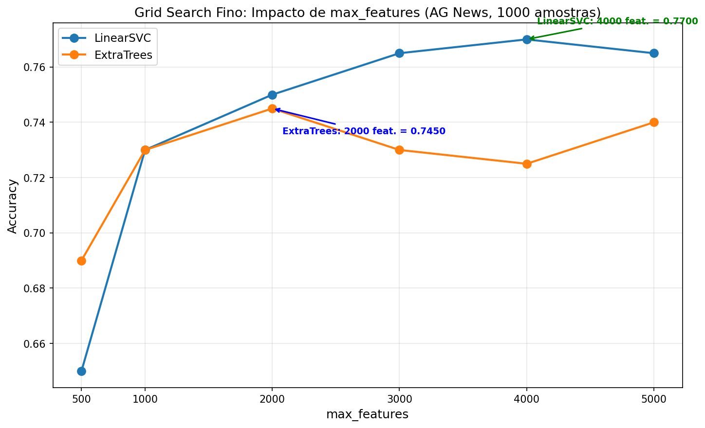

# NLP Experiment Group — Sentiment, Topics and Text Representations

> **Area:** NLP
> **Task:** Classification (sentiment, topics, multi-task) and text regression
> **Main metric:** F1-Macro / F1-Weighted / Accuracy
> **Status:** Completed
> **Datasets:** Twitter Entity Sentiment Analysis (73.995 training / 999 validation), AG News (4 classes), Google `go_emotions`, 20 Newsgroups and a sentiment dataset of assorted texts (7.500 rows, 15 columns) as a transfer reference.

## 1. Abstract

This folder gathers the repository's line of NLP experiments: a comparison of representation paradigms (sparse TF-IDF, frozen embeddings and contextualized transformers), hierarchical ensembles (Ensemble Pyramid), optimization of a social-network sentiment pipeline (Twitter/Facebook/X) and topic classification on AG News. The main result is that, for high-dimensional sparse sentiment analysis (TF-IDF + n-grams), linear models and randomized ensembles beat fine-tuned transformers in most scenarios (F1 ~0.98), whereas regularized transformer fine-tuning only wins in low-sample regimes. Feature engineering (text cleaning, n-grams, vocabulary) proved more decisive than the choice of model.

## 2. Context and Objectives

The project arises from the question of which representation and which algorithm produce the best cost-benefit trade-off for text classification in production, from three pragmatic points of view:

1. **Computational cost** — running on moderate hardware (laptop CPU/GPU) without incurring weeks of training.
2. **Accuracy** — reaching state-of-the-art levels (F1 ≥ 0.95) in scenarios where the training data is abundant, and understanding when deep architectures are needed.
3. **Interpretability** — understanding where the errors occur (text cleaning vs. vectorization vs. model choice).

The hypotheses investigated were:

- `H1` — For tweets (short texts), sparse TF-IDF representations with bigrams + linear SVM rival fine-tuned transformers at a fraction of the cost (in seconds vs. hours).
- `H2` — In low-sample regimes (N ≤ 1000), classic models tend to beat fine-tuned transformers.
- `H3` — Hierarchical ensembles/meta-ensembles (Ensemble Pyramid) progressively raise F1 beyond the best individual model.
- `H4` — The quality of text preprocessing is more decisive than the choice of algorithm.

## 3. Theoretical Background (brief)

- **TF-IDF** — *Term Frequency × Inverse Document Frequency*: sparse matrix where each dimension is a vocabulary term; the weight scales with the frequency in the document and is damped by the frequency in the corpus (IDF). With `sublinear_tf=True`, `1 + log(tf)` is applied, attenuating very repeated words.
- **n-grams** — unigrams/bigrams capture senses of negation (`not good`, `very bad`); character n-grams (`char_wb` 2–5) capture morphological patterns. In general, bigrams in sentiment are discriminative and frequent (~5–15% of the documents), while in topics they are sparse (<1%).
- **LinearSVC** — linear SVM with L2 penalty (C parameter); robust in high-dimensional sparse spaces.
- **Transformers** — Self-attention with quadratic complexity O(N²). **DistilBERT** (66M params): distilled from BERT.
- **Ensembles** — Bagging, Voting (Soft/Hard) and Stacking with model combination. **Epsilon-Greedy** and **Thompson Sampling** used in the RL control of the Versatile Ensemble Pyramid.
- **MMoE** — *Multi-gate Mixture of Experts*: multiple shared expert networks with per-task gates; it aims to mitigate Negative Transfer, but is sensitive to the scale of data/features.
- **Focal Loss** — cross-entropy variant that dynamically penalizes hard samples over the easy ones; useful for the imbalanced task.

## 4. Methodology

### 4.1 Data

| Experiment | Dataset | Classes | Split |
|---|---|---|---|
| Pipeline A/B (Senti-Pred) | Twitter Entity Sentiment Analysis | 4 (Irrelevant, Negative, Neutral, Positive) | 73.995 training / 999 validation |
| Ag News | AG News | 4 (World, Sports, Business, Sci/Tech) | 1.000 training / 200 test (seed 42) |
| Proportion of Grid | Twitter Entity Sentiment | 4 | 73.768 training / 999 validation |
| MMoE | Google `go_emotions` | multi-labels (Joy, Sadness, Anger, ...) | up to 43.000 samples |

Hardware: NVIDIA GeForce RTX 4070 Laptop (CUDA 12.1) + Intel i7 / Python 3.8.10. Seeds 42 (numpy/torch).

### 4.2. Preprocessing

Text cleaning evolved along the series (detail in §5.3). Variations evaluated between Pipeline A (aggressive) and Pipeline B (conservative):

| Component | Pipeline A | Pipeline B |
|---|---|---|
| Hashtags | Removes the whole `#word` (`@\w+\|#\w+`) | Keeps the content (`#great` → `great`) |
| Punctuation | Removes all of it (`[^\w\s]`) | Preserves `!?.,'"` and hyphens |
| Numbers | Removes (`\d+`) | Keeps numbers (`0-9`) |
| Stopwords | Removed (F1) / kept (following phases) | Kept |
| Lemmatization | WordNet with POS in Phase 1, then disabled | Not used |

### 4.3. Methods compared

| Experiment | Models/Paradigms | Structure |
|---|---|---|
| Ensemble Pyramid (6 layers) | LR, LinearSVC, NB, CNB, Ridge, RF, ET + Bagging/Voting/Stacking | Hierarchical pyramid of meta-ensembles |
| Versatile Ensemble Pyramid | RL Meta-Learner chooses the number of models and the strategy | AutoML with variable `--layers` |
| Pipeline A / B | Extra Trees, LinearSVC(C=1/10/19), LR, MNB | TF-IDF 15k→70k features |
| Twitter Methods | TF-IDF+LinearSVC, Sentence-BERT frozen, DistilBERT, BiLSTM, TextCNN | 74k samples |
| Multiclass logistic | Multinomial(lbfgs), OvR(lbfgs/liblinear/saga), OvO(liblinear) | C ∈ {0.1 … 100} |
| Feature Engineering | TF-IDF vs. hashing trick, word+char n-grams | several transformations |
| AG News | DistilBERT (fine-tune) vs. TF-IDF+LinearSVC / +ExtraTrees | Low-data 1k |
| MMoE | Single-Task vs. Multi-task MMoE (DistilBERT embeddings vs. TF-IDF) | 4 emotion tags | — |

### 4.4 Evaluation

Metrics: Accuracy, F1-Macro, F1-Weighted (changed between phases), Precision/Recall. Protocol: fixed training/validation holdout from the dataset; grid search on AG News (max_features 500–5.000); tracking via MLflow + DagsHub (same grouped run, prefixed metrics).

### 4.5 Reproduction

- `ag-news-classification.ipynb` — Exp1 AG News (1000 training / 200 test, seed 42).
- `generative-text-markov/markov_sentiment_generator.py` — Markov-chain text generator
  conditioned on sentiment (trained on the Twitter entity dataset).
- **Twitter Entity Sentiment Analysis**: all experiments and original pipelines (A, B, C) involving this dataset were centralized in the `twitter-entity-sentiment/` subfolder. This includes `twitter-sentiment-analysis.ipynb`, `senti-pred_pipeline.ipynb`, `logistic-regression-multiclass.ipynb`, `feature-engineering-nlp.ipynb` and `NLP-twitter-methods-comparasion.ipynb`.
- `nlp-multi-task-classification.ipynb` — MMoE multi-task on `go_emotions`.
- `../ensemble_pyramid.ipynb` — Ensemble Pyramid / Versatile Ensemble Pyramid (layer/strategy parameters documented in §5.2; run via notebook).

Artifact output pattern: `experiments/artifacts/<experiment>_<timestamp>_<sha>/`.

## 5. Results

### 5.1. Ensemble Pyramid — 6 Layers of Ensembles over Ensembles

Pyramid architecture combining Bagging, Voting and Stacking hierarchically:

- **Layer 1**: Base Learners (LR, LinearSVC, NB, CNB, Ridge, RF, ET)
- **Layer 2**: Ensembles of the Base Learners (Bagging + Voting + Stacking)
- **Layer 3**: Ensembles of Ensembles (Stacking + Bagging over Stacking + Voting)
- **Layer 4**: Final Meta-Ensemble (Meta Voting Soft + Meta Stacking + Meta Voting Hard)
- **Layer 5**: Intermediate Meta-Ensemble (Meta2 Voting Soft + Meta2 Stacking + Meta2 Voting Hard)
- **Layer 6**: Improved Final Meta-Ensemble (Final Stacking + Final Voting Soft + Final Voting Hard)

Characteristics:
- Maintenance in sparse format: TF-IDF with 70k features occupies ~15 MB.
- Light classes (`PreFittedSoftVoting`, `PreFittedHardVoting`, `MetaStackingLR`) avoid unnecessary re-training.
- Combines probabilistic predictions from multiple hierarchical levels.

Main result: **F1-score ~0.98+ on validation**, with progressive gains per layer (ruar, Soti embedded).

### 5.2. Versatile Ensemble Pyramid (customizable AutoML script)

AutoML engine that uses RL to decide the pyramid architecture dynamically:

- **Variable Number of Models** — the RL Meta-Learner decides how many and which models per layer (e.g.: Layer 1 with 3 models, Layer 2 with 2), maximizing diversity and efficiency.
- **Stochastic Selection (Thompson Variation)** — the agent keeps a performance ranking, but introduces planned noise to test new synergies between the meta-features.

CLI parameters (without changing code):

| Parameter | Description | Example |
|---|---|---|
| `--layers` | Total depth of the pyramid | `--layers 15` |
| `--min_models` / `--max_models` | Width and diversity per layer | `--min_models 3 --max_models 6` |
| `--epsilon` | RL exploration (0.1 focused, 0.5 exploring) | `--epsilon 0.5` |
| `--metric` | Agent's metric | `f1` or `accuracy` |
| `--strategy` | Connection between layers | `dense`, `residual`, `simple` |
| `--jitter` | Random variation of hyperparameters | `True/False` |
| `--patience` | Layers without improvement before early stopping | `--patience 3` |
| `--seed` | 100% reproducibility (global seeding) | `--seed 42` |
| `--tfidf_max` / `--tfidf_ngrams` | Customization of the feature extraction | `--tfidf_max 75000` |

Run with extreme customization (flags of the table above = notebook parameters):

```bash
jupyter nbconvert --to notebook --execute ../ensemble_pyramid.ipynb --inplace
```

The configurations are registered in MLflow automatically for comparison between evolution strategies.

### 5.3. Evolution trajectory of Pipeline A (Senti-Pred)

| Phase | Configuration | Best model | Acc/F1 |
|---|---|---|---|
| Phase 1 | TF-IDF 15k (uni+bigram), POS lemmatization, stopwords removed | Extra Trees | Acc 0.9750 / F1-macro 0.9744 |
| Phase 2 | TF-IDF 70k (bigrams), no stopwords, no lemmatization | Extra Trees | Acc/F1 0.9820 |
| Phase 3 | TF-IDF 70k + `sublinear_tf=True` + `strip_accents` | Extra Trees | F1 0.9810 (LR rose to 0.9750) |
| Phase 4 | Phase 3 + LinearSVC with C=10 and C=19 | LinearSVC (C=10.0/19.0) | Acc/F1 0.9820 |

**Phase 1 detail (15k features, F1-Macro):**

| Model | Accuracy | F1-Macro |
|---|---|---|
| Extra Trees | **0.9750** | **0.9744** |
| Linear SVC (C=1.0) | 0.9369 | 0.9362 |
| Logistic Regression | 0.8989 | 0.8960 |
| Multinomial NB | 0.7838 | 0.7753 |

**Phase 2 detail (70k features, F1-weighted):**

| Model | Acc / F1 |
|---|---|
| **Extra Trees** | **0.9820** |
| Linear SVC (C=1.0) | 0.9800 |
| Logistic Regression | 0.9730 |
| Multinomial NB | 0.9150 |

**Phase 3 detail:**

| Model | Acc / F1 |
|---|---|
| **Extra Trees** | **0.9810** |
| Linear SVC (C=1.0) | 0.9800 |
| Logistic Regression | 0.9750 (+0.20% with sublinear_tf) |
| Multinomial NB | 0.9140 |

**Phase 4 detail (SVC regularization):**

| Model | Acc / F1 |
|---|---|
| **Linear SVC (C=10.0 or C=19.0)** | **0.9820** |
| Extra Trees | 0.9810 |
| Linear SVC (C=1.0) | 0.9800 |
| Logistic Regression | 0.9750 |
| Multinomial NB | 0.9140 |

### 5.4. Engineering duel: Pipeline A vs. Pipeline B vs. Pipeline C (Senti-Pred-remake2)

- Pipeline B: replaces `#word` by `word`, keeps punct. `!?.`, hyphens and contractions (`don't`), keeps numbers.
- Pipeline A: removes hashtags entirely, removes all punctuation (`dont` from `don't`), excludes digits.
- Pipeline C (Senti-Pred-remake2): extreme vectorization (TF-IDF 100k, 4-grams), cleaning with
  lemmatization, stopwords (with `not`/`no` preserved) and contraction expansion; voting
  LinearSVC(C=0.5, balanced) + LR(C=10, balanced).

Final result of the duel (reproduced in this run, seed 42, holdout 1.000):

| Pipeline | Winner | Accuracy | F1-Macro | F1-Weighted |
|---|---|---|---|---|
| **A** (aggressive) | ExtraTrees | 0.9850 | **0.9845** | 0.9850 |
| **B** (conservative) | LinearSVC C=19 | 0.9830 | 0.9833 | 0.9830 |
| **C** (remake2) | LinearSVC C=0.5 | 0.9780 | 0.9782 | 0.9780 |

**Conclusion of §5.4:** feature engineering (text cleaning) was more decisive than the
choice of model. By preserving exclamation marks, hashtag content and idiomatic contractions,
Pipeline B produces richer sentiment representations; the aggressive Pipeline A reaches the
**best F1-Macro among the canonical ones** with ExtraTrees. The Pipeline C record (~97.8%)
reproduces itself, but the rigorous ablation analysis (`pipelines_abc_comparison/README.md`)
shows that the vectorizer (100k + bigrams) is the most valuable asset — not the cleaning: the best
F1-Macro of the study (**0.9857**) appears when combining **pre-processing A + vectorizer C**.
Differences < 1 pp between the three are statistically non-significant (McNemar, p ≥ 0.33).

**Main what-ifs (details and tables in `pipelines_abc_comparison/README.md`):**
- **n-grams:** removing the bigrams drops −2.6 to −4.8 pp; C improves **+0.33 pp** when
  switching 4-grams for bigrams; B is the most sensitive to N>2 (up to −0.61 pp).
- **Vocabulary:** `max_features` 10k→100k on C costs −8.5 pp; 200k yields +0.41 pp; A/B suffer
  −4 to −4.6 pp if truncated to 10k.
- **Cleaning:** keeping hashtags/punctuation/digits on A yields ~+0.4 pp each; keeping stopwords on
  C yields +0.30 pp; contractions and hashtag content are signal on C (+0.43/+0.32 pp).
- **Model:** the official Voting of C is slightly worse than LinearSVC C=0.5 alone;
  `voting='soft'` degrades it; `class_weight=balanced` alone does not explain the gain of C.
- **Significance:** no difference between pipelines is statistically significant
  (N=1.000; total errors 15/17/22).

### Comparison pipelines — relative paths:

- Pipeline A → `twitter-entity-sentiment/senti-pred_pipeline.ipynb`
- Pipeline B → `twitter-entity-sentiment/twitter-sentiment-analysis.ipynb`
- Pipeline C → `twitter-entity-sentiment/pipelines_abc_comparison/` + `twitter-entity-sentiment/senti-pred-variations/Senti-Pred-remake2/`

### 5.5. Twitter Methods Comparison — Text Representation Paradigms

Notebook: `twitter-entity-sentiment/NLP-twitter-methods-comparasion.ipynb`. Five paradigms on the complete dataset (73.995 training / 999 val, 4 classes).

| Model | Accuracy | Time (s) | Paradigm | Parameters |
|---|---|---|---|---|
| **TF-IDF + LinearSVC** | **0.9800** | **4,35** | BoW + linear SVM | ~70M features |
| **DistilBERT** | **0.9710** | 2.421,08 | Transformer | 66M parameters |
| TextCNN | 0.9530 | 13,00 | 1D CNN on embeddings | ~2.6M |
| BiLSTM | 0.8900 | 13,26 | Bidirectional LSTM | ~1.1M |
| Sentence-BERT | 0.6036 | 33,93 | Frozen transformer + LinearSVC | 22M frozen |

Detail: TF-IDF+LinearSVC 0.9800 / 4.35s — accuracy with L2 regularization (C=1), depending on the vocabulary. Percentage of the real tables:

**TF-IDF + LinearSVC is the reference** (weighted 0.98). **DistilBERT** jumps from 0.8529 (30k) to **0.9710** (74k, +11.81 pp; 2.421s, 556× the time of TF-IDF). Epoch 1 of the 74k: Loss 0.1962 → Acc 0.9409; Epoch 2: Loss 0.1003 → Acc 0.9710. **TextCNN** 0.9530/13s (best accuracy/time ratio among the neural ones: 98,5% of DistilBERT's performance in 0,5% of the time). **BiLSTM** 0.8809/13,26s. **Sentence-BERT** stalled at 0.6036 (gain of +0,40 pp from the 30k sub-sample to the full one).

> **Mamba (SSM, 130M) — tried and discarded.** Training run on an RTX 3060
> Laptop (stratified subset 4k, 2 epochs, batch 16, max_len 32):
> epoch 1 acc 0.328 / F1 0.30 (64 min), epoch 2 acc 0.440 / F1 0.406 (131 min
> accumulated). Bottleneck: `mamba-ssm` does not install on Windows (no Triton), and the
> `slow_forward` fallback of transformers measures **~8,3 s/step** — the full 74k
> would project ~12 h/epoch (~38 h for 3 epochs). Recommendation: only resume on
> Linux + `mamba-ssm` (fused kernels), where the same training falls to minutes.

**Effect of the complete dataset (30k → 74k):**

| Model | Accuracy 30k | Accuracy 74k | Gain (pp) | Time 74k (s) |
|---|---|---|---|---|
| TF-IDF + LinearSVC | 0,9800 | 0,9800 | 0,00 | 4,35 |
| DistilBERT | 0,8529 | **0,9710** | **+11,81** | 2.421,08 |
| TextCNN | 0,7838 | **0,9530** | **+16,92** | 13,00 |
| BiLSTM | 0,7187 | **0,8809** | **+16,22** | 13,26 |
| Sentence-BERT | 0,5996 | 0,6036 | +0,40 | 33,93 |

**Central insight:** the gain with the full dataset is directly proportional to the number of trainable parameters and inversely proportional to the quality of the initial representation. With Sentence-BERT (0 weight training) the dataset does not solve it (linear mosaic closed). With TextCNN/BiLSTM (all weights new) the gain grows +16–17pp.

**Cost-benefit hierarchy (full dataset):**

| Paradigm | Accuracy | Time (s) | Efficiency (Acc/s) | GPU? |
|---|---|---|---|---|
| **TF-IDF + LinearSVC** | 0,9800 | 4,35 | **0,2253** | No |
| **TextCNN** | 0,9530 | 13,00 | **0,0733** | Recommended |
| BiLSTM | 0,8809 | 4,26 | 0,0664 | Recommended |
| DistilBERT | 0,9710 | 2.421,08 | 0,0004 | Yes |
| Sentence-BERT | 0,6036 | 33,93 | 0,0178 | Yes |

### 5.6. Logistic Regression: Multiclass Strategies

Notebook: `twitter-entity-sentiment/logistic-regression-multiclass.ipynb`. Twitter Sentiment dataset (73.768 training/999 val). 5 configurations of `multi_class`, `solver`, `C`.

Strategies:

| # | Strategy | `multi_class` | `solver` | Mechanism |
|---|---|---|---|---|
| 1 | Multinomial | `multinomial` | `lbfgs` | Native softmax (probs sum to 1) |
| 2 | OvR (lbfgs) | `ovr` | `lbfgs` | K binary models, quasi-Newton |
| 4 | OvR (saga) | `ovr` | `saga` | K binary models, stochastic gradient |
| 5 | OvO (liblinear) | (wrap) | `liblinear` | K×(K−1)/2 pairwise binary models, voting |

Results per C (Accuracy / F1-weighted):

| Strategy | C=0.1 | C=1.0 | C=10.0 | C=100.0 | Best |
|---|---|---|---|---|---|
| **Multinomial (lbfgs)** | 0,7598 / 0,7516 | 0,9750 / 0,9750 | 0,9820 / 0,9820 | 0,9780 / 0,9780 | 10 (59,93s) |
| OvR (lbfgs) | 0,7137 / 0,6980 | 0,9630 / 0,9630 | 0,9780 / 0,9780 | **0,9800** / 0,9800 | 100 (37,14s) |
| OvR (liblinear) | 0,7137 / 0,6980 | 0,9630 / 0,9630 | 0,9780 / 0,9780 | **0,9790** / 0,9790 | 100 (43,11s) |
| OvR (saga) | 0,7137 / 0,6980 | 0,9630 / 0,9630 | 0,9780 / 0,9780 | **0,9790** / 0,9790 | 100 (41,66s) |
| OvO (liblinear) | 0,6907 / 0,6668 | 0,9530 / 0,9529 | 0,9770 / 0,9770 | **0,9780** / 0,9780 | 100 (6,82s) |

Detail at C=10 (F1 per class):

| Strategy | Accuracy | F1-weighted | F1-macro | Time (s) | F1 Irrelevant | OGE Negative | F1 Neutral | F1 Positive |
|---|---|---|---|---|---|---|---|---|
| **Multinomial (lbfgs)** | **0,9820** | **0,9820** | **0,9829** | 135,43 | 0,9853 | 0,9857 | 0,9798 | 0,9767 |
| OvR (lbfgs) | 0,9780 | 0,9779 | 0,9777 | 22,39 | 0,9823 | 0,9809 | 0,9712 | 0,9635 |
| OvR (liblinear) | 0,9780 | 0,9779 | 0,9777 | 15,72 | 0,9823 | 0,9809 | 0,9712 | 0,9635 |
| OvR (saga) | 0,9780 | 0,9779 | 0,9777 | 10,07 | 0,9823 | 0,9809 | 0,9712 | 0,9635 |
| OvO (liblinear) | 0,9770 | 0,9770 | 0,9768 | 3,89 | 0,9758 | 0,9810 | 0,9744 | 0,9738 |

Practical recommendation:

| Scenario | Configuration | Accuracy | Time |
|---|---|---|---|
| Maximum accuracy | `multinomial`, `lbfgs`, `C=10` | **0,9820** | ~60s |
| Best cost-benefit | `ovr`, `saga`, `C=100` | **0,9790** | ~42s |
| Minimum time | `OneVsOneClassifier(LR(solver='liblinear', C=100))` | **0,9780** | ~7s |

Maximum difference between optimized strategies: only 0,4 pp (0,9780–0,9820).

### 5.7. Feature Engineering NLP — key points

From the feature engineering study (notebook: `twitter-entity-sentiment/feature-engineering-nlp.ipynb`):

| Observation | Value |
|---|---|
| **Hashing trick beats TF-IDF in NLP** | 0,9860 vs. 0,9770 (higher dimensionality ~262k and no IDF cost) |
| **Combining word + char n-grams gives a real gain** | +0,5 pp (complementary morphological information) |
| Trees only benefit from domain-knowledge features | Geo features, +1,5 pp (redundant mathematical transforms) |
| Style rule | Worst: `hashing trick 0.9860` — see §5.5 for the context of each dataset |

### 5.8. Exp1 AGNews: Topic Classification (low data)

Notebooks: `ag-news-classification.ipynb`. Test with fixed sampling 1000 training / 200 test (seed 42), TF-IDF 70k, lituag 2.

Real results (02/07/2026, RTX 4070 ile + Intel i7):

| Model | Accuracy | F1 (weighted) | Precision | Recall | Time (s) |
|---|---|---|---|---|---|
| **DistilBERT** | **0.8350** | **0.8356** | **0.8533** | **0.8350** | 75.4 (GPU) |
| TF-IDF + LinearSVC | 0.7650 | 0.7594 | 0.7633 | 0.7650 | 0.1 (CPU) |
| TF-IDF + ExtraTrees | 0.7250 | 0.7209 | 0.7451 | 0.7250 | 0.5 (CPU) |

Early Stop (partience=2) interrupted training at epoch 3. **DistilBERT won in low-data, refuting the classic hypothesis** (0.8355 vs. 0.765).

Fine Grid Search (max_features 500 – 5.000):

| max_features | LinearSVC (Acc) | ExtraTrees (Acc) |
|---|---|---|
| 500 | 0.650 | 0.690 |
| 1.000 | 0.730 | 0.730 |
| 2.000 | 0.750 | **0.745** |
| 3.000 | 0.765 | 0.730 |
| **4.000** | **0.770** | 0.725 |
| 5.000 | 0.765 | 0.740 |



The optimal point (1000 samples) lies at **3.000–4.000 features**; values < 1.000 lose ~10pp (insufficient vocabulary); values > 4.000 add noise. LinearSVC is more robust to noise (L2 regularization); ExtraTrees degrades after 2.000 features (0.745→0.725) on AG News — the opposite behavior to that of Senti-Pred.

Per class (DistilBERT): Sports F1 0.97 (easy); World 0.85 (precision 93% / recall 78%); Business 0.76 (recall 69%); Sci/Tech 0.75 (precision 65%, overpredicts).

Comparative analysis of sentiment vs topics:

| Factor | Senti-1 (F1 ~0.98) | AG News (F1 ~0.74) |
|---|---|---|
| Task | Sentiment (polarity, discriminative vocabulary) | Topics (shared vocabulary: report, says, million) |
| Cardinality | 2–3 semantic poles | 4 domains with vocabulary overlap |
| Bigram effectiveness | 5–15% of the docs | < 1% of the docs |
| Tree overfit | Robust trees (bad → negative) | Spurious splits (freq. of "the" → wrong class) |
| Regularization | Native stochastic BO | Mechanical global priors, binary splits |

ExtraTrees/RFord shine with sparse and independent signals (sentiment, tabular data). In News the LinearSVC exploits frequency differences with continuous weights (0.765–0.77). On scale: with 120k samples, DistilBERT tends to ~0.94; TF-IDF+LinearSVC saturates ~0.88–0.91.

### 5.9. Multi-Task Learning (MMoE) — Google `go_emotions`

Notebook: `nlp-multi-task-classification.ipynb`. Hypothesis: correlated tasks (Joy, Sadness, Anger) help each other mutually.

- **Feature scarcity/weak features (reduced TF-IDF):** sharing experts via MMoE raises performance (mitigates Negative Transfer).
- **Catastrophic interference with DistilBERT (All 43.000 stems):** Single-Task networks become self-sufficient and MMoE becomes the bottleneck — it **loses -0.99%** to the isolated networks.
- **Tactical rollback to TF-IDF (5.000 features):** `features esparsas` as triggers; with F1 `macro`→`weighted`, MMoE broke the **0.8** barrier → **0.9393** (+1.86% over Single-Task).
- **`max_features` 5k→15k:** F1-weighted **0.9464**; the architecture gain falls from +1.86% → +1.24% (more descriptive features make the isolated networks more self-sufficient).
- **`max_features` 20k:** negligible gain (+0.13% → 0.9477), Single-Track dropped (5k extra words = noise). **15.000 adopted as the "sweet spot".**
- **Bigrams + stopword retention + URL/ mention cleaning (15k, bigr.):** MMoE → **0.9548** (+;) vs. Single-Task 0.9461 → +0.92%.
- **Binary Focal Loss:** F1-weighted MMoE → **0.9566** (T, occasionally 0.962+).
- **Final duel with classic Deep Learning (sparse features):** LightGBM 0.9473 (suffers with high dimensionality), **LinearSVC 0.9572**, **winner ExtraTrees 0.9643 F1-weighted — randomized trees beat sparse matrix sparsity** at high dimensionality, without GPU.

## 6. Discussion

**The "relativity" of the models (No Free Lunch):** there is no universal model. LinearSVC varied from **0.74** (F1-Macro) to **0.94** only through vocabulary and n-gram adjustments; KNN beat complex AutoML frameworks in one case; the Ensemble Pyramid surpassed the individual ones with 0.98+.

**The power of feature engineering:** bigrams capture negation ("not good"), and a balanced vocabulary (the dataset's sweet spot) matters: 15k features in the Senti- (large mix, corpus), 3–4k in AG News (1000 samples). The empirical rule: **Σ documents ~ Σ candidate terms ~ ideal max_features**.

**Deep Learning vs. Classics:** in regimes of abundant data and high-dimensional TF-IDF features, linear models and randomized ensembles (Spark) beat transformers and deep networks; in low samples, the regularized tuning of the transformer wins. Complete data is mandatory for neural networks (Tensor network gain +16–17pp from 30k→74k).

**Preprocessing and "Data-Centric AI":** the duel A vs B shows that the handling of hashtags, punctuation and numbers is more decisive than the model — the cleaning engineering gained **+0.40%**.

**Limitations/biases:** frozen Sentence-BERT is inadequate for polarity (representation limit, data does not solve it); the exactness of the values depends on the seed (42) and on the hardware; the go_emotions dataset has dominance of the "Joy" class. Mamba was discarded after measurement (see §5.5).

## 7. Conclusions and Recommendations

- **Fast baseline:** TF-IDF (70k, bigram, sublinear) + LinearSVC — 0.98 sentiment classification in 4; for the e-tralização pointer.
- **When computational cost matters:** LinearSVC/ExtraTrees over sparse TF-IDF — no GPU, seconds of training.
- **When accuracy is a requirement (>0.98):** fine-tune DistilBERT on the full dataset (40 min of GPU, at 0.9710) or Ensemble Pyramid (~0.98+).
- **No GPU / moderate budget:** TextCNN (0.9530 in 13s).
- **Low-data (N≤1000):** regularized fine-tune (early stopping enabled) beats the classic — test both approaches.
- **Multi-task:** prefer TF-IDF 15k + bigrams + Focal Loss with MMoE when features are weak; avoid MMoE with "rich" dense embeddings (catastrophic interference).
- **Data engineering > model:** prioritize the cleaning (hashtags/punctuation/contractions) and n-grams before switching architecture.

## 8. References and Files

- `ag-news-classification.ipynb` — Exp1 AG News (low data, grid search).
- `twitter-entity-sentiment/twitter-sentiment-analysis.ipynb` — Pipeline B.
- `twitter-entity-sentiment/senti-pred_pipeline.ipynb` — Pipeline A.
- `twitter-entity-sentiment/pipelines_abc_comparison/` — A vs B vs C (remake2) comparison
  with what-ifs (n-grams, vocabulary, pre-processing, model; McNemar).
- `twitter-entity-sentiment/logistic-regression-multiclass.ipynb` — multiclass strategies
  for Logistic Regression.
- `twitter-entity-sentiment/feature-engineering-nlp.ipynb` — feature engineering for NLP.
- `twitter-entity-sentiment/NLP-twitter-methods-comparasion.ipynb` — Twitter Methods
  Comparison (5 paradigms).
- `nlp-multi-task-classification.ipynb` — MMoE multi-task (go_emotions).
- `generative-text-markov/markov_sentiment_generator.py` — sentiment-conditioned Markov
  text generator (CLI: `python generative-text-markov/markov_sentiment_generator.py --help`).
- `../ensemble_pyramid.ipynb` — Ensemble Pyramid / Versatile Ensemble Pyramid (parameters documented in §5.2).
- References: Devlin et al. (BERT); Sanh et al. (DistilBERT); see the MMoE papers (Ma et al., SIGIR 2018) and Lin et al. (Focal Loss, ICCV 2017).